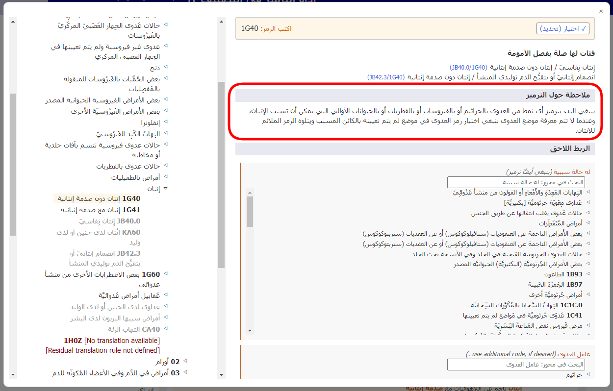

# ملحوظة الترميز 

عند فتح تفاصيل أحد الكيانات في قائمة النتائج، يتم عرض "ملحوظة الترميز" إذا كانت متاحة لهذا الكيان (انظر لقطة الشاشة أدناه).

عندما تكون في أحد الكيانات في المستعرض المدمج في التصنيف-11، يتم عرض قسم "ملحوظة الترميز" كما هو موضح أدناه.

