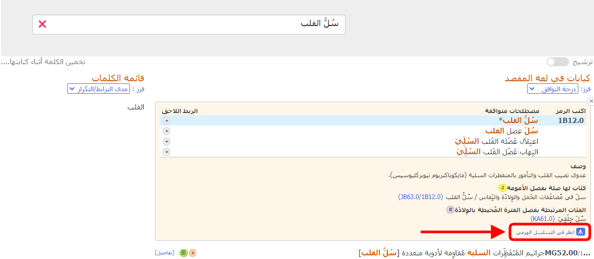
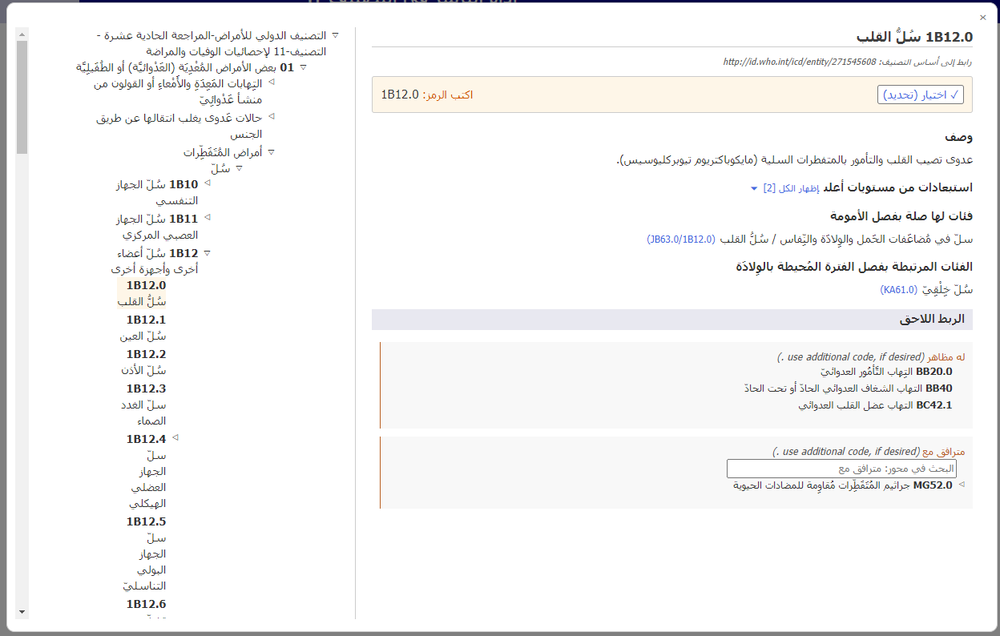
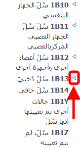

# المستعرض المدمج

عندما يتم عرض تفاصيل الكيان، وعند النقر فوق أيقونة تكبير (المربع الصغير المشار إليه في لقطة الشاشة أدناه) يتم فتح مستعرض التصنيف-11 داخل أداة الترميز.

يتم عرض المستعرض المدمج للتصنيف-11 في الصفحة بمثابة نافذة أمامية.

فيما يلي بيانات الكيانات التي يتم عرضها على الجانب الأيمن من المستعرض (إن وُجِدَت):

- اسم تم تعيينه بالكامل
- الوصف
- المعلومات الإضافية
- المُشْتَمَلات
- المُسْتَبْعَدات
- المُسْتَبْعَدات من المستويات الأعلى
- تم ترميزه في مكان آخر
- ملحوظة الترميز
- الربط اللاحق

عند تصفح التصنيف-11، ستجد التسلسل الهرمي لموضوعات التصنيف على يسار الشاشة. عند النقر فوق أي كيان، ستظهر تفاصيل هذا الكيان على يمين الشاشة.

في البداية، يفتح النظام التسلسل الهرمي للرمز المحدد فقط. ومع ذلك، يمكنك عرض العناصر التابعة لكل كيان بالنقر فوق المثلثات الصغيرة الموجودة على يسار الكيانات. 

