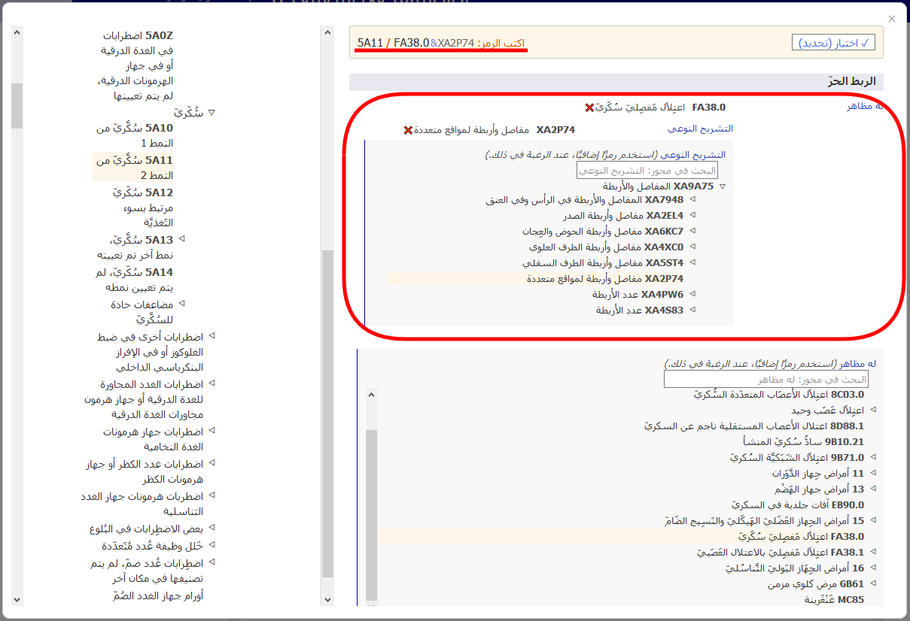

# ⁧⁩الربط اللاحق⁧⁩      

يتيح لك نظام الربط اللاحق إضافة المزيد من التفاصيل إلى الكيان المحدد. ويمكن إضافة شتى أنواع المعلومات إلى العناصر المختلفة. على سبيل المثال، يمكن إضافة معلومات "الباثولوجيا النسيجية" الإضافية إلى معظم فئات الأورام، ولكن لا يمكن إضافتها إلى الفئات الموجودة في أماكن أخرى في التصنيف.

عند فتح تفاصيل أحد الكيانات في قائمة النتائج، يتم فقط عرض رابط الربط اللاحق إذا كان الربط اللاحق ينطبق على هذا الكيان (انظر لقطة الشاشة أدناه). 

عندما تكون في أحد الكيانات في المتصفح المدمج للتصنيف-11، سيوضح قسم الربط اللاحق المحاور المحتملة فقط التي تنطبق على هذا الكيان.

تحتوي بعض الفئات على معلومات غير كاملة لأغراض متعددة تتعلق بالتصنيف الدولي للأمراض. في هذه الحالات، يكون واسِم الرابط "الربط اللاحق الإلزامي".    

إذا كان الربط اللاحق إلزاميًا، فتشير ملحوظة "*(ينبغي أيضًا ترميز)*" في قسم الربط اللاحق بالمستعرض إلى ضرورة إضافة معلومات إلى هذا المحور.   

لفتح الرابط اللاحق المقابل لمصطلح مطابق بعينه، يتعين عليك النقر على إحدى أيقونات الرابط اللاحق على الجانب الأيمن لمحتوى تفاصيل الكيان. 
فقد تكون هذه الأيقونة هي الربط اللاحق متاح لهذا الكيان:

أو الربط اللاحق إلزامي لهذا الكيان: 

يظهر المصطلح المطابق المقابل في المتصفح المدمج للتصنيف-11 تحت مسمى «المصطلح المحدد»، كما ستُظهِر أداة الترميز معرِّف المورد المحدد الأساسي للعنصر المحدد، إذا كان مختلفًا عن معرف المورد المحدد الأساسي للكيان الحالي (انظر لقطة الشاشة أدناه).

## ⁧⁩عرض مجموعات القيم والبحث فيها 

يمكن أن تحصل بعض محاور الربط اللاحق على قيم من مجموعة أصغر من القيم المحتملة مثل الوضعيات الجانبية، بينما يمكن أن تحصل بعض المحاور على قيم من مجموعة أكبر نسبيًا من القيم مثل الباثولوجيا النسيجية.

  - إذا كانت مجموعة القيم صغيرة، فسيعرض المتصفح جميع القيم المحتملة مع رموزها.

    

  - إذا كانت مجموعة القيم كبيرة، فيمكنك استعراضها من خلال الشجرة الهرمية لمحور الربط اللاحق. بخلاف ذلك، يمكنك البحث في مجموعات القيم بالكتابة في مربع البحث. وسيبحث المتصفح عن قيم هذا المحور فقط.     

    
  
  - في بعض الأحيان، حتى وإن كانت مجموعة القيم الفعلية لأحد المحاور كبيرة، لا تنطبق جميع القيم من هذه المجموعة على أحد الكيانات. في مثل هذه الحالة، يعرض المتصفح الجزء ذي الصلة أو يبحث فيه فقط. إذا كان عدد القيم التي تنطبق أقل من 12 قيمة، فسيُدرج المتصفح جميع هذه القيم. إذا كانت النتيجة أكبر من ذلك، فسيتيح المتصفح البحث في المحور وتصفحه.

    على سبيل المثال، يمكن الربط اللاحق للمصطلح "كيسَة عَظمِيَّة أمدَمِّيَّة/كيس أُمِّ الدَّم في عَظم" مع "تفصيلة تشريحية نوعية"، ولكن لا تنطبق جميع القيم. في مثل هذه الحالة، يعرض المتصفح القيم ذات الصلة أو يبحث فيها فقط. في المثال أدناه، عندما يبحث المستخدم عن كلمة "رأس"، يعرض النظام النتائج الموجودة فقط في فرع "العظام" المتفرع من محور "تفصيلة تشريحية نوعية". 
    
    

## ⁧⁩إنشاء سلسلة رمز⁧⁩ 

لإنشاء رمز، يجب النقر فوق القيم المعروضة في نتائج البحث، في قوائم التسلسل الهرمي أو القوائم الأقصر. 

يوضح المثال أدناه كيفية ترميز "ورم خبيث في الثَديّ" بالتفصيل مع الوضعيات الجانبية والتشريح النوعي.     
يتم عرض تحديدات الربط اللاحق أعلى قسم الربط اللاحق، ويتم عرض سلسلة الرمز الناتجة فوق قسم الربط اللاحق.     
يؤدي النقر فوق زر "تحديد" إلى نسخ سلسلة الرمز الناتجة في الحافظة.

## الربط اللاحق باستخدام قيم متعددة من نفس المحور 

يتيح النظام قيمة واحدة لكل محور بالنسبة لمعظم محاور الربط اللاحق.      
على سبيل المثال، عند الربط اللاحق مع "شديد"، لا يمكنك اختيار القيمة "خفيف" و"معتدل" في الوقت نفسه. ومع ذلك، يتيح النظام تحديد قيم متعددة مع بعض المحاور. موضح أدناه المحاور التي تتيح قيمًا متعددة:

- مترافق مع
- حالة سببية
- له مظاهر
- التشريح النوعي
- عوامل عدوى
- عوامل كيميائية
- أدوية

بالنسبة لهذه المحاور، يمكنك تحديد أكثر من قيمة واحدة. على سبيل المثال، عندما يكون الربط اللاحق مع التشريح النوعي متاحًا يمكنك تحديد أكثر من موضع في الجسم.

وبالنسبة لبعض محاور الأسباب الخارجية، تُتاح القيم المتعددة فقط عندما تأتي من كتل مختلفة.

على سبيل المثال، عند الربط اللاحق لمصطلح "حادث مروري غير قصدي بإصابة راكب درّاجة هوائية بدواستين" باستخدام محور "واصف لحادث نقل"، يمكننا استخدام قيمة واحدة من الكتلة "دور مستخدم المركبة في الشخص المصاب بحادث مواصلات" وقيمة واحدة من الكتلة "الطرف المقابل في حادث تصادم وسائط النقل البرية"، ولكن لا يمكننا استخدام قيمتين من نفس الكتلة.

عندما لا يُسمح بقيم متعددة في أحد المحاور، ويقوم المستخدم بالنقر فوق المحور الثاني، يستبدل النظام القيمة الموجودة. على سبيل المثال، عند الربط اللاحق مع كلمة "شديد" وأنت قد اخترت بالفعل كلمة "خفيف" بمثابة قيمة، فإن النقر فوق كلمة "معتدل" سيؤدي إلى استعاضة القيمة "خفيف" بالقيمة "معتدل". 

## تطابق الربط اللاحق / الربط المسبق

في بعض الحالات، قد تكون التوليفة التي يقوم المستخدم بإنشائها مطابقة لكيان موجود في التصنيف. في هذه الحالة، يستخدم النظام مفهوم الربط المسبق تلقائيًا عند إنشاء رمز. في المثال أدناه، اختار المستخدم ⁧⁩كارسينوما غزوية في الثدي⁧⁩ وقام بربطها لاحقًا مع ⁧⁩كارسينوما القناة مرتشح، لم يتم تعيينه في مكان آخر⁧⁩. ومع ذلك، بدلًا من توفير رمزين، يوفر النظام رمزًا واحدًا فقط لأنه توجد فئة في التصنيف لهذه التوليفة، وهي ⁧⁩2C61.0 كارسينوما قنوية غزوية في الثدي⁧⁩ ولذلك يوفرها النظام على أنها الرمز. 

## ⁧⁩الربط اللاحق المتداخل⁧⁩ 

في حالات محددة، قد يوفر النظام تحديدًا إضافيًا لقيم الربط اللاحق. إذا كانت التفاصيل النوعية معروفة، فينبغي تحديد الكيان الأكثر دقة. وإذا لم يتم تحديده، فينبغي تحديد الكيان الأقل نوعية.

## تنسيق لاحق آخر

اقترحت أو طلبت العديد من الكيانات محاور التنسيق اللاحق ذات الصلة بها. يمكنك رؤية هذه المحاور في منطقة التنسيق اللاحق واستخدامها لتحسين الكيان لديك.

ومع ذلك، في بعض الأحيان قد تحتاج إلى التنسيق اللاحق لكيان ما مع كيانات أخرى غير مقترحة أو غيرمطلوبة. في هذه الحالة، يمكنك استخدام منطقة "التنسيق اللاحق الآخر" لإنشاء تعبير التنسيق اللاحق الخاص بك باستخدام مجموعة أكبر من كيانات التصنيف.

