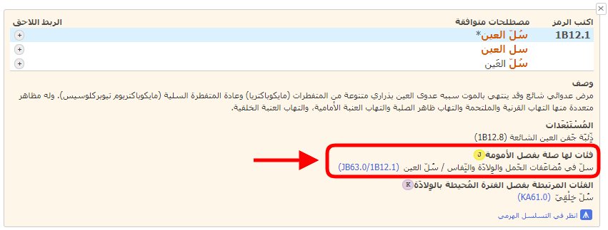
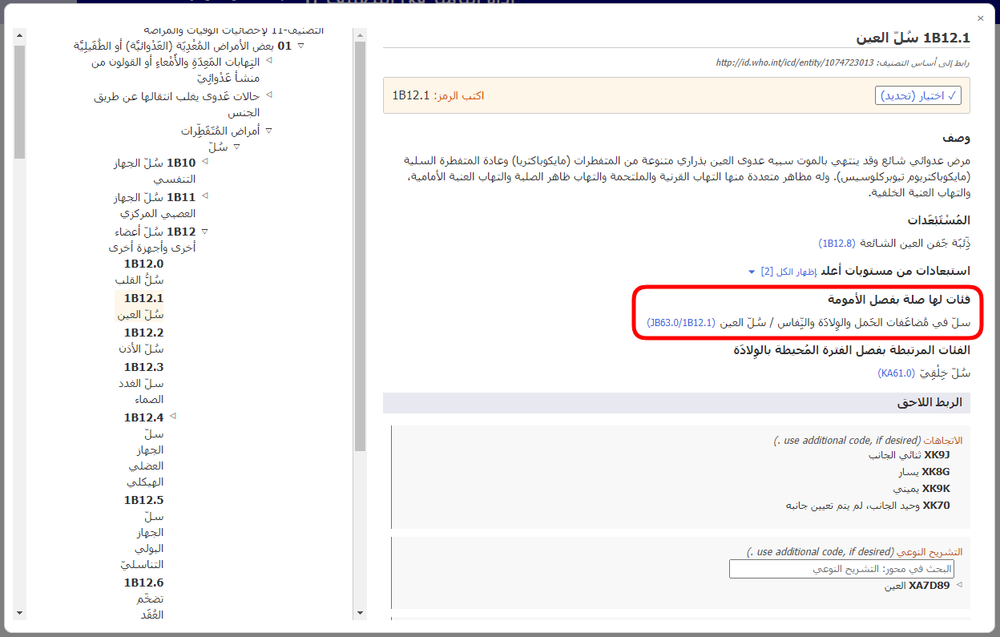
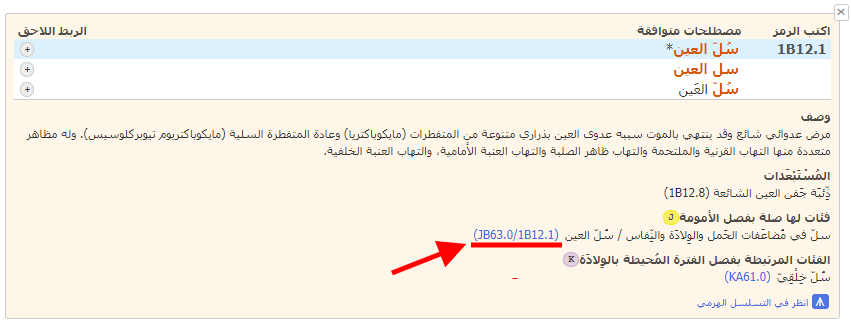
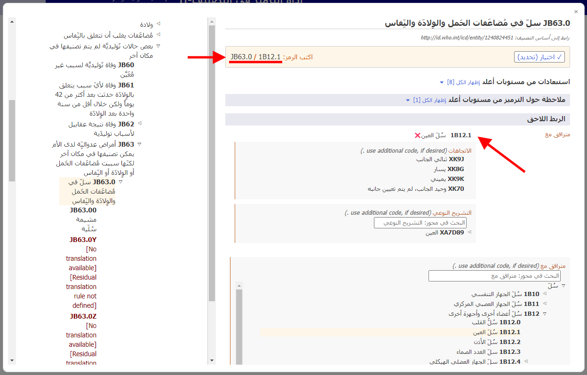

# الفئات ذات الصلة في الفصل المعني بالأمهات    

عند ترميز وفيات الأمهات، في معظم الحالات يتم ترميز السبب الأساسي ضمن الفصل 18. لتبسيط الترميز وللحفاظ على التفاصيل الواردة من باقي التصنيف، توفر أداة الترميز في التصنيف-11 رموزًا بديلة للفصل المعني بالأمهات. 

إذا كانت نتيجة البحث تحتوي على رمز بديل للفصل المعني بالأمهات، فسوف ترى الأيقونة J. عند فتح تفاصيل الكيان في قائمة النتائج، يتم عرض قسم "الفئات ذات الصلة في الفصل المعني بالأمهات" لهذا الكيان.     

على سبيل المثال، للكيان "سُلّ العين" (1B12.1) فئة ذات صلة في الفصل المعني بالأمهات، وهي الكيان "سلّ في مُضاعَفات الحَمل والوِلادَة والنِّفاس" (JB63.0). يتم الجمع بين رمز هذا الكيان ورمز "سُلّ العين" (1B12.1) ليصبح الرمز الناتج JB63.0/1B12.1. 

عندما تكون في أحد الكيانات في المستعرض المدمج في التصنيف-11، يتم عرض قسم "الفئات ذات الصلة في الفصل المعني بالأمهات" كما هو موضح أدناه.

عند النقر فوق الرابط الموجود في قسم "الفئات ذات الصلة في الفصل المعني بالأمهات"، في هذا المثال JB63.0/1B12.1 (الذي يظهر أسفله خط أحمر في لقطة الشاشة لتفاصيل الكيان، وأيضًا في لقطة الشاشة للمستعرض المدمج)

يفتح المستعرض المدمج مباشرة الكيان ذي الصلة في الفصل المعني بالأمهات (في المثال أدناه: "JB63.0 سلّ في مُضاعَفات الحَمل والوِلادَة والنِّفاس") الذي تم ربطه لاحقًا مع الكيان المحدد (في المثال أدناه: "1B12.1 سُلّ العين") دون أي تدخل من المستخدم.

