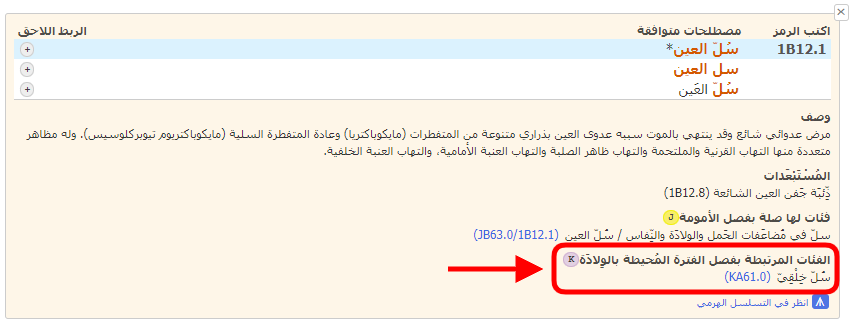
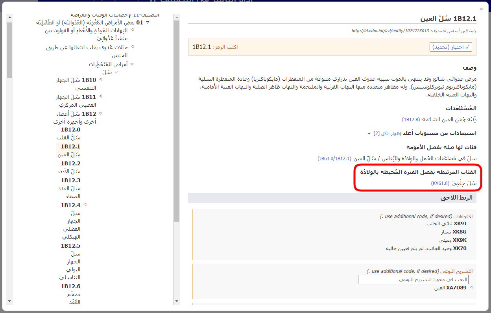
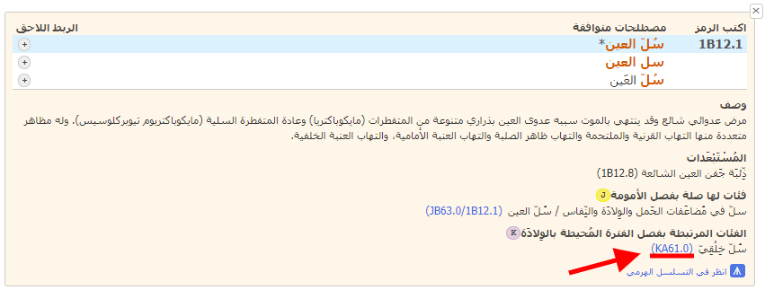
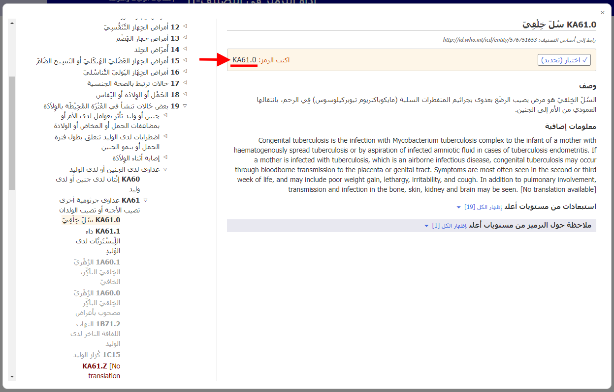

# الفئات المرتبطة بفصل الفترة المُحيطة بالوِلادَة 

عند ترميز وفيات الفترة المحيطة بالولادة، يجري ترميز معظم الحالات وفق الفصل 19. ولتبسيط هذا الأمر، وللحفاظ على التفاصيل الواردة من باقي أجزاء التصنيف، توفر لك أداة ترميز التصنيف الدولي للأمراض-11 رموزًا بديلة لفصل الفترة المحيطة بالولادة. 

إذا تضمنت نتائج البحث رمزًا بديلًا مرتبطًا بالفترة المحيطة بالولادة، فسترى أيقونة K.

عند فتح تفاصيل الكيان في قائمة النتائج، سيظهر قسم «الفئات المرتبطة بفصل الفترة المحيطة بالولادة» لهذا الكيان.     

على سبيل المثال: يتضمن الكيان «سل العين» (1B12.1) فئة ذات صلة في فصل الفترة المحيطة بالولادة «سل خِلقي» (KA61.0)

عندما تكون في أحد الكيانات في المستعرض المدمج للتصنيف-11، يظهر قسم «الفئات المرتبطة بفصل الفترة المحيطة بالولادة» كما هو موضح أدناه.

عند النقر فوق الرابط الموجود في قسم «الفئات المرتبطة بفصل الفترة المحيطة بالولادة»، في المثال KA61.0 (الذي يظهر أسفله خط أحمر في لقطة الشاشة لتفاصيل الكيان، وأيضًا في لقطة الشاشة للمستعرض المدمج)

يفتح المستعرض المدمج مباشرة الكيان ذا الصلة بفصل الفترة المحيطة بالولادة (في المثال أدناه: «KA61.0 سل خِلقي») دون أي تدخل من المستخدم

