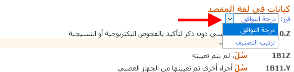
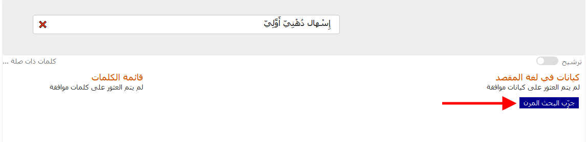
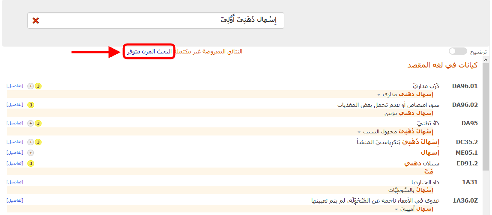

# البحث‬
            
تعمل أداة الترميز بالبحث فيها، وذلك عندما يواصل المستخدم الكتابة في مربع البحث: 

تنتج أداة الترميز (وتُحدِّث بشكل ديناميكيّ) نوعين مختلفين من المخرجات عند مواصلة البحث:

            

1. ## ⁩قائمة الكلمات
    
    على الجانب الأيسر من أداة الترميز، تظهر قائمة من الكلمات.

    إذا كنت في منتصف إحدى الكلمات، فسيحاول النظام تخمين الكلمة التي تقوم بكتابتها.
    
    
 
    إذا أكملت كتابة كلمة (هذا يعني أنك **ضغطت على زر المسافة** بعد نهاية الكلمة أو **قمت بتحديد كلمة** مباشرة من قائمة الكلمات)، فسيظهر لك النظام الكلمات الرئيسية ذات الصلة.     
    يتم حساب الصلة باستخدام عدد المرات التي تظهر فيها الكلمات معًا في التصنيف، وبعض المقاييس الأخرى المشابهة.
    
    

    يمكن فرز هذه القائمة حسب الصلة (الافتراضية) أو حسب الترتيب الأبجدي.
    
    

    من الممكن النقر فوق هذه الكلمات، بدلًا من مواصلة الكتابة.

     

2. ## كيانات الوجهة
    
    يعرض العمود الأوسط من المخرجات في واجهة أداة الترميز الكيانات المطابقة للبحث.
 
    يتم فرز المخرجات حسب جودة تطابق النص المُدخل مع العبارة الموجودة في التصنيف الدولي للأمراض. تم تظليل الكلمات المطابقة في هذه القائمة (أي: كلمة "السل" في لقطة الشاشة أدناه).    
    يظهر تركيز الفأرة أو لوحة المفاتيح (يمكن التمرير عبر قائمة الكيانات باستخدام المفتاحين لأعلى ولأسفل في لوحة المفاتيح) من خلال السهم الأحمر الموجود على الجانب الأيسر من الكيان، ومن خلال الخلفية ذات اللون الرمادي الفاتح.    

    

    على الجانب الأيمن من قائمة نتائج الكيانات، توضح أداة الترميز أيقونات صغيرة توفر معلومات محددة عن الكيانات، كما في لقطة الشاشة أدناه:  

    

    كل أيقونة لها معنى مختلف:

    - الربط اللاحق متاح لهذا الكيان: 
    - الربط اللاحق إلزامي لهذا الكيان: 
    - ملحوظة الترميز متاحة لهذا الكيان:     
    - توجد فئة/فئات ذات صلة في الفصل المعني بالأمهات لهذا الكيان:     
    - توجد فئة/ فئات مرتبطة بفصل الفترة المحيطة بالوِلادَة لهذا الكيان: 
    

    إذا كانت نتيجة البحث تحتوي على "تطابق مثالي"، فسيتم تأكيد الكيان المطابق بخلفية زرقاء (كما في لقطة الشاشة أدناه)
    
    

    يمكنك تغيير ترتيب الفرز باستخدام مربع القائمة المنسدلة الموجود أعلى القائمة. لديك خياران:

      - الفرز حسب نقاط التطابق (الافتراضي)
      - الفرز حسب ترتيب التصنيف

    

    توضح القائمة الرموز والعناوين فقط، باستثناء إذا لم يكن العنوان نتيجة بحث، مثلًا في لقطة الشاشة أدناه، يعد المصطلح المُظلل مصطلحًا مطابقًا:
    
    

    ### نتائج غير كاملة 
   
    إذا لم تكن الكلمة (الكلمات) التي تم إدخالها في البحث دقيقة بشكل كافٍ، ووجد النظام نتائج أكثر مما يمكن عرضه، فسيعرض النظام التنبيه الآتي:

    إذا وجد النظام نتائج في أكثر من 50 كيان، فسيعرض أفضل 50 حالة تطابق، وسيعرض التنبيه الآتي: ⁦*⁩النتائج الموضحة غير كاملة⁦*⁩

    

    

    في هذه الحالات، يُنصح بتوفير المزيد من المعلومات في خانة البحث.
    

    ### ⁩البحث المرن⁦ 

    يمكن استخدام خاصية البحث المرن في الحالات التي لا يؤدي فيها البحث العادي في أداة الترميز إلى أي نتائج.

    ⁦⁩

    تختلف طريقة إجراء البحث في البحث المرن على النحو التالي: 
    
    في البحث العادي، تعرض أداة الترميز فقط النتائج التي تحتوي على *جميع* الكلمات التي استخدمتها في خانة البحث. وتقبل الأداة المتغيرات أو المرادفات المختلفة للكلمات، ولكنها تبحث في الأساس عن النتائج التي تحتوي على جميع العناصر المذكورة في خانة البحث. بينما في البحث المرن، ليس بالضروري أن تحتوي النتائج على جميع الكلمات المكتوبة في خانة البحث. ستحاول أداة الترميز البحث عن أفضل عبارة مطابقة، ولكن قد لا يوجد أي حالات تطابق مع الكلمات المكتوبة في خانة البحث على الإطلاق.

    - على سبيل المثال، لنفترض أن المستخدم يبحث عن *إِسْهال دُهْنِيّ أَوَّلِيّ* ولا توجد عبارة في فهرس التصنيف-11 تحتوي على هذه الكلمات معًا. لن يعرض البحث العادي في أداة الترميز أي نتائج، بينما سيعرض البحث المرن نتائج تحتوي على إحدى الكلمتين. وفي هذه الحالة، ستحتوي أفضل النتائج على كلمة "إِسْهال دُهْنِيّ" والتي تعد أحد مصطلحات الفهرس المذكورة أسفل "حالات أخرى تم تعيينها أنها أعراض تتعلق بأسفل البطن أو بالسبيل الهضمي السفلي".    

     

    ⁦

    من الخصائص المرنة الأخرى محاولة البحث عن متغيرات أوسع نطاقًا للكلمات. على سبيل المثال، إذا بحث المستخدم عن _أدينوساركوما في الرئة_، فسيتم عرض _أورام خبيثة في القصبة أو في الرئة، لم يتم تعيينه_. وتظهر هذه النتيجة عند البحث بعبارة "أورام خبيثة" بدلًا من "أدينوساركوما".

    ### النسخ السريع 

    يؤدي النقر فوق الرمز (أو عنوان الرمز)، أو الضغط على مفتاح الإدخال في لوحة المفاتيح، إلى نسخ الرمز المحدد في الحافظة. يمكنك التحقق من الرموز المنسوخة في أي وقت في الحافظة الموجودة أعلى يمين الصفحة:

    ⁦⁩

    
    ### ⁩تفاصيل الكيانات⁦ 

    عند النقر فوق رابط "التفاصيل" (أو فوق أي من الأيقونات الصغيرة)، يتم فتح محتوى تفاصيل الكيان على الجانب الأيمن من كل نتيجة (انظر لقطات الشاشة أدناه):

    

    

    في أعلى محتوى تفاصيل الكيان، ومن خلال الرابط «إظهار الكل»، تعرض أداة الترميز جميع المصطلحات المطابقة للكيان الحالي

        

    بالنقر على الرابط «إخفاء»، ستختفي جميع المصطلحات المطابقة، ما عدا المصطلحات الخمسة الأولى

    
                
3. ## توزيع / عامل تصفية الفصول 
    
    على الجانب الأيمن، عند الضغط على زر التبديل، تعرض أداة الترميز توزيع الفصول ويمكن ضبط عوامل التصفية من أجل البحث.

    

    يعرض توزيع الفصول عدد حالات التطابق الموجودة في كل فصل بالتصنيف.

    
              
    بشكل افتراضي، يبحث النظام في جميع الفصول باستثناء فصلي *رموز الامتداد* *والطب الشعبي*. يمكنك تغيير عامل التصفية من خلال النقر فوق خانات الاختيار الموجودة بالقرب من أسماء الفصول. إذا لم تضع علامة في خانة أحد الفصول، فلن يتم عرض النتائج من هذا الفصل.
 
    يؤدي النقر فوق عنوان الفصل إلى عرض النتائج من هذا الفصل فقط.
              
    

    يؤدي النقر فوق *عرض النتائج من المجموعة الافتراضية* إلى إعادة ضبط عوامل تصفية الفصول التي حددتها، وعرض النتائج من جميع الفصول باستثناء فصلي *رموز الامتداد* *والطب الشعبي*.
              
    

