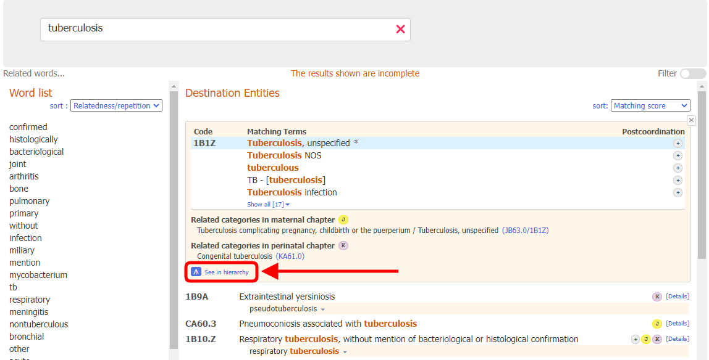
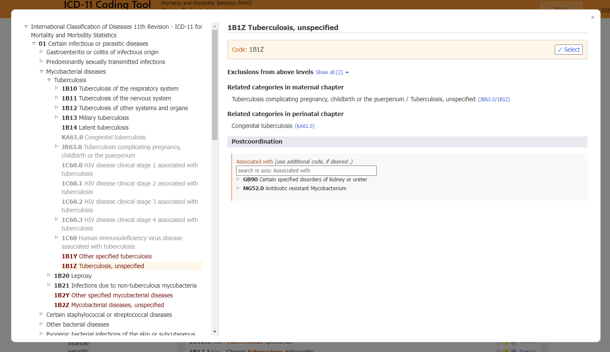
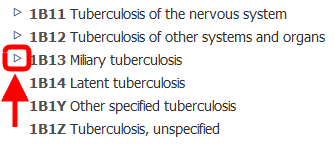

# Integrated browser

When the entity details are displayed, clicking on the maximize icon (the small square indicated in the screenshot below) opens the ICD-11 browser within the coding tool

The integrated ICD-11 browser is displayed in the page as a foreground window

The entity's data displayed on the right side of the browser are (if present):

- Fully Specified Name
- Description
- Additional Information
- Inclusions
- Exclusions
- Exclusions from above levels
- Coded Elsewhere
- Related categories in maternal chapter
- Related categories in perinatal chapter
- Coding Note
- Coding Note from above levels
- Postcoordination

When browsing ICD-11, you will see the classification hierarchy on the left side of the screen. Clicking on any entity will display the details of that entity on the right side of the screen

Initially, the system only opens the hierarchy of the selected code. However, you may make the children of every entity visible by clicking on the small triangles on the left side of the entities. 

