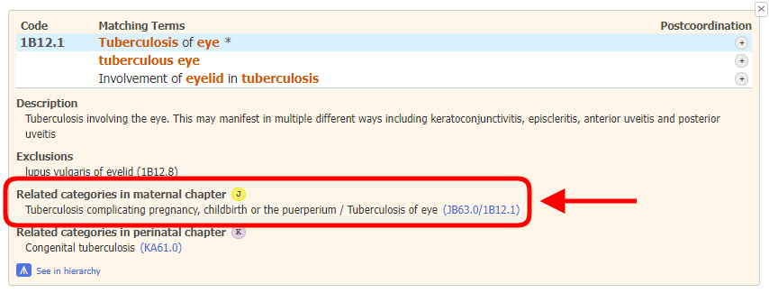
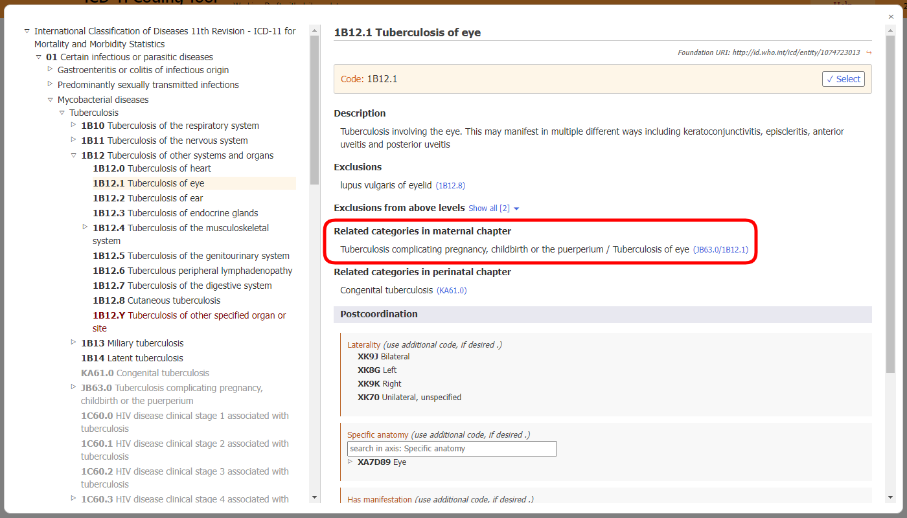
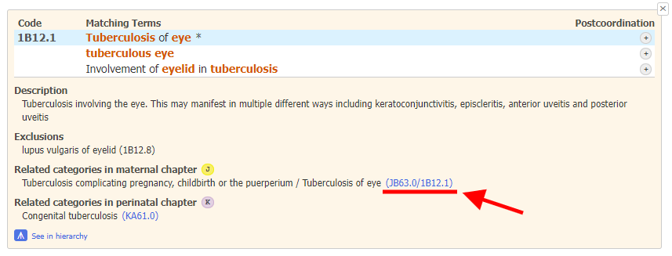
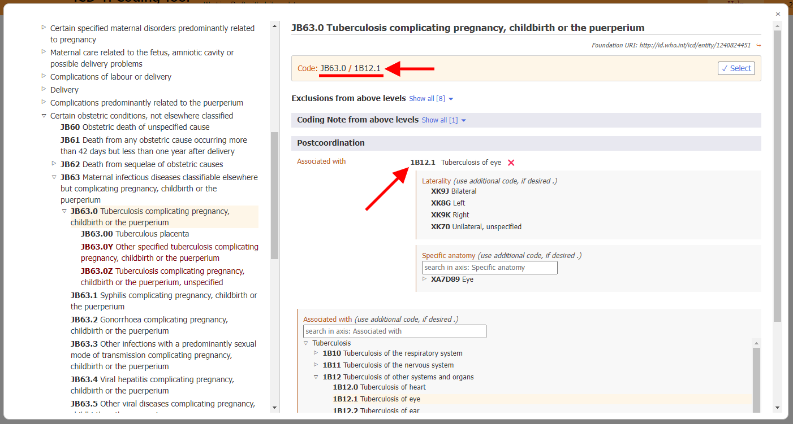

# Related categories in maternal chapter

When coding maternal mortality, mostly the case is coded to Chapter 18. To simplify this and also to be able to keep the detail coming from the rest of the classification, ICD-11 Coding Tool provides you maternal chapter alternative codes. 

If the search result has a maternal code alternative, you'll see the J icon.

When you open the details of the entity in the results list, the "Related categories in maternal chapter" section is displayed for that entity.     

For example, the entity "Tuberculosis of eye" (1B12.1) has as related category in maternal chapter the entity "Tuberculosis complicating pregnancy, childbirth or the puerperium" (JB63.0)
This code is combined with the code of Tuberculosis of eye (1B12.1) and the resulting code becomes JB63.0/1B12.1. 

When you are on an entity in the integrated ICD-11 browser, the "Related categories in maternal chapter" section is shown as below

Clicking on the link within the "Related categories in maternal chapter" section, in this example JB63.0/1B12.1 (below underlined in red in the entity details screenshot and also in the integrated browser screenshot)

The integrated browser directly opens the related entity in the maternal chapter (in the example below: "JB63.0 Tuberculosis complicating pregnancy, childbirth or the puerperium") postcoordinated with the entity selected (in the example below: "1B12.1 Tuberculosis of eye") without any user intervention

