# Searching

The Coding Tool works by searching as the user continues typing in the searchbox: 

Coding Tool generates (and dynamically updates) two different outputs as the search continues:

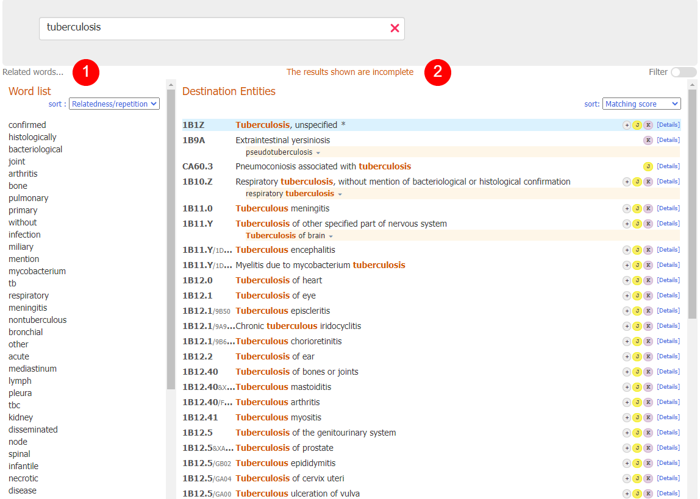
            
1. ## Word list 
    
    On the left side the Coding Tool shows a list of words.

    If you are in the middle of a word the system will try to guess the word that you are typing.
    
    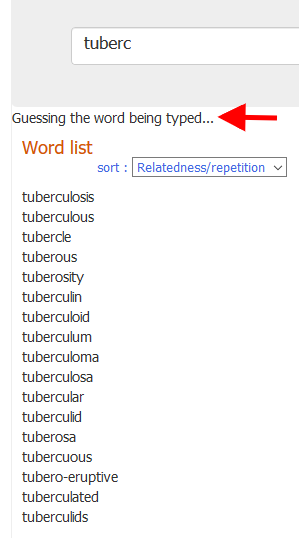
 
    If you have completed a word (it means that you have **typed a space** at the end of a word, or you have **selected a word** directly from the word list) the system will show you related keywords.     
    The relatedness is calculated by using the number of times the words appear together in the ICD together with some other similar measures.
    
    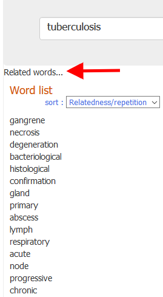

    This list can be sorted by relatedness (default) or alphabetically
    
    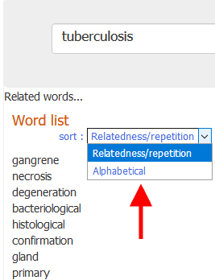

    It is possible to click these words instead of continuing to type.

     

2. ## Destination Entities
    
    The middle output of the Coding Tool interface shows the matched entities of the search.
 
    This output is sorted by how well the text entered matches the phrase in the ICD. The matched words are highlighted in this list (e.g: the word "tuberculosis" in the screenshot below).    
    The mouse's focus or the keyboard's focus (you can scroll throw the entities list also with the keyboard up and down keys) is showing by the red arrow on the left side of the entity and by the light-grey background.    

    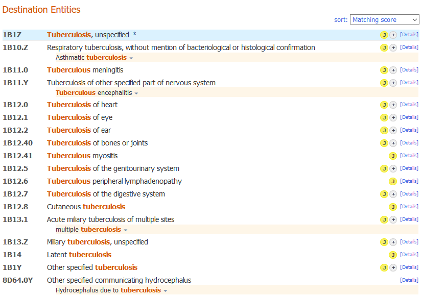

    On the right side of the entities result list, the Coding Tool also shows small icons that provide specific information about entities, as in the screenshot below:  

    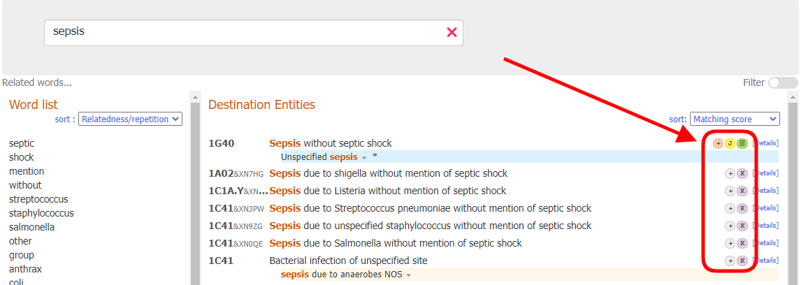

    Every icon has a different meaning:
    
    - Postcoordination is available for this entity: 
    - Postcoordination is mandatory for this entity: 
    - Coding note is available for this entity:     
    - There is/are a related category/categories in maternal chapter for this entity:     
    - There is/are a related category/categories in perinatal chapter for this entity:     

    

    If the search result contains a "perfect match", the matching entity is emphasized with a blue background (as in the screenshot below)
    
    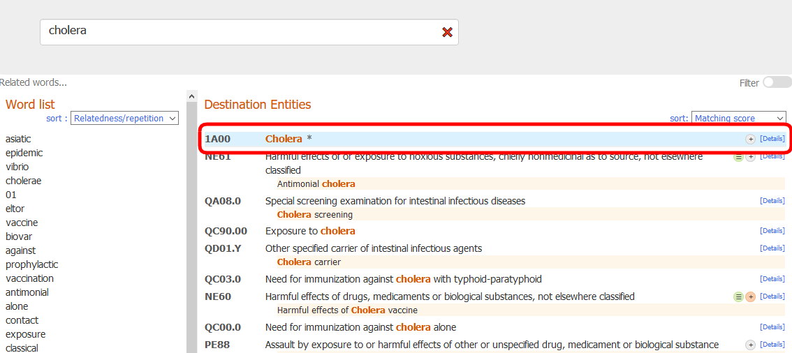

    You may change the sort order by using the dropdown box at the top of the list. We have two options    

    - Sort by matching score (default)
    - Sort by classification order

    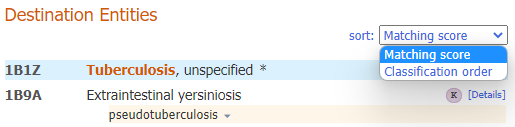

    The list shows only the codes and titles, except if the title is not a search result. e.g in the screenshot below, the highlighted term is a matching term:
    
    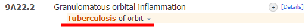

     

    ### Incomplete results
   
    If the word(s) that have been entered in the search are not precise enough and the system finds more results than it could show, it gives the following warnings:

    If it finds results in more than 50 entities, it will show the best 50 matches and will place the warning: *The results shown are incomplete*

    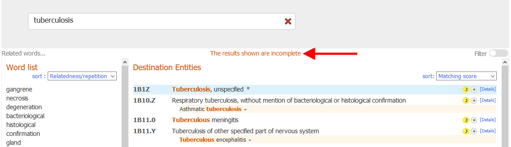

    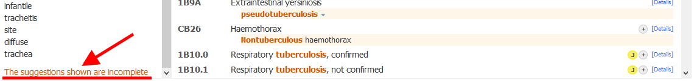

    In these cases, you are advised to provide more information in the search area.
    
     

    ### Flexible Search 

    Flexible search feature could be used in cases when the Coding Tool's regular search do not return any results.

    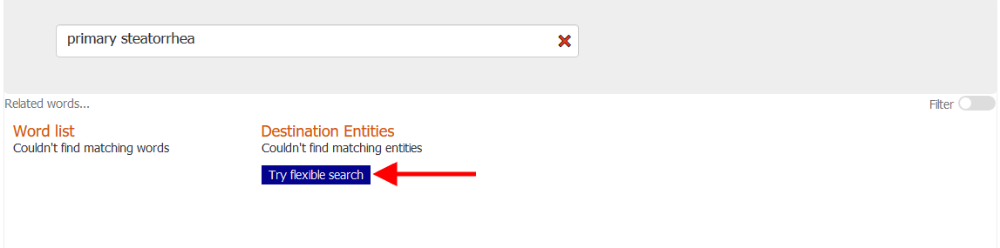

    The way searching is performed in the flexible search mode is different in the following aspects:

    In the regular search mode, the Coding Tool will only give you results that contain *all* of the words that you've used in your search. It accepts different variants or synonyms of the words but essentially it searches for a result that contains all components of your search. Whereas in flexible search mode, the results do not have to contain all of the words that are typed. It would still try to find the best matching phrase but there may be words in your search that are not matched at all.

    - For example, let's say the user is searching for *primary steatorrhea* and there is no phrase in the ICD-11 index that contains these words together. The regular search of the Coding Tool will not give you any results whereas the flexible search will give you results that contain one of the words. The top result in this case will be steatorrhoea which is an index term under Other specified symptoms related to the lower gastrointestinal tract or abdomen.    

     

    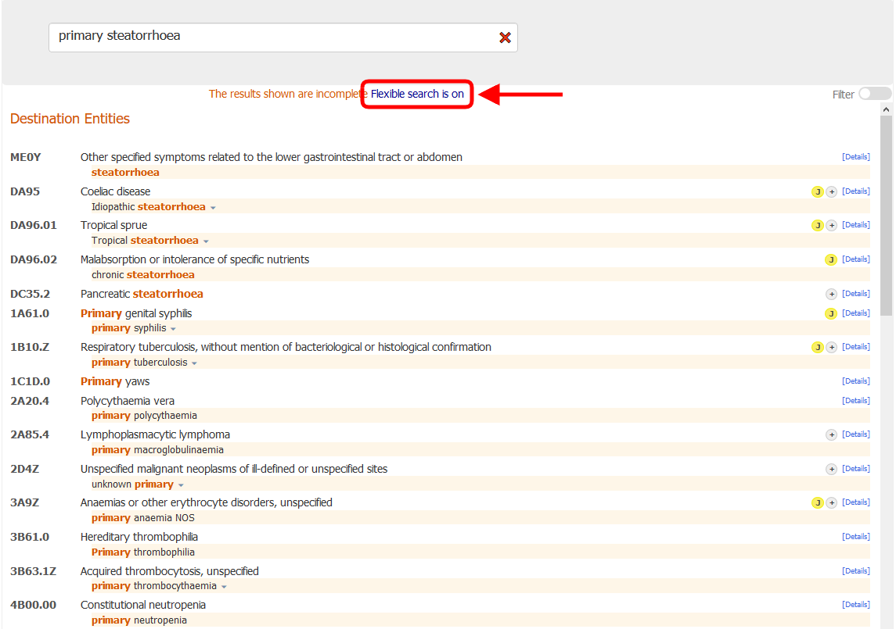

    Another flexibility added is trying also some broader variants of the words. For example if the user searches _Lung adenosarcoma_, they will get _Malignant neoplasms of bronchus or lung, unspecified_ . This is done by trying with "malignant neoplasm" instead of "adenosarcoma" phrase.

     

    ### Quick copying

    Clicking on the code (or on the code's title), or pressing the enter key on keyboard, copies the code selected  into the clipboard. You can check what code is copied in the clipboard at any time on the right top of the page:

    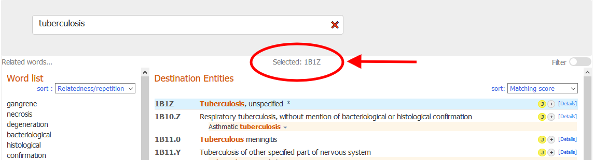

     
    
    ### Entity details

    Clicking on "details" link (or on one of the small icons), on the right of every result opens the entity details content (see screenshots below):

    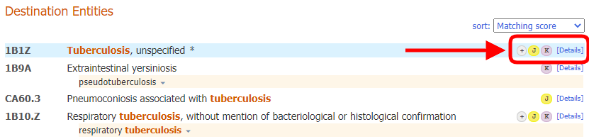

    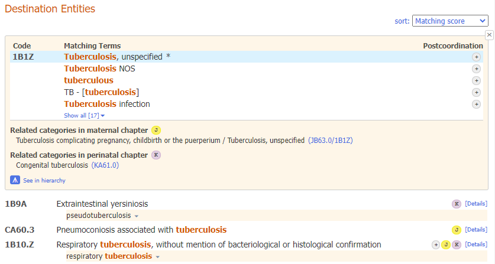

    On the top of the entity details content, by means of the link "show all", the Coding Tool shows all the matching terms for the current entity.

    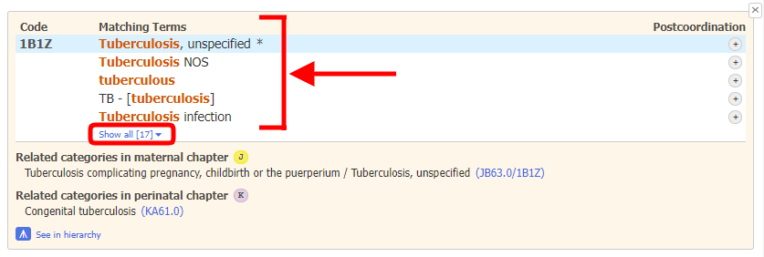

    Clicking on the "hide" link will hide all the matching terms except the first five terms.

    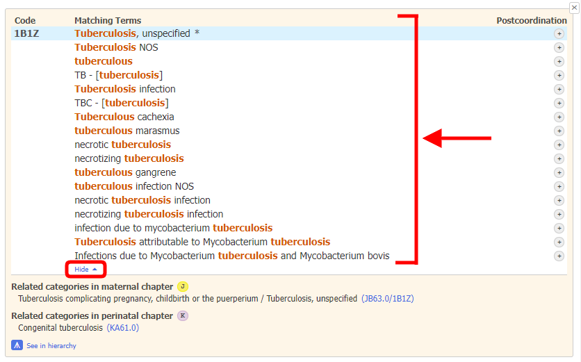

     
                
3. ## Chapter distribution / filter
    
    On the right side, by means of a switch button, the Coding Tool shows the chapter distribution and is able to set filters for the search.

    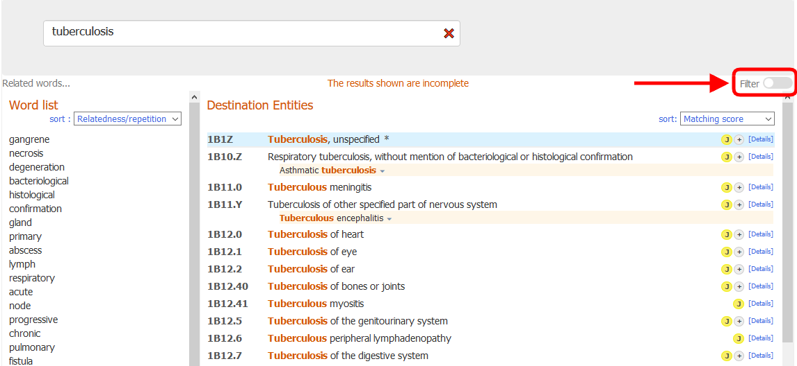

    The chapters distribution shows the number of matches found in each chapter of the classification.

    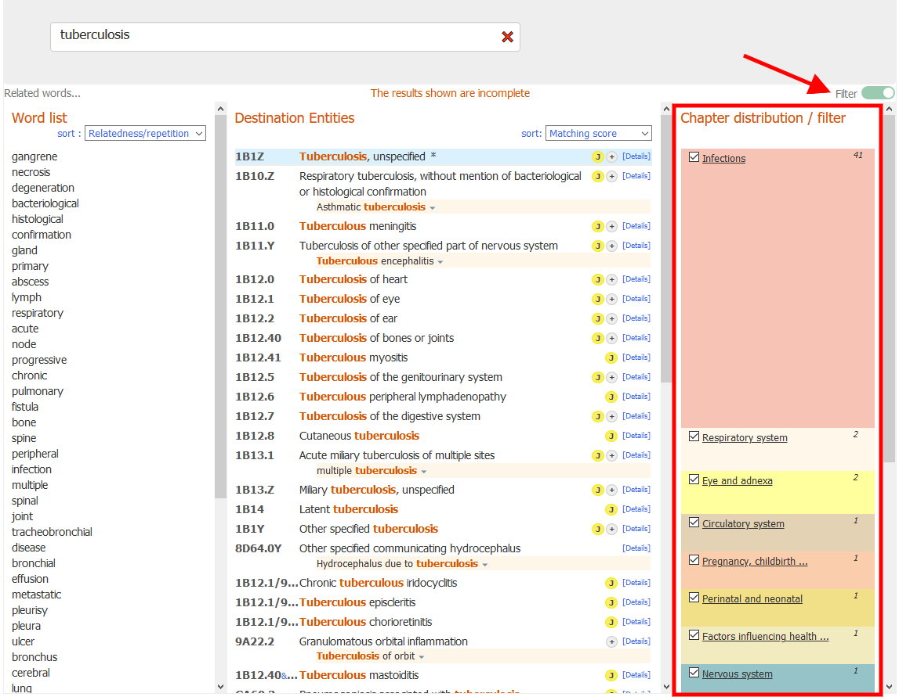
              
    By default, the system searches all chapters except the *Extension Codes* and the *Traditional Medicine*.
    One can change the filter by clicking on the checkboxes near the chapter names. If unticked, the results from that chapter are not shown.
 
    Clicking on a chapter title will show you the results only from that chapter
              
    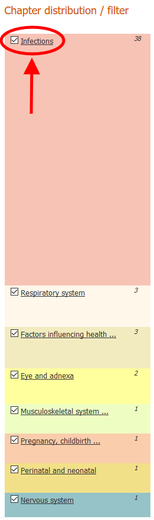

    Clicking on the *Show results from default set* will reset the chapter filters that you've defined and give you results from all chapters except the *Extension Codes* and the *Traditional Medicine*
              
    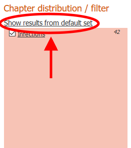

