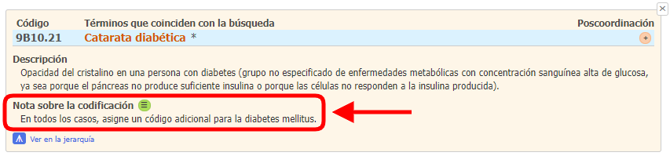
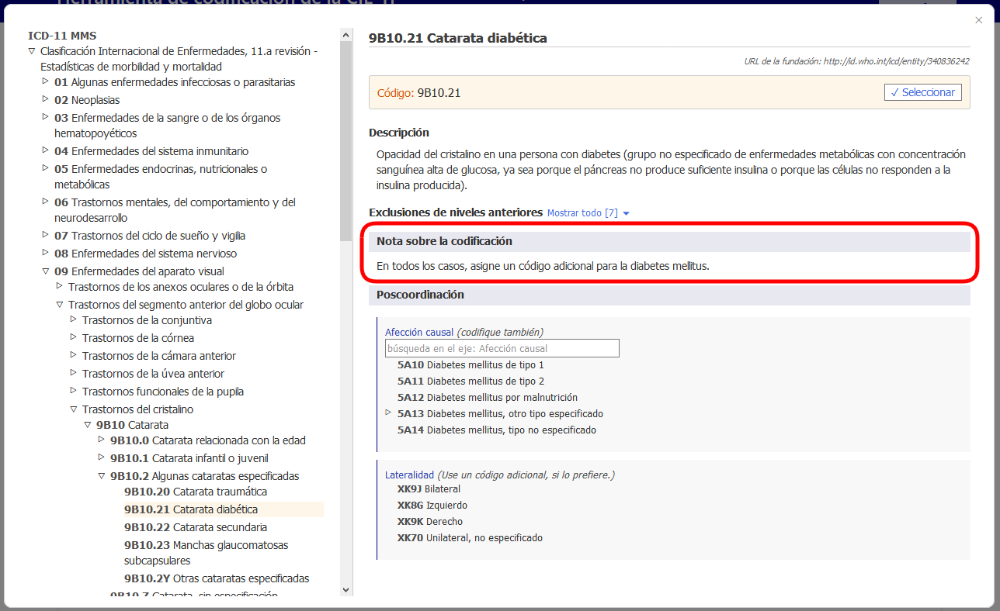

# Nota sobre la codificación

Cuando el usuario abre los detalles de una entidad que aparece en la lista de resultados, si la entidad tiene alguna nota sobre la codificación, el usuario podrá visualizarla en el navegador integrado a la herramienta de codificación (véase un ejemplo en la captura de pantalla).

Cuando el usuario abre una entidad en el navegador integrado a la herramienta de codificación, la sección correspondiente a las notas sobre la codificación aparece como se muestra a continuación.

