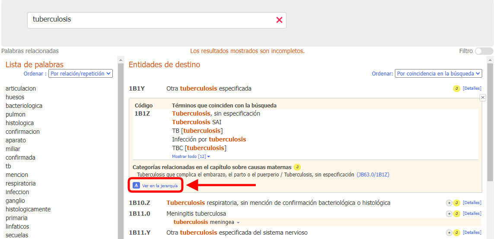
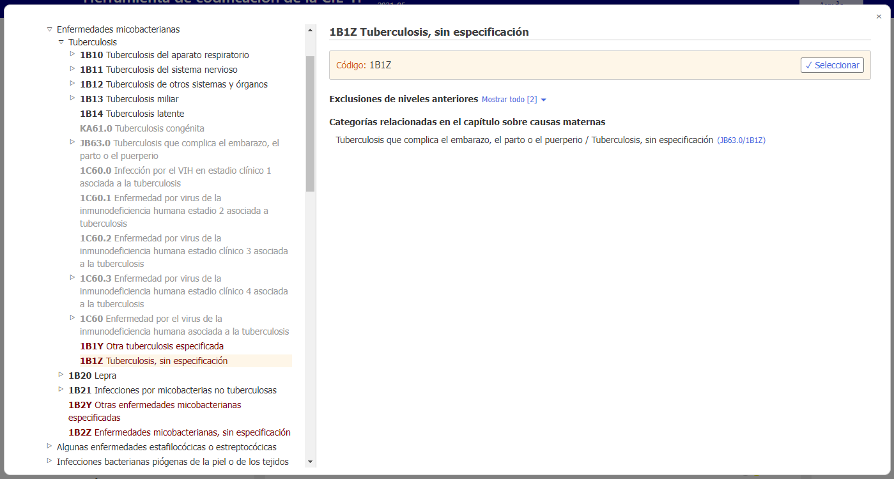
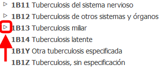

# Navegador integrado

Al abrir los detalles de la entidad y luego hacer clic en el ícono de maximizar (el cuadro pequeño que se observa en la captura de pantalla de abajo), se abre el navegador de la CIE-11 dentro de la herramienta de codificación.

Este navegador integrado aparece como una ventana de primer plano.

En el lado derecho del navegador aparece la siguiente información de la entidad (si está disponible):

- Nombre completo especificado
- Descripción
- Información adicional
- Inclusiones
- Exclusiones
- Exclusiones de niveles anteriores
- Codificado en otra parte
- Categorías relacionadas en el capítulo sobre causas maternas
- Related categories in perinatal chapter
- Nota sobre la codificación
- Poscoordinación

Al navegar en la CIE-11, el usuario verá la jerarquía de la clasificación en la parte izquierda de la ventana. Si hace clic en cualquier entidad, podrá ver los detalles de esa entidad en la parte derecha de la ventana.

Inicialmente, el sistema solo abre la jerarquía del código seleccionado. Sin embargo, el usuario puede visualizar las entidades hijas de cualquier entidad haciendo clic en los triángulos que se encuentran a la izquierda de las entidades. 

