# Poscoordinación

El sistema de poscoordinación permite agregar más detalles a la entidad seleccionada. Pueden agregarse distintos tipos de información a diferentes elementos. Por ejemplo, puede agregarse información adicional sobre "histopatología" a la mayoría de las categorías de neoplasia pero no a otras categorías de la clasificación.

Cuando el usuario abre los detalles de una entidad que aparece en la lista de resultados, el enlace de poscoordinación solo aparece si puede aplicarse poscoordinación a esa entidad.

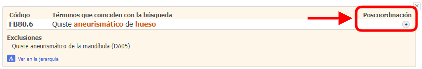

Cuando el usuario está viendo una entidad en el navegador de la CIE-11 integrado a la herramienta de codificación, el área de poscoordinación solo mostrará los ejes de poscoordinación que pueden aplicarse a esa entidad.

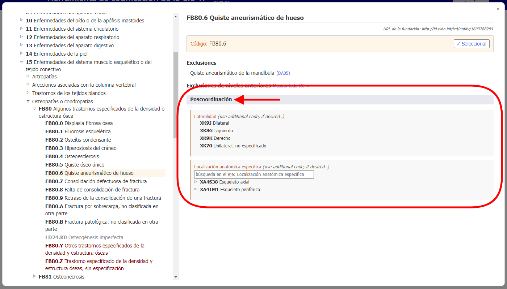

Algunas categorías tienen información que, para los múltiples propósitos de la CIE, está incompleta. En estos casos, el vínculo dice "poscoordinación obligatoria".    

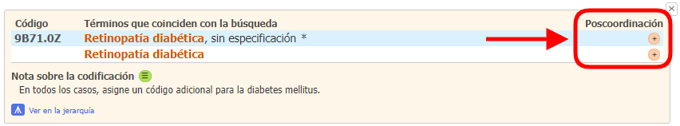

Si la poscoordinación es obligatoria, la nota "*(codifique también)*" en el área de poscoordinación del navegador indica que debe agregarse la información correspondiente a este eje.   

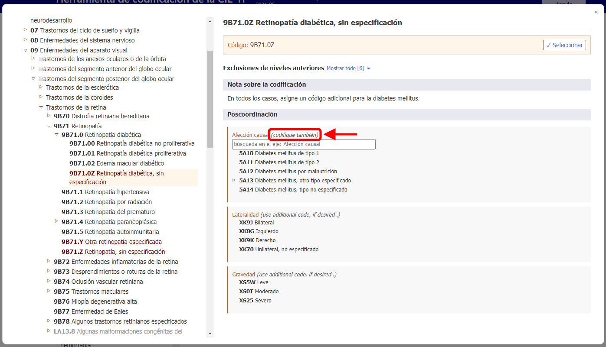

Para abrir la poscoordinación correspondiente a un término coincidente específico, debe hacer clic en uno de los íconos de poscoordinación en el lado derecho del contenido "detalles" de la entidad
El ícono puede ser La poscoordinación está disponible:

O La Postcoordinación es obligatoria: 

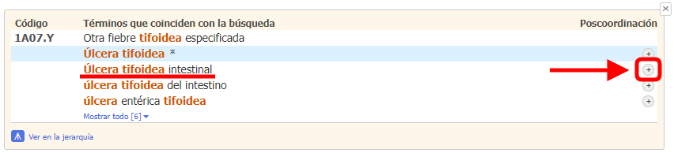

En el navegador integrado de la CIE-11, el término coincidente correspondiente se muestra como "Término seleccionado". La Herramienta de codificación también mostrará el URI de la Fundación del término seleccionado si es diferente del URI de la Fundación de la entidad actual (ver la captura de pantalla a continuación).

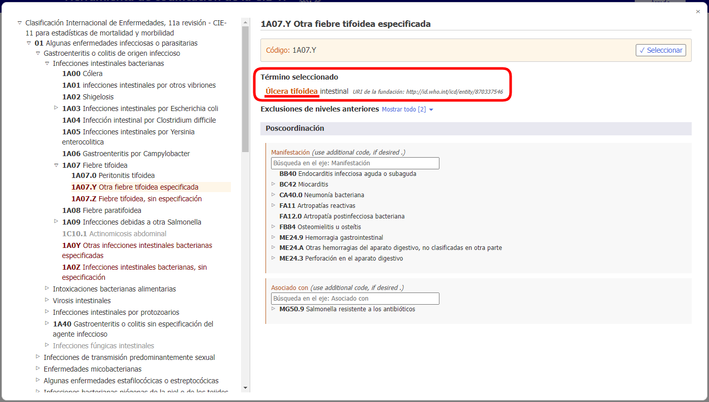

## Mostrar o buscar grupos de valores

Usando algunos de los ejes de poscoordinación pueden obtenerse valores de un grupo más pequeño de valores posibles ("lateralidad", por ejemplo), mientras que en algunos ejes pueden obtenerse valores de un grupo bastante grande (como "histopatología").

  - Si el conjunto de valores es pequeño, el navegador mostrará todos los valores posibles con sus códigos.

    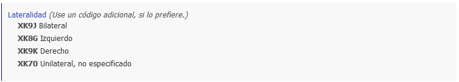

  - Si el conjunto de valores es grande, el usuario puede buscar en la jerarquía del eje de poscoordinación. De no ser posible, puede buscar los grupos de valores escribiéndolos en el cuadro de búsqueda. El navegador solo buscará los valores de ese eje.     

    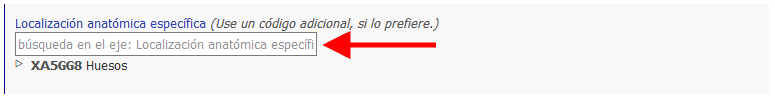
  
  - A veces, aunque el conjunto de valores para un eje sea grande, no todos los valores del grupo son aplicables a una entidad. En tales casos, el navegador buscará y mostrará solo la parte pertinente. Si el número de valores que pueden aplicarse es menor de 12, el navegador los mostrará todos. Si hay más resultados, el navegador permitirá hacer búsquedas en el eje y navegarlo.

    Por ejemplo, en el caso de "quiste aneurismático de hueso" puede hacerse la poscoordinación con "detalle anatómico específico" pero no todos valores son aplicables, por lo que el navegador buscará y mostrará solo los pertinentes. En el ejemplo de abajo, cuando el usuario busca "cabeza", el sistema solo muestra los resultados que se encuentran en la ramificación "huesos" del eje "detalle anatómico específico". 
    
    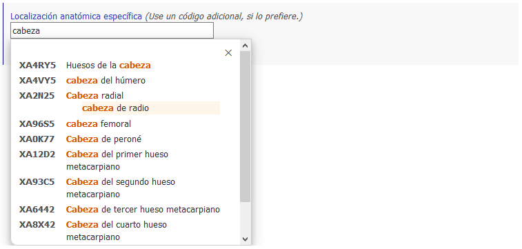

## Creación de una cadena de códigos

Para crear un código, hay que hacer clic en los valores que se muestran en los resultados de la búsqueda, en la jerarquía o en las listas más cortas. 

En el ejemplo de abajo se muestra el código de "neoplasia maligna de mama con información sobre lateralidad y detalle anatómico específico".     
Lo seleccionado en la poscoordinación aparece en la parte superior del área de poscoordinación y la cadena de códigos generada aparece encima de la sección de poscoordinación.      
Al hacer clic en el botón "Seleccionar" la cadena de códigos seleccionada se copia en el portapapeles.

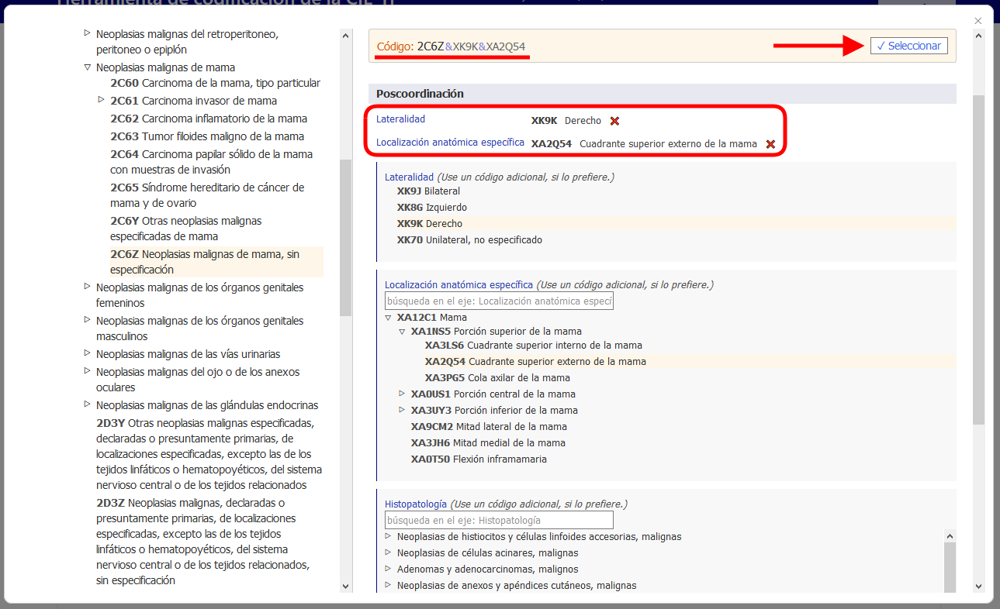

## Poscoordinación usando varios valores del mismo eje

En la mayoría de los ejes de poscoordinación, el sistema permite un valor por eje.      
Por ejemplo, al hacer la poscoordinación de "gravedad" no se pueden seleccionar los valores "leve" y "moderado" al mismo tiempo. Sin embargo, en ciertos ejes, el sistema permite asignar varios valores. Los ejes que permiten más de un valor son los siguientes:

- Asociado con
- Afección casual
- Tiene manifestación clínica
- Detalle anatómico específico
- Agentes infecciosos
- Agentes químicos
- Medicación

En estos ejes, el usuario puede suministrar más de un valor. Por ejemplo, cuando se permite hacer la poscoordinación con detalle anatómico específico, puede seleccionar más de una localización.

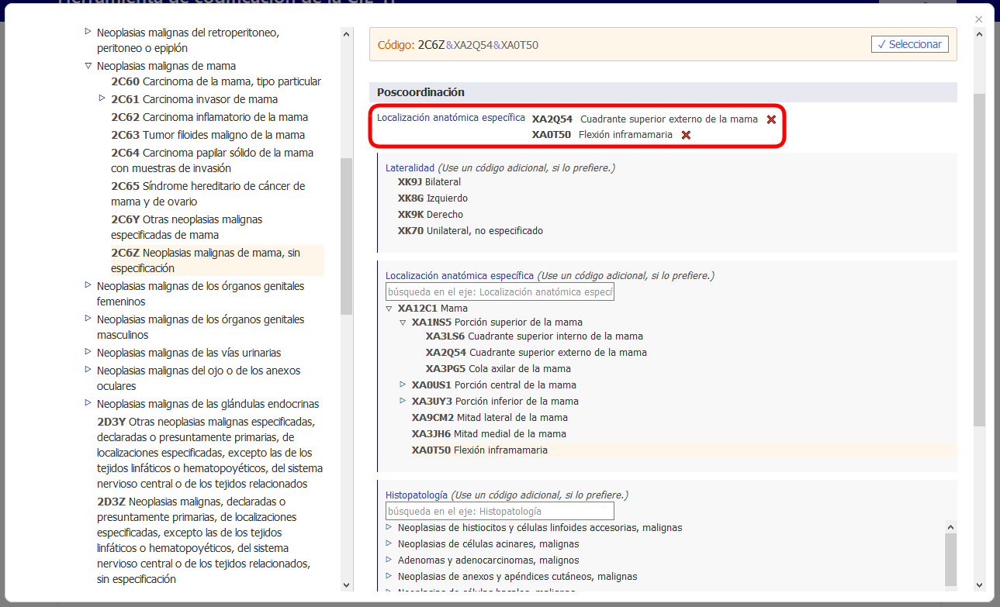

En algunos de los ejes de causas externas, se permiten varios valores solo cuando vienen de diferentes bloques.

Por ejemplo, al hacer la poscoordinación de "Evento no intencional en transporte terrestre en el tránsito que causa traumatismo a ciclista" usando el eje "descriptor del evento de transporte", podemos usar un valor del bloque "Papel como usuario del vehículo de la persona lesionada en un evento de transporte" y otro del bloque "Contraparte en una colisión de transporte terrestre", pero no podemos usar dos valores del mismo bloque.

Cuando no se permite usar varios valores para un eje y el usuario hace clic en un segundo valor, el sistema reemplazará el valor existente. Por ejemplo, si hace la poscoordinación de gravedad y ya ha seleccionado "leve" como valor, al hacer clic en "moderado" se reemplazará el valor "leve" con el valor "moderado". 

## Equivalencia de poscoordinación/precoordinación

En algunos casos, la combinación que crea el usuario puede ser equivalente a una entidad de la clasificación. En estos casos, cuando se cree el código, el sistema usará automáticamente el concepto precoordinado. En el ejemplo de abajo, el usuario ha seleccionado Carcinoma invasor de la mama y ha hecho la poscoordinación con Carcinoma infiltrante del conducto, SAI. Sin embargo, en vez de dar dos códigos, el sistema solo da uno porque en la clasificación hay una categoría para esta combinación (2C61.0 carcinoma invasor de la mama) que, por tanto, se da como código. 

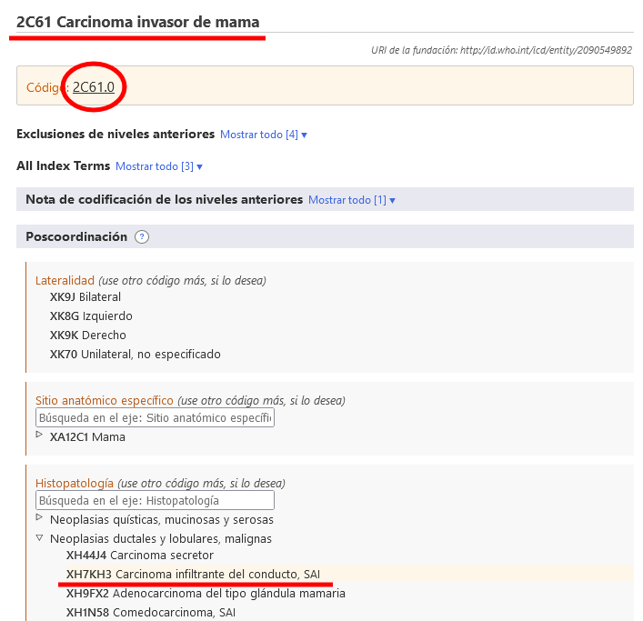

## Poscoordinación anidada

En algunos casos, el sistema puede suministrar una mayor especificación de los valores de poscoordinación. Si el usuario conoce el detalle específico, debe seleccionar la entidad más precisa; de lo contrario, debe seleccionar la menos específica.

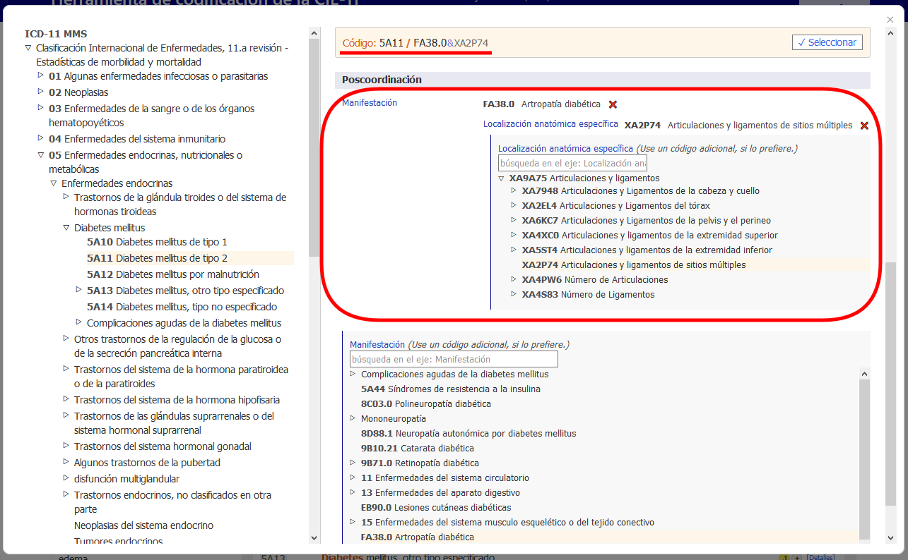

## Other postcoordination

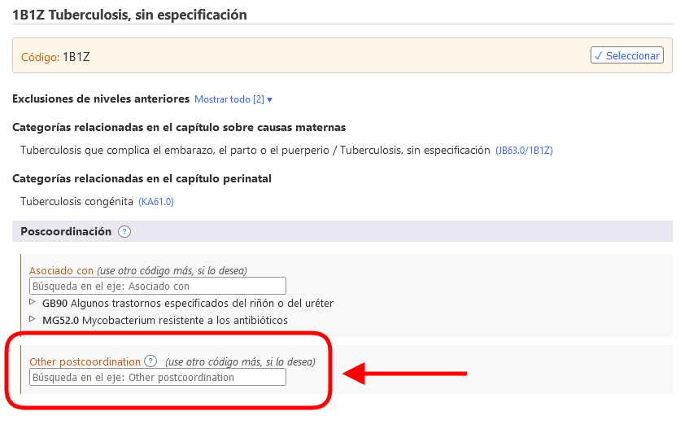