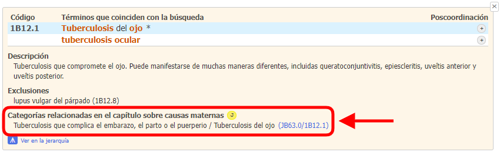
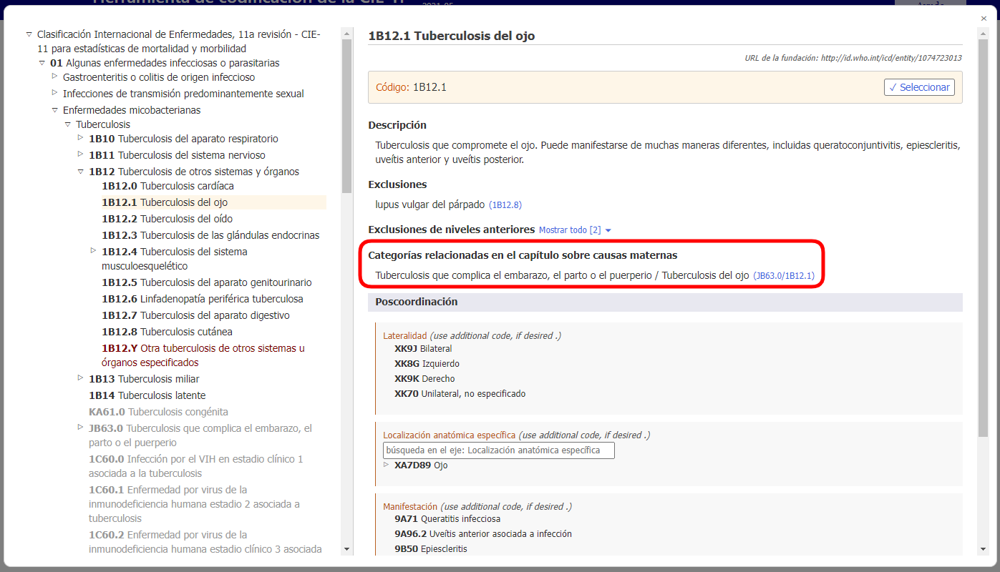
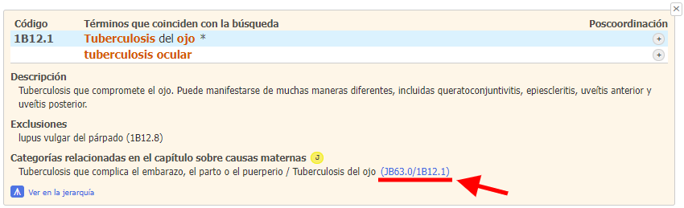
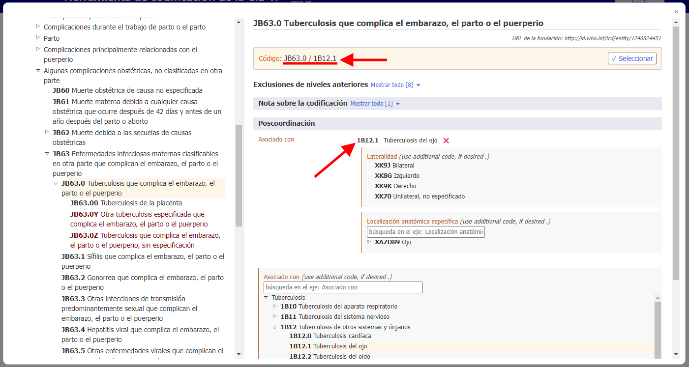

# Categorías relacionadas en el capítulo sobre causas maternas   

Cuando se codifica la mortalidad materna, en la mayor parte de los casos el código de la causa subyacente se encuentra en el capítulo 18. Para simplificar la codificación y para evitar que aparezcan detalles del resto de la clasificación, la herramienta de codificación de la CIE-11 suministra códigos alternativos al capítulo de causas maternas.  

Si en los resultados de la búsqueda aparece un código alternativo relacionado con causas maternas, el usuario verá el ícono J.

Cuando abra los detalles de la entidad en la lista de resultados, verá una sección sobre categorías relacionadas con el capítulo de causas maternas.     

Por ejemplo, la entidad "Tuberculosis del ojo" (1B12.1) tiene como categoría relacionada en el capítulo de causas maternas la entidad "Tuberculosis que complica el embarazo, el parto o el puerperio" (JB63.0). Este código se combina con el código de tuberculosis del ojo (1B12.1) y el código resultante pasa a ser JB63.0/1B12.1. 

Cuando el usuario abre una entidad en el navegador integrado, la sección sobre categorías relacionadas en el capítulo sobre causas maternas aparece como se ve en la siguiente captura de pantalla.

Se puede hacer clic en el enlace de la sección de categorías relacionadas en el capítulo sobre causas maternas, que en este ejemplo es el código JB63.0/1B12.1 (subrayado en rojo abajo en las capturas de pantalla de los detalles de la entidad y el navegador integrado).

El navegador integrado abre directamente la entidad relacionada en el capítulo sobre causas maternas (en el ejemplo de abajo: "JB63.0 Tuberculosis que complica el embarazo, el parto o el puerperio") con la poscoordinación con la entidad seleccionada (en el ejemplo de abajo: "1B12.1 Tuberculosis del ojo") sin intervención del usuario.

