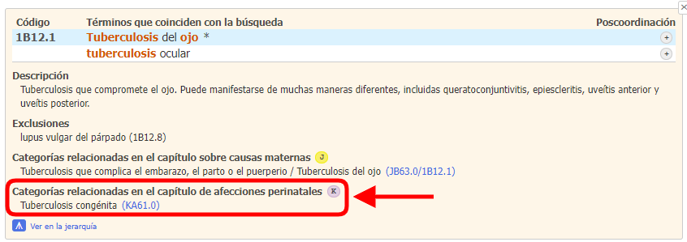
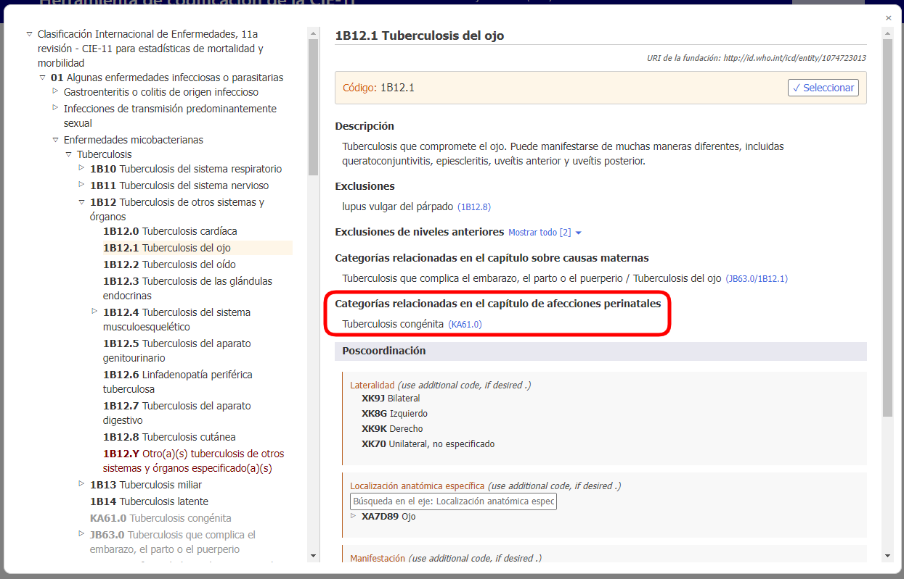
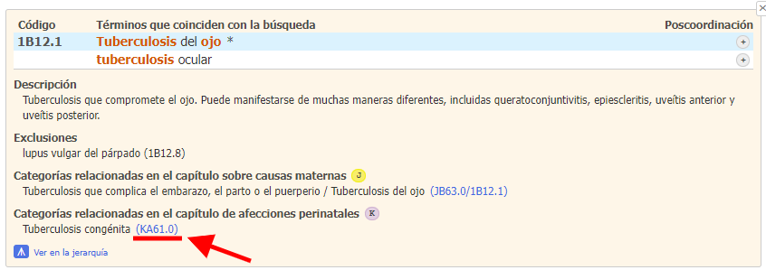
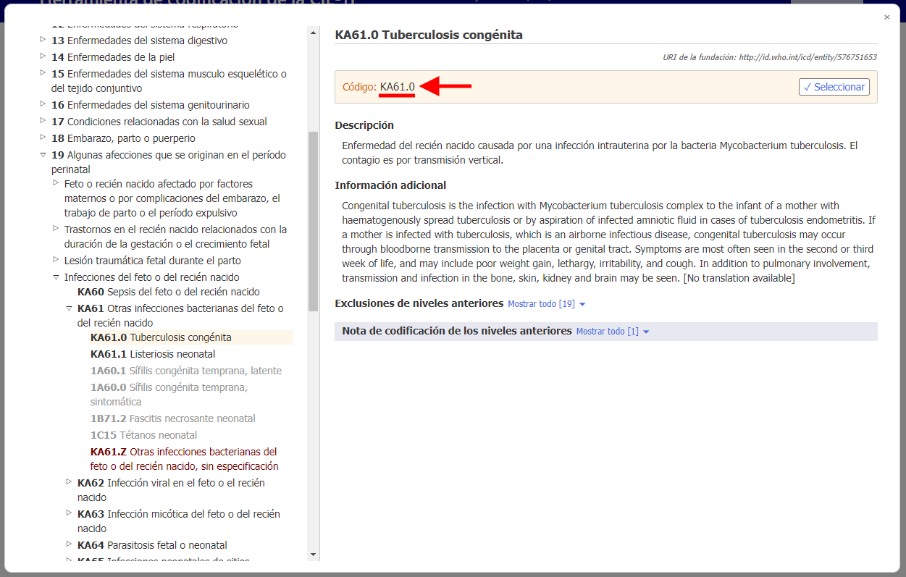

# Categorías relacionadas en el capítulo de afecciones perinatales   

Al codificar la mortalidad perinatal, la mayoría de los casos se codifican en el Capítulo 19. Para simplificar esto y también para poder mantener los detalles provenientes del resto de la clasificación, la herramienta de codificación de la CIE-11 le proporciona códigos alternativos del capítulo perinatal.

Si el resultado de la búsqueda tiene una alternativa de código perinatal, usted verá el ícono K.

Cuando usted abre "detalles" de la entidad en la lista de resultados, se despliega la sección "Categorías relacionadas en el capítulo perinatal" para esa entidad.

Por ejemplo, la entidad "Tuberculosis del ojo" (1B12.1) tiene como categoría relacionada en el capítulo perinatal a la entidad "Tuberculosis congénita" (KA61.0)

Cuando usted está en una entidad en el navegador integrado de la CIE-11, la sección "Categorías relacionadas en el capítulo perinatal" se muestra como a continuación

Haciendo clic en el enlace dentro de la sección "Categorías relacionadas en el capítulo perinatal", en este ejemplo KA61.0 (abajo subrayado en rojo en la captura de pantalla de detalles de la entidad y también en la captura de pantalla del navegador integrado)

El navegador integrado abre directamente la entidad relacionada en el capítulo perinatal (en el ejemplo siguiente: "KA61.0 Tuberculosis congénita") sin intervención del usuario

