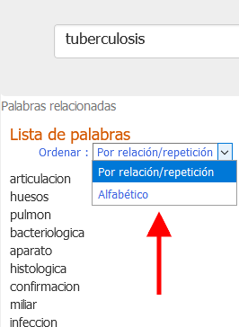
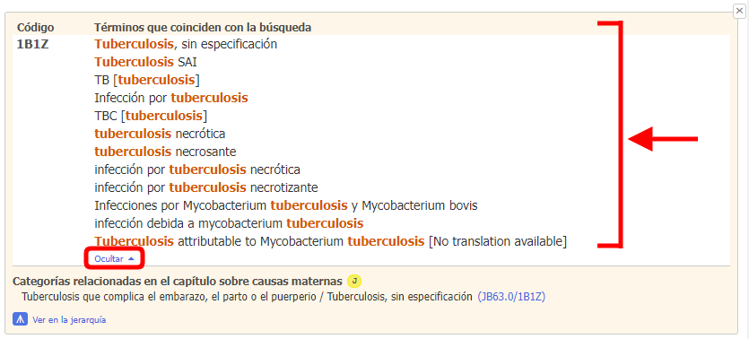

# Búsqueda

La herramienta de codificación permite hacer búsquedas a medida que el usuario escribe en el cuadro de búsqueda: 

A medida que se introduce la búsqueda, la herramienta de codificación genera (y actualiza de manera dinámica) dos resultados diferentes:

           

1. ## Lista de palabras
    
    Del lado izquierdo aparece una lista de palabras.

    Si el usuario ha escrito la mitad de una palabra, el sistema tratará de adivinar lo que está escribiendo.
    
     
 
    Si el usuario ha terminado de escribir una palabra (es decir, si **escribe un espacio** al final de una palabra, o si **selecciona una palabra** directamente de la lista de palabras) el sistema mostrará palabras clave relacionadas.     
    El grado de relación se calcula usando el número de veces que las palabras aparecen juntas en la CIE junto con otros criterios similares.
    
    

    Esta lista puede ordenarse por relación/repetición (criterio predeterminado) u orden alfabético.
    
    

    Se puede hacer clic en estas palabras en lugar de seguir escribiendo.

     

2. ## Entidades destinatarias
    
    En el medio de la interfaz de la herramienta de codificación aparecen las entidades que coinciden con la búsqueda.
 
    Los resultados se ordenan según el grado de coincidencia que haya entre el texto escrito y la CIE. En esta lista de resultados, las palabras buscadas aparecerán marcadas para que se destaquen (por ejemplo, la palabra "tuberculosis" en la captura de pantalla que se presenta más abajo).    
    La entidad seleccionada con el mouse o el teclado (el usuario puede desplazarse por la lista usando las flechas hacia arriba y hacia abajo del teclado) aparece marcada con una flecha roja del lado izquierdo y un fondo de color gris claro.    

    

    Del lado derecho de la lista de entidades encontradas en la búsqueda, la herramienta de codificación muestra unos íconos que dan información específica sobre las entidades, como se ve en la siguiente captura de pantalla:  

    

    Cada ícono tiene un significado diferente:
    
    - Poscoordinación disponible para esta entidad: 
    - Poscoordinación obligatoria para esta entidad: 
    - Nota de codificación disponible para esta entidad:     
    - Hay una o más categorías relacionadas con esta entidad en el capítulo sobre causas maternas:     
    - Hay una o más categorías relacionadas en el capítulo perinatal para esta entidad:     

    Si entre los resultados de la búsqueda hay una "coincidencia perfecta", esta aparecerá destacada con un fondo azul (como en la captura de pantalla que se presenta a continuación).
    
    

    El usuario puede cambiar el orden utilizando el menú desplegable que se encuentra en la parte superior de la lista, donde podrá ver dos opciones:

    - por coincidencia en la búsqueda (criterio predeterminado)
    - por orden en la clasificación

    

    En la lista solo aparecen los códigos y los títulos, salvo que el término buscado no aparezca en el título. Véase un ejemplo en la siguiente captura de pantalla, donde se resalta el término que coincidió con la búsqueda:
    
    

    ### Resultados incompletos
   
    Si la palabra o palabras escritas en el cuadro de búsqueda no son lo suficientemente precisas y el sistema encuentra más resultados de los que puede mostrar, aparecerán las advertencias que se muestran en la captura de pantalla abajo.

    Si encuentra resultados en más de 50 entidades, mostrará los 50 mejores y aparecerá el siguiente mensaje: *Los resultados que se muestran están incompletos*

    

    

    En estos casos, se recomienda introducir más información en el cuadro de búsqueda.
    

    ### Búsqueda flexible

    Si el usuario hace una búsqueda normal en la herramienta de codificación y no obtiene resultados, puede hacer una búsqueda flexible.

    

    En el modo de búsqueda flexible, las búsquedas son diferentes:

    En el modo de búsqueda normal, la herramienta de codificación solo dará resultados que tengan *todas* las palabras que se han usado en la búsqueda. Acepta diferentes variantes de las palabras y sinónimos, pero básicamente busca resultados que tengan todos los elementos que se introdujeron. En la búsqueda flexible, los resultados no necesariamente tienen todas las palabras que escribe el usuario. El sistema procurará encontrar las frases que coincidan mejor, pero puede haber resultados en los que no aparezcan algunas de las palabras introducidas en la búsqueda. 

    - Por ejemplo, digamos que el usuario busca *esteatorrea primaria*. Como en el índice de la CIE-11 no hay ninguna frase que tenga esas dos palabras juntas, al hacer una búsqueda normal en la herramienta de codificación no se obtendrán resultados, pero al hacer una búsqueda flexible se obtendrán resultados que tengan una de las palabras. En este caso, el primer resultado será "esteatorrea", que es un término del índice en la entidad "Otros síntomas especificados relacionados a la parte baja del aparato gastrointestinal o el abdomen".  

     

    

    Otra flexibilidad se encuentra al hacer búsquedas con variantes más amplias de los términos. Por ejemplo, si el usuario escribe _adenocarcinoma de pulmón_, tendrá como resultado _Neoplasias malignas del bronquio o el pulmón, sin especificación_. Esto se logra usando la frase "neoplasia maligna" en lugar de "adenocarcinoma".

    ### Copiado rápido

    Al hacer clic en el código (o en el título correspondiente), o al presionar la tecla "Entrar" en el teclado, se copia el código seleccionado en el portapapeles. El código que se copiará en el portapapeles aparece en todo momento en la parte superior derecha de la página:

    

    
    ### Detalles de la entidad

    Al hacer clic en el vínculo "detalles" que se encuentra a la derecha de cada resultado (o en uno de los pequeños íconos que están a un lado), se abre el contenido detallado de la entidad:

    

    

    En la parte superior del contenido de los detalles de la entidad, mediante el enlace "mostrar todo", la herramienta de codificación muestra todos los términos que coinciden para la entidad.

    

    Al hacer clic en el enlace "Ocultar", se esconderán todos los términos coincidentes excepto los primeros cinco.

    

                
3. ## Distribución por capítulos y filtro
    
    El usuario de la herramienta de codificación encontrará arriba, a la derecha, un botón de alternancia, el cual permite mostrar la distribución por capítulos y crear filtros para las búsquedas.

    

    La distribución por capítulos muestra el número de coincidencias encontradas en cada capítulo de la CIE

    
              
    De manera predeterminada, el sistema hace la búsqueda en todos los capítulos excepto el de *Códigos de extensión* y el de *Medicina tradicional*.

    El usuario puede cambiar el filtro haciendo clic en las casillas que se encuentran al lado de los nombres de los capítulos. Si no aparece ninguna marca, no se mostrarán los resultados de ese capítulo.
 
    Al hacer clic en el título de un capítulo se podrán ver los resultados de ese capítulo.
              
    

    Al hacer clic en *Mostrar resultados de selección predeterminada* se restablecerán los filtros definidos y se obtendrán resultados de todos los capítulos excepto el de *Códigos de extensión* y el de *Medicina tradicional*.
              
    

