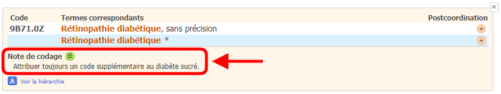
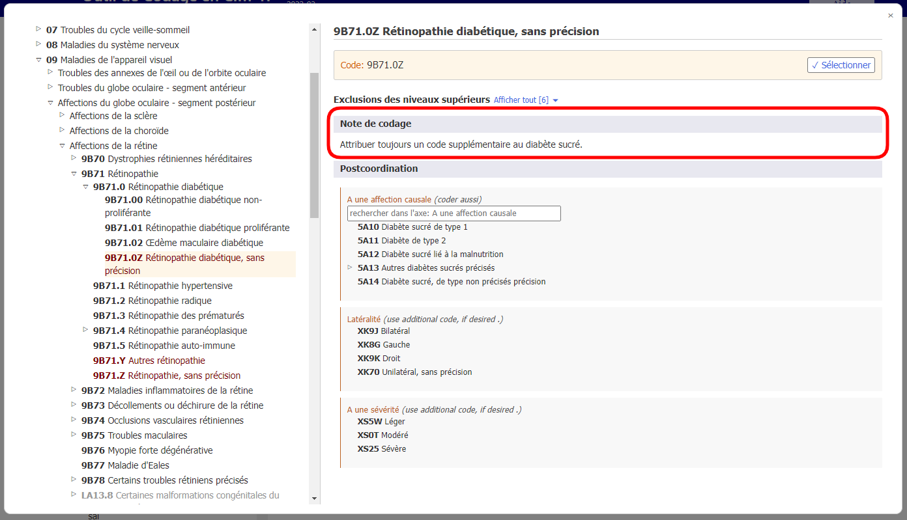

# Note de codage

Lorsque vous avez ouvert le détail d'une entité dans la liste des résultats, la section « Note de codage » s'affiche si elle est disponible pour cette entité (voir la capture d'écran ci-dessous).

Lorsque vous êtes sur une entité dans le navigateur intégré CIM-11, la section « Note de codage » s'affiche comme ci-dessous

