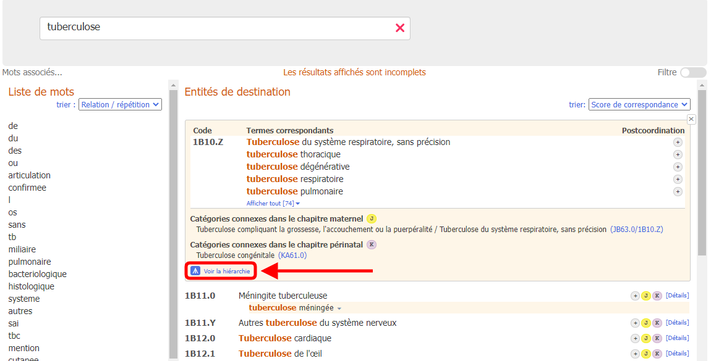
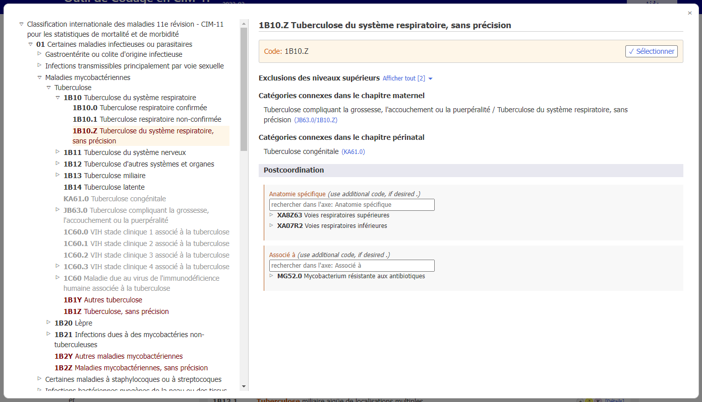
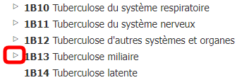

# Navigateur intégré

Lorsque les détails de l'entité sont affichés, un clic sur l'icône de maximisation (le petit carré indiqué dans la capture d'écran ci-dessous) ouvre le navigateur CIM-11 dans l'outil de codage.

Le navigateur intégré CIM-11 est affiché dans la page comme une fenêtre de premier plan.

Les données de l'entité affichées sur le côté droit du navigateur sont (si elles sont présentes) : 

- Nom entièrement précisé
- Description
- Informations supplémentaires
- Inclusions
- Exclusions
- Exclusions des niveaux ci-dessus
- Codé ailleurs
- Catégories connexes dans le chapitre maternité
- Catégories connexes dans le chapitre périnatal
- Note de codage
- Note de codage des niveaux supérieurs
- Postcoordination

Lorsque vous naviguez dans la CIM-11, vous verrez la hiérarchie de classification sur le côté gauche de l'écran. En cliquant sur une entité, les détails de cette entité s'affichent dans la partie droite de l'écran.

Initialement, le système n'ouvre que la hiérarchie du code sélectionné. Cependant, vous pouvez rendre visibles les enfants de chaque entité en cliquant sur les petits triangles situés à gauche des entités.

