# Postcoordination

Le système de postcoordination permet d'ajouter plus de détails à l'entité choisie. Différents types d'informations peuvent être ajoutés à différents éléments. Par exemple, des informations supplémentaires sur l' « Histopathologie » peuvent être ajoutées à la plupart des catégories de Tumeurs, mais elles ne peuvent pas être ajoutées aux autres catégories de la classification.

Lorsque vous avez ouvert le détail d'une entité dans la liste des résultats, le lien de postcoordination n'est affiché que si la postcoordination est applicable à cette entité (voir la capture d'écran ci-dessous).

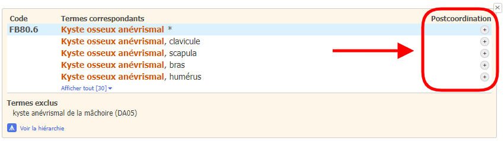

Lorsque vous vous trouvez sur une entité dans le navigateur intégré CIM-11, la zone de postcoordination n'affichera que les axes de postcoordination possibles qui sont applicables à cette entité

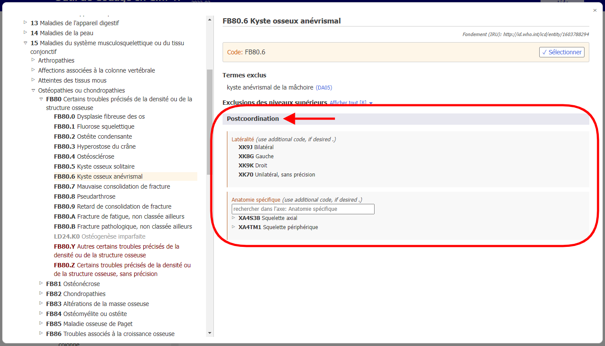

Certaines catégories contiennent des informations qui sont incomplètes pour les multiples objectifs de la CIM. Dans ces cas, le lien est marqué par l’icône « Postcoordination obligatoire ».

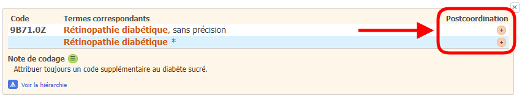

Si la postcoordination est obligatoire, la note « (coder aussi) » dans la zone de postcoordination du navigateur indique que des informations doivent être ajoutées pour cet axe.

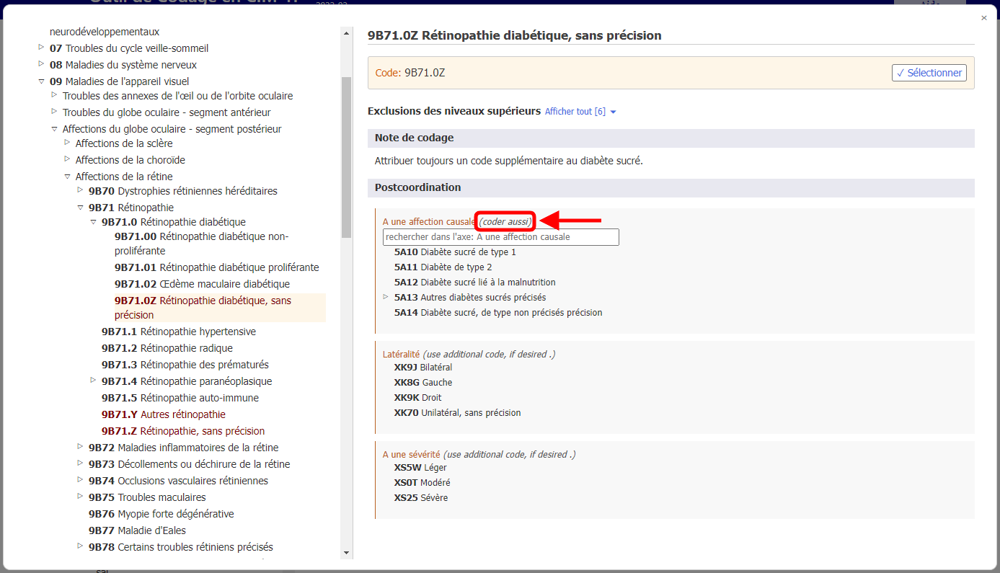

Pour ouvrir la postcoordination correspondant à un terme spécifique, vous devez cliquer sur l'une des icônes de postcoordination situées à droite du contenu des détails de l'entité.    
L'icône « Postcoordination possible » est disponible :

Ou l’icône « ¨Postcoordination obligatoire » est affiché : 

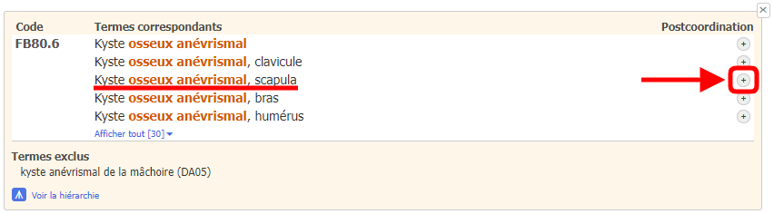

Dans le navigateur intégré CIM-11, le terme correspondant est affiché comme « Terme sélectionné ». L’outil de codage affichera également l'URI de base du terme sélectionné s'il est différent de l'URI de base de l'entité actuelle (voir la capture d'écran ci-dessous).

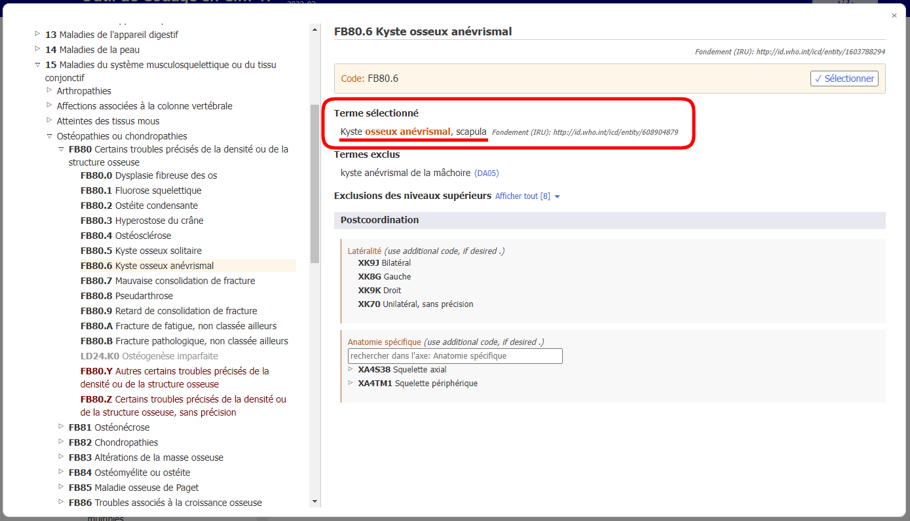

## Affichage / Recherche de jeux de valeurs

Certains axes de postcoordination peuvent contenir des valeurs à partir d'un plus petit ensemble de valeurs possibles, comme la Latéralité, tandis que d'autres axes peuvent contenir des valeurs à partir d'un plus grand ensemble de valeurs, comme l'Histopathologie. 
    
  - Si la valeur définie est petite, le navigateur affichera toutes les valeurs possibles avec leurs codes.

    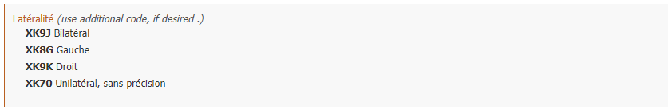

  - Si le jeu de valeurs est important, vous parcourez l'arborescence de l'axe de postcoordination. Sinon, vous pouvez rechercher les ensembles de valeurs en tapant dans le champ de recherche. Le navigateur ne recherchera que les valeurs pour cet axe.

    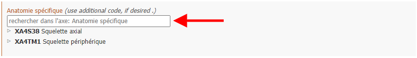

  - Parfois, même si l'ensemble des valeurs réelles d'un axe est important, toutes les valeurs de l'ensemble de valeurs ne sont pas applicables à une entité. Dans ce cas, le navigateur n'affichera/recherchera que la partie pertinente. Si le nombre de valeurs pouvant être appliquées est inférieur à 12, le navigateur les énumérera toutes. Si le résultat est supérieur à 12, le navigateur permettra la recherche et la navigation dans l'axe.

    Par exemple, le « Kyste osseux anévrysmal » peut être postcoordonné avec le « Détail anatomique spécifique » mais toutes les valeurs ne sont pas applicables. Dans ce cas, le navigateur n'affiche/recherche que les valeurs pertinentes. Dans l'exemple ci-dessous, lorsque l'utilisateur recherche « Tête », le système ne montre que les résultats qui se trouvent dans la branche « Os » de l'axe « Détail anatomique spécifique ».

    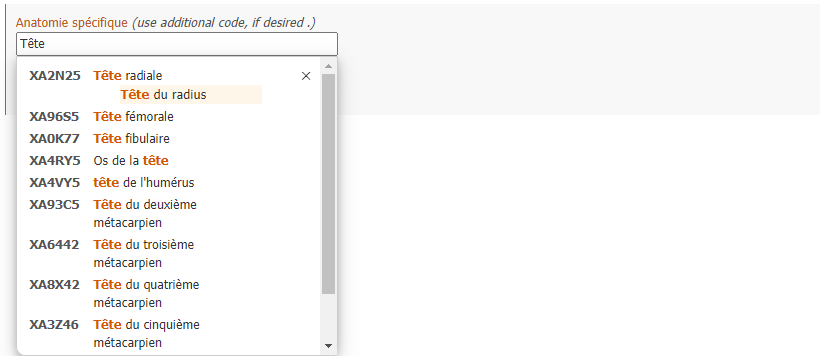

## Construire une chaîne de code

Pour construire un code, vous devez cliquer sur les valeurs qui sont affichées dans les résultats de la recherche, dans la hiérarchie ou dans les listes plus courtes.

L'exemple ci-dessous montre comment coder « Néoplasme malin du sein détaillé avec latéralité et anatomie spécifique ».     
Les sélections de postcoordination sont indiquées en haut de la section de postcoordination et la chaîne de code générée est indiquée au-dessus de la section de postcoordination.     
En cliquant sur le bouton « Sélectionner », la chaîne de code générée est copiée dans le presse-papiers.

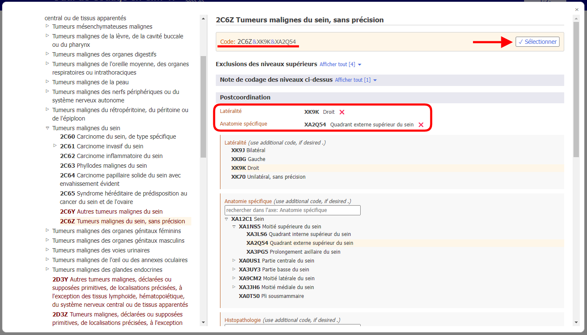

## Postcoordination utilisant plusieurs valeurs du même axe

Le système autorise une valeur par axe pour la plupart des axes de postcoordination.      
Par exemple, lors de la postcoordination avec la « gravité », vous ne pouvez pas choisir les valeurs « légère » et « modérée » en même temps. Cependant, pour certains axes, le système permet de fournir plusieurs valeurs. Les axes qui autorisent des valeurs multiples sont les suivants :

- Associé à
- Affection causale
- A pour manifestation
- Anatomie spécifique
- Agents infectieux
- Agents chimiques
- Médicaments

Pour ces axes, vous pouvez fournir plus d'une valeur. Par exemple, lorsque la postcoordination avec une anatomie spécifique est autorisée, vous pouvez sélectionner plus d'un site.

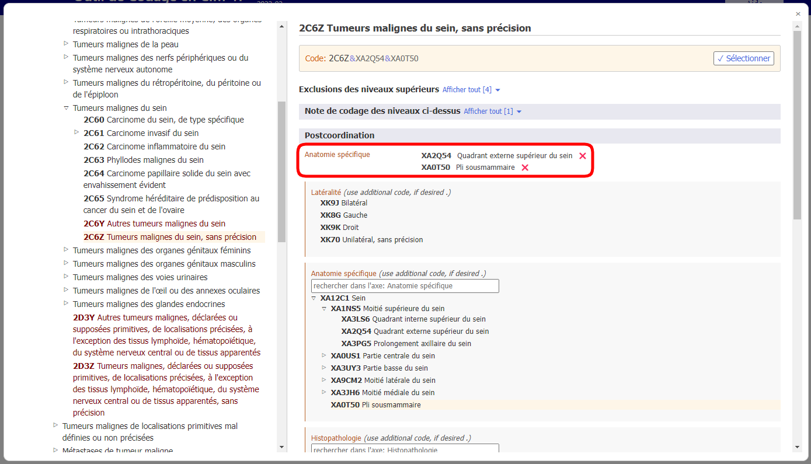

Et pour certains axes de causes externes, nous autorisons plusieurs valeurs uniquement lorsqu'elles proviennent de blocs différents. 

Par exemple, lors de la postcoordination d'un « Evénement de transport terrestre involontaire blessant un cycliste à pédale » en utilisant l'axe Descriptif de l'événement de transport, nous pouvons utiliser une valeur du bloc « RÔLE DE L'UTILISATEUR DU VÉHICULE D'UNE PERSONNE BLESSÉE LORS D'UN ÉVÉNEMENT DE TRANSPORT » et une autre du bloc « PARTIE PRENANTE DANS UN ACCIDENT DE TRANSPORT TERRESTRE » mais nous ne pouvons pas utiliser deux valeurs du même bloc.

Lorsque plusieurs valeurs pour un axe ne sont pas autorisées et que l'utilisateur clique sur la deuxième, le système remplace la valeur existante. Par exemple, lorsque vous effectuez une postcoordination avec la gravité et que vous avez déjà choisi la valeur « léger », le fait de cliquer sur « modéré » remplacera la valeur « léger » par la valeur « modéré ».

## Equivalence postcoordination / précoordination

Dans certains cas, la combinaison construite par l'utilisateur peut être équivalente à une entité existante dans la classification. Dans ces cas, le système utilisera automatiquement le concept précoordonné lorsqu'il construira un code. Dans l'exemple ci-dessous, l'utilisateur a choisi le Carcinome invasif du sein et l'a postcoordonné avec le Carcinome canalaire infiltrant, SAI. Cependant, au lieu de donner deux codes, le système n'en donne qu'un seul car dans la classification il y a une catégorie pour cette combinaison : le 2C61.0 Carcinome canalaire invasif du sein est donc donné comme le code à utiliser. 

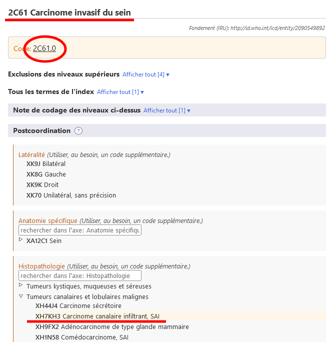

## Postcoordination nichée

Dans certains cas, le système peut fournir une spécification supplémentaire des valeurs de postcoordination. Si le détail spécifique est connu, sélectionnez l'entité la plus précise. Sinon, sélectionnez l'entité la moins précise.

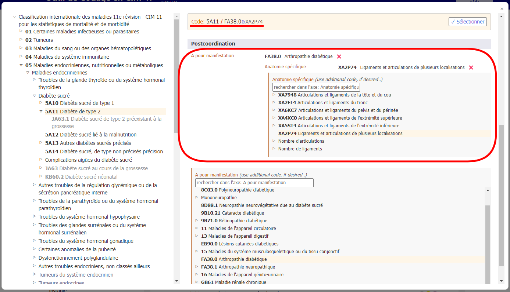

## Autre postcoordination

De nombreuses entités ont des axes de postcoordination suggérés ou obligatoires qui les concernent. Vous pouvez voir ces axes dans la zone de postcoordination et les utiliser pour affiner votre entité.

Cependant, vous devrez parfois postcoordonner une entité avec d'autres entités qui ne sont ni suggérées ni requises. Dans ce cas, vous pouvez utiliser la zone « autre postcoordination » pour construire votre expression de postcoordination en utilisant un ensemble plus large d'entités de classification.

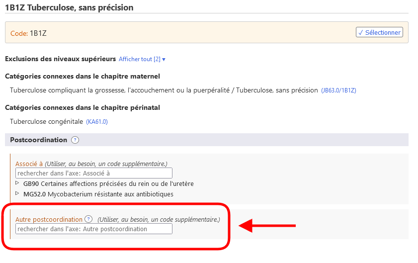
