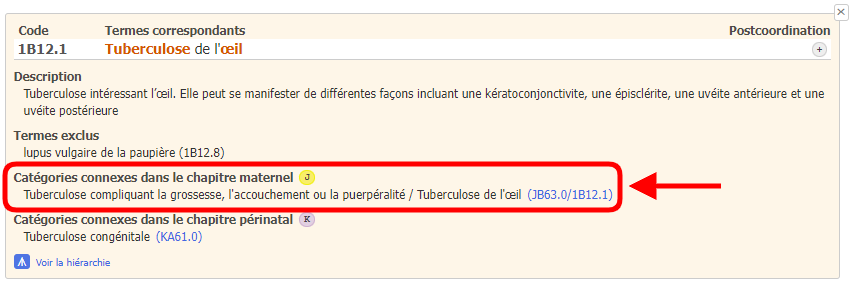
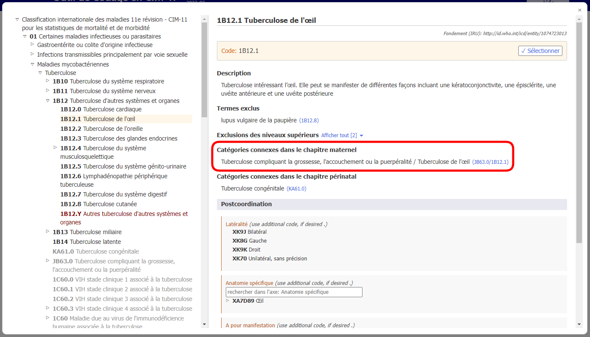
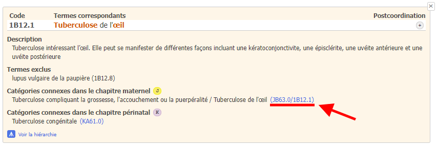
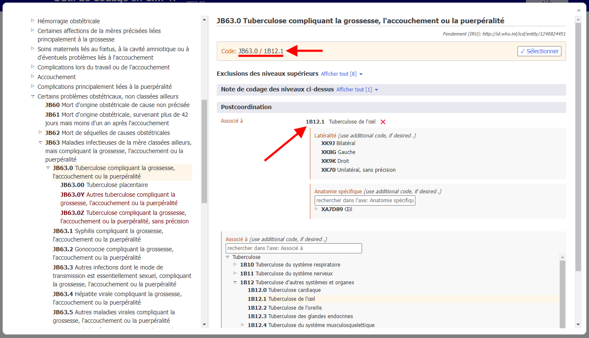

# Catégories connexes dans le chapitre maternité

Lors du codage de la mortalité maternelle, la cause sous-jacente est généralement codée au chapitre 18. Pour simplifier cela et pouvoir garder le détail provenant du reste de la classification, l’outil de codage de la CIM-11 vous fournit des codes alternatifs du chapitre maternité.

Si le résultat de la recherche comporte une alternative au code maternité, vous verrez apparaître l'icône J.

Lorsque vous ouvrez les détails de l'entité dans la liste des résultats, la section « Catégories connexes dans le chapitre maternité » s'affiche pour cette entité.    

Par exemple, l'entité « Tuberculose de l'œil » (1B12.1) a comme catégorie connexe dans le chapitre maternité l'entité « Tuberculose compliquant la grossesse, l'accouchement ou la puerpéralité » (JB63.0).     
Ce code est combiné avec le code de la « Tuberculose de l'œil » (1B12.1) et le code résultant devient JB63.0/1B12.1.

Lorsque vous êtes sur une entité dans le navigateur intégré de la CIM-11, la section « Catégories connexes dans le chapitre maternité » s'affiche comme suit

Cliquer sur le lien dans la section « Catégories connexes dans le chapitre maternité », dans cet exemple JB63.0/1B12.1 (ci-dessous souligné en rouge dans la capture d'écran des détails de l'entité et également dans la capture d'écran du navigateur intégré).

Le navigateur intégré ouvre directement l'entité correspondante dans le chapitre maternité (dans l'exemple ci-dessous : « JB63.0 Tuberculose compliquant la grossesse, l'accouchement ou la puerpéralité ») postcoordonnée avec l'entité sélectionnée (dans l'exemple ci-dessous : « 1B12.1 Tuberculose de l'œil ») sans aucune intervention de l'utilisateur.

