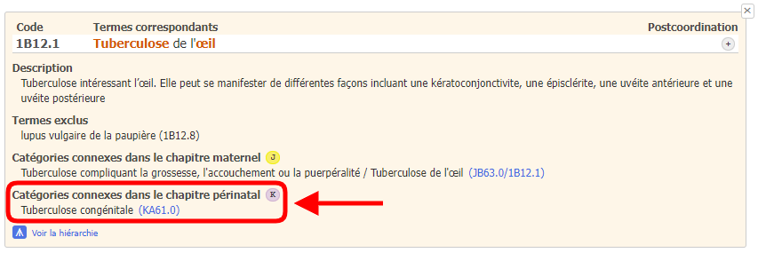
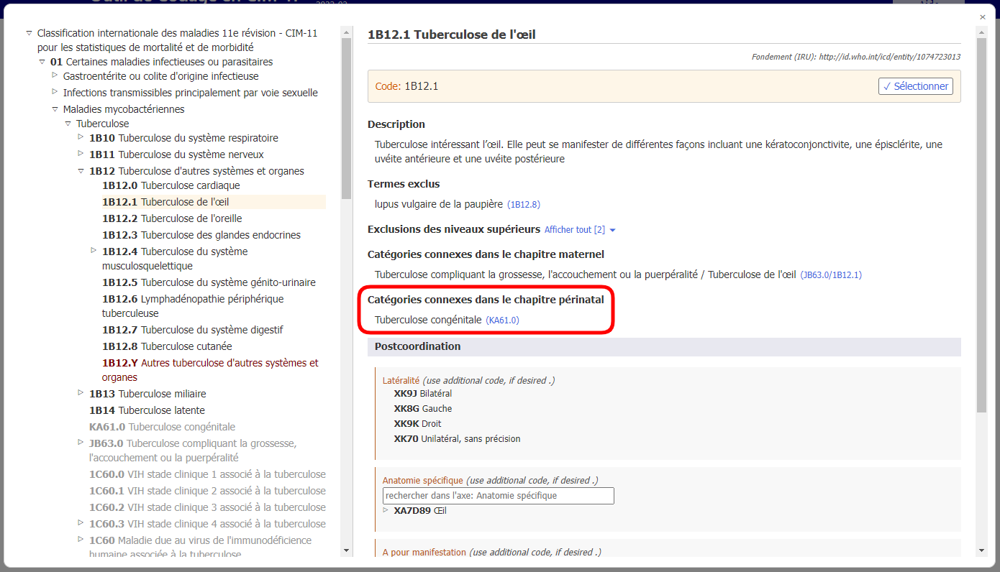
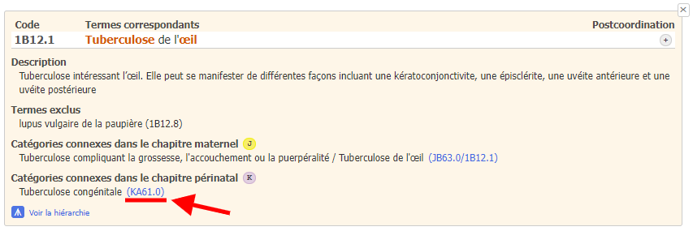
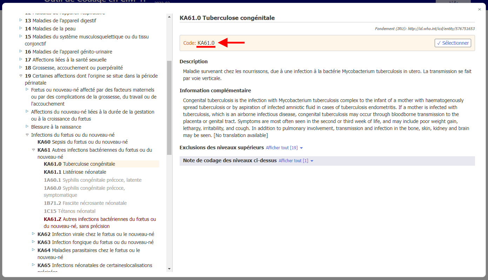

# Catégories connexes dans le chapitre périnatal

Lors du codage de la mortalité périnatale, la cause sous-jacente est généralement codée au chapitre 19. Pour simplifier cela et pouvoir garder le détail provenant du reste de la classification, l’outil de codage de la CIM-11 vous fournit des codes alternatifs du chapitre périnatal.

Si le résultat de la recherche comporte une alternative de code périnatal, vous verrez apparaître l'icône K.

Lorsque vous ouvrez les détails de l'entité dans la liste des résultats, la section « Catégories connexes dans le chapitre périnatal » s'affiche pour cette entité.

Par exemple, l'entité « Tuberculose de l'œil » (1B12.1) a comme catégorie connexe dans le chapitre périnatal l'entité « Tuberculose congénitale » (KA61.0).

Lorsque vous vous trouvez sur une entité dans le navigateur intégré de la CIM-11, la section « Catégories connexes dans le chapitre périnatal » s'affiche comme suit

En cliquant sur le lien dans la section « Catégories connexes dans le chapitre périnatal », dans cet exemple KA61.0 (ci-dessous souligné en rouge dans la capture d'écran des détails de l'entité et également dans la capture d'écran du navigateur intégré).

Le navigateur intégré ouvre directement l'entité correspondante dans le chapitre périnatal (dans l'exemple ci-dessous : « KA61.0 Tuberculose congénitale ») sans aucune intervention de l'utilisateur.

