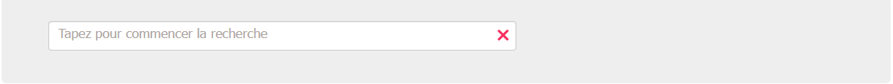
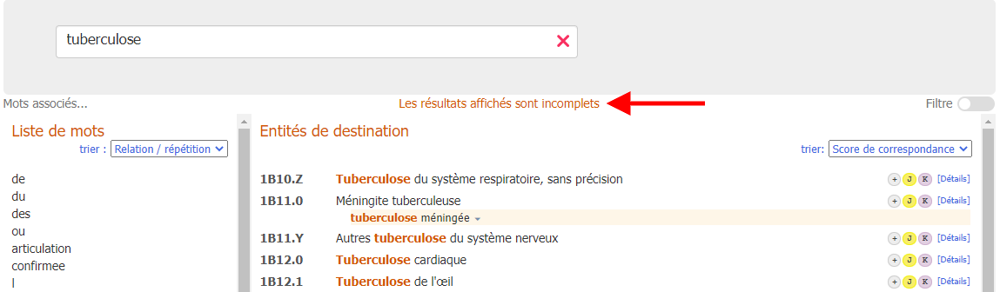

# Recherche
            
L'outil de codage fonctionne en effectuant une recherche au fur et à mesure que l'utilisateur continue à taper dans la fenêtre de recherche :

L'outil de codage génère (et met dynamiquement à jour) deux sorties différentes au fur et à mesure que la recherche se poursuit :

            
1. ## Liste de termes
    
    Sur le côté gauche, l'outil de codage affiche une liste de mots.

    Si vous êtes au milieu d'un mot, le système essaie de deviner le terme que vous êtes en train de taper.
    
    
 
    Si vous avez complété un mot (cela signifie que vous avez **saisi un espace** à la fin d'un mot, ou que vous avez **sélectionné un mot** directement dans la liste des mots), le système vous montrera les mots-clés associés.
    Le lien de parenté est calculé en utilisant le nombre de fois où les mots apparaissent ensemble dans la CIM, ainsi que d'autres mesures similaires
    
    

    Cette liste peut être triée par proximité avec le terme cherché (par défaut) ou par ordre alphabétique.
    
    

    Il est possible de cliquer sur ces mots au lieu de continuer à taper.

     

2. ## Entités résultantes
    
    La sortie centrale de l'interface de l'outil de codage montre les entités correspondantes de la recherche.
 
    Cette sortie est triée en fonction de la correspondance entre le texte saisi et la phrase de la CIM. Les mots correspondants sont mis en évidence dans cette liste (par exemple, le mot "tuberculose" dans la capture d'écran ci-dessous).
    Le focus de la souris ou du clavier (vous pouvez également faire défiler la liste des entités avec les touches haut et bas du clavier) est indiqué par la flèche rouge sur le côté gauche de l'entité et par le fond gris clair.
    
    

    Sur le côté droit de la liste des résultats des entités, l’outil de codage affiche également de petites icônes qui fournissent des informations spécifiques sur les entités, comme dans la capture d'écran ci-dessous :      

    

    Chaque icône a une signification différente :

    - La postcoordination est disponible pour cette entité : 
    - La postcoordination est obligatoire pour cette entité : 
    - Une note de codage est disponible pour cette entité : 
    - Il y a une/des catégorie(s) connexe(s) dans le chapitre maternité pour cette entité : 
    - Il y a une/des catégorie(s) connexe(s) dans le chapitre périnatal pour cette entité :     

    Si le résultat de la recherche contient une "correspondance parfaite", l'entité correspondante est mise en évidence par un fond bleu (comme dans la capture d'écran ci-dessous).
    
    

    Vous pouvez modifier l'ordre de tri en utilisant la liste déroulante en haut de la liste. Nous avons deux options

      - Trier par score de correspondance (par défaut)
      - Trier par ordre de classification

    

    La liste ne montre que les codes et les titres, sauf si le titre n'est pas un résultat de recherche. Par exemple, dans la capture d'écran ci-dessous, le terme en surbrillance est un terme correspondant :
    
    

    ### Résultats incomplets
   
    Si le ou les mots saisis dans la recherche ne sont pas assez précis et que le système trouve plus de résultats qu'il ne peut en afficher, il émet les avertissements suivants :

    S'il trouve des résultats dans plus de 50 entités, il affichera les 50 meilleures correspondances et placera l'avertissement suivant : *Les résultats affichés sont incomplets*

    

    

    Dans ces cas, il vous est conseillé de fournir plus d'informations dans la zone de recherche.
    

    ### Recherche souple

    La fonction de recherche flexible peut être utilisée dans les cas où la recherche régulière de l'outil de codage ne renvoie aucun résultat.

    

    La façon dont la recherche est effectuée dans le mode de recherche flexible est différente dans les aspects suivants :

    En mode de recherche normal, l’outil de codage ne vous donnera que des résultats contenant tous les mots que vous avez utilisés dans votre recherche. Il accepte différentes variantes ou synonymes de mots, mais il recherche essentiellement un résultat qui contient tous les éléments de votre recherche. En revanche, en mode de recherche flexible, les résultats ne doivent pas nécessairement contenir tous les mots saisis. Il essaiera toujours de trouver la meilleure phrase correspondante, mais il se peut que certains mots de votre recherche ne correspondent pas du tout
    
    -  Par exemple, disons que l'utilisateur cherche *Stéatorrhée primaire* et qu'il n'existe aucune phrase dans l'index de la CIM-11 qui contienne ces mots ensemble. La recherche normale de l'outil de codage ne donnera aucun résultat, alors que la recherche flexible donnera des résultats contenant l'un des mots. Le premier résultat dans ce cas sera stéatorrhée qui est un terme de l'index sous Autres symptômes précisés liés au tractus gastro-intestinal inférieur ou à l'abdomen.     

     

    

    Une autre flexibilité ajoutée est d'essayer également des variantes plus larges des mots. Par exemple, si l'utilisateur recherche *Adénosarcome du poumon*, il obtiendra *Tumeurs malignes des bronches ou du poumon, non précisées*. Pour ce faire, on utilise la phrase "Tumeur maligne" au lieu de "Adénosarcome"

    ### Copie rapide

    En cliquant sur le code (ou sur le titre du code), ou en appuyant sur la touche Entrée du clavier, le code sélectionné est copié dans le presse-papiers. Vous pouvez vérifier à tout moment quel code est copié dans le presse-papiers en haut à droite de la page :

    

    
    ### Détails de l'entité

    En cliquant sur le lien "détails" (ou sur l'une des petites icônes), à droite de chaque résultat, vous ouvrez le contenu détaillé de l'entité (voir les captures d'écran ci-dessous) :

    

    

    En haut du contenu des détails de l'entité, au moyen du lien "afficher tout", l'outil de codage affiche tous les termes correspondants à l'entité actuelle.

    

    En cliquant sur le lien "masquer", tous les termes correspondants seront masqués, sauf les cinq premiers.

    
                
3. ## Distribution des chapitres / filtre
    
    Sur le côté droit, au moyen d'un bouton de commutation, l'outil de codage montre la distribution des chapitres et permet de définir des filtres pour la recherche.

    

    La distribution des chapitres montre le nombre de correspondances trouvées dans chaque chapitre de la classification.

    
              
    Par défaut, le système recherche dans tous les chapitres, sauf dans les chapitres *Codes d'extension* et *Médecine traditionnelle*.     
    On peut changer le filtre en cliquant sur les cases à cocher à côté des noms de chapitres. Si la case n'est pas cochée, les résultats de ce chapitre ne sont pas affichés.
 
    Clicking on a chapter title will show you the results only from that chapter
              
    En cliquant sur le titre d'un chapitre, vous obtiendrez les résultats de ce chapitre uniquement.

    

    En cliquant sur le bouton « Afficher les résultats de l'ensemble par défaut », vous réinitialiserez les filtres de chapitre que vous avez définis et vous obtiendrez les résultats de tous les chapitres, à l'exception des « Codes d'extension » et de la « Médecine traditionnelle »

    