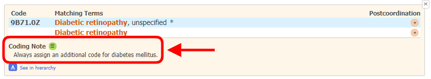
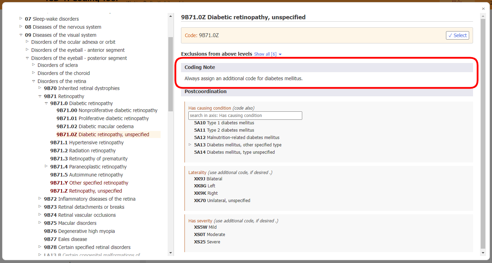

# Coding Note

When you have opened the detail of an entity in the results list, the "Coding Note" section is displayed if available to that entity (see screenshot below)

When you are on an entity in the integrated ICD-11 browser, the "Coding Note" section is shown as below

