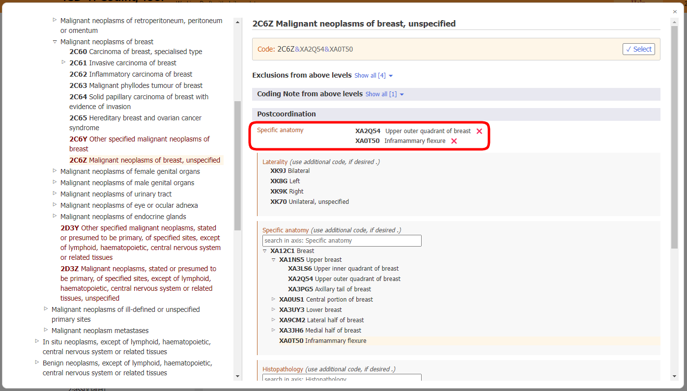

# Postcoordination

The postcoordination system allows adding more detail to the entity that is chosen. Different types of information can be added to different elements. For example, additional "Histopathology" information could be added to most of the Neoplasm categories but it cannot be added to the categories elsewhere in the classification.

When you have opened the detail of an entity in the results list, the postcoordination link is only displayed if postcoordination is applicable to that entity (see screenshot below) 

When you are on an entity in the integrated ICD-11 browser, the postcoordination area will only show the possible postcoordination axes that are applicable to that entity

Some categories contain information that is incomplete for the multiple purposes of the ICD. In such cases, the icon is "Mandatory postcoordination"    

If the postcoordination is mandatory, the note "*(code also)*" in the browser's postcoordination area indicates that information needs to be added for that axis.   

For opening the postcoordination corresponding to a specific matching term, you have to click onto one of the postcoordination icons on the right side of the entity details content. 
Icon can be Postcoordination is available:

Or Postcoordination is mandatory: 

Into the integrated ICD-11 browser the corresponding matching term is shown as "Selected term". The Coding Tool will also show the Foundation URI of the selected term if it is different from the Foundation URI of the current entity (see screenshot below).

## Displaying / Searching value sets

Some of the postcoordination axes can get values from a smaller set of possible values such as Laterality whereas some axes can get values from a larger value set such as Histopathology.

  - If the value set is small, the browser will show all possible values with their codes.

    

  - If the value set is large, you browse through the hierarchy tree of the postcoordination axis. Otherwise, you can search the value sets by typing in the search box. The browser will search only the values for that axis.     

    
  
  - Sometimes, even though the actual value set for an axis is large, not all values from the value set are applicable for an entity. In such cases, the browser will show/search only the relevant part. If the number of values that can be applied is less than 12, the browser will list all of them. If the result is larger than the browser will allow searching and browsing of the axis.

    For example, Aneurysmal bone cyst can be postcoordinated with Specific Anatomic Detail but not all values are applicable. In such cases, the browser will display/search only the relevant ones. In the example below, when the user searches "head", the system only shows the hits that are in the "bones" branch of the "Specific anatomic detail" axis. 
    
    

## Building a Code String

To build a code you need to click on the values that are displayed in the search results, in the hierarchy or in the shorter lists. 

The example below shows how to code "malignant neoplasm of breast detailed with laterality and specific anatomy".     
The postcoordination selections are shown at the top of the postcoordination section and the code string generated is shown above the postcoordination section.     
Clicking on the "Select" button copies the code string generated into the clipboard.

## Postcoordination using multiple values from the same axis

The system allows one value per axis for most of the postcoordination axes.      
For example, when postcoordinating with "severity" you can't pick the value "mild" and "moderate" at the same time. However, for certain axes, the system does allow selecting multiple values. The axes that allow multiple values are listed below:

- Associated with
- Causing condition
- Has manifestation
- Specific anatomy
- Infectious agents
- Chemical agents
- Medication

For these axes, you may select more than one value. For example, when postcoordination with specific anatomy is allowed, you may select more than one site

For some of the external causes axes, we allow multiple values only when they come from different blocks

For example, when postcoordinating Unintentional land transport traffic event injuring a pedal cyclist using the Transport event descriptor axis, we can use one value from the block "VEHICLE USER ROLE OF PERSON INJURED IN TRANSPORT RELATED EVENT" and another from the block "COUNTERPART IN LAND TRANSPORT CRASH" but we can't use two values from the same block.

When multiple values for an axis are not allowed and the user clicks on the second one, the system will replace the existing value. For example, when you are postcoordinating with severity and have already chosen mild as a value, clicking on moderate will replace the mild value with the moderate value. 

## Postcoordination / pre-coordination equivalence

In certain cases the combination built by the user may be equivalent to an existing entity in the classification. In these cases, the system will automatically use the pre-coordinated concept when it's building a code. In the example below, the user has chosen Invasive carcinoma of breast and post-coordinated it with Infiltrating duct carcinoma, NOS. However, instead of giving two codes, the system gives just one code because in the classification there is a category for this combination i.e. 2C61.0 Invasive ductal carcinoma of breast and therefore it is given as the code.

## Nested postcoordination

In certain cases the system may provide further specification of the postcoordination values. If the specific detail is known then select the more precise entity. If not then select the less specific entity.

## Other postcoordination

Many entities have suggested or required postcoordination axes that are relevant to them. You can see these axes in the postcoordination area and use them to refine your entity.

However, sometimes you may need to postcoordinate an entity with other entities that are not suggested or required. In that case, you can use the "other postcoordination" area to build your postcoordination expression using a wider set of classification entities.

