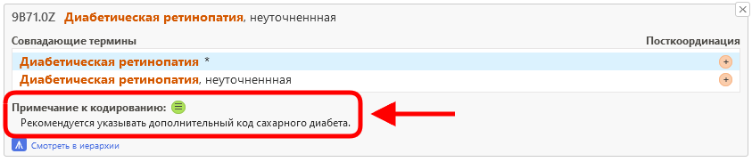
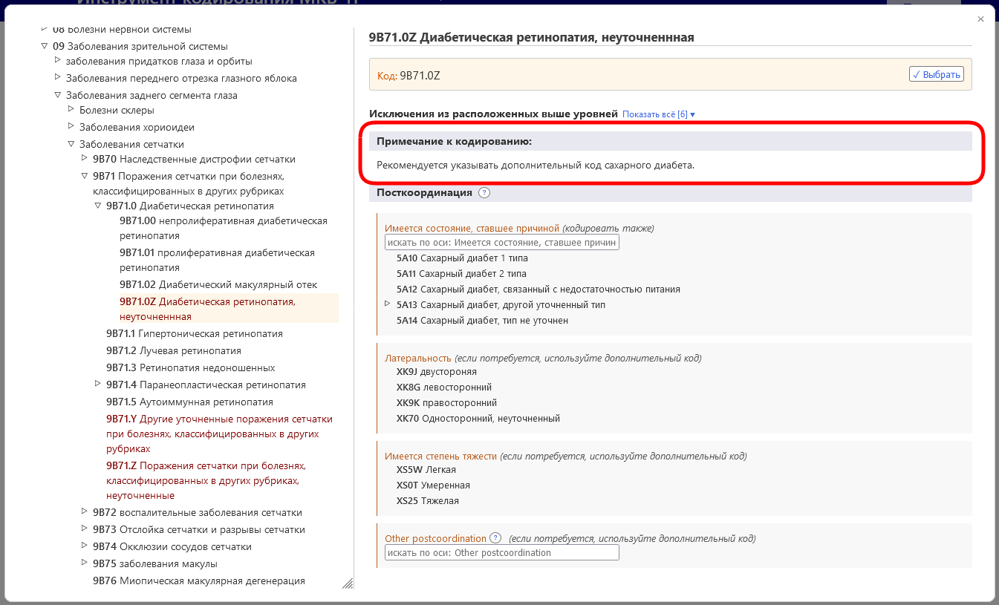

# Примечание к кодированию

Когда вы открыли дополнительные сведения о записи в списке результатов, отображается значок "Примечание к кодированию", если он доступен для данной записи (см. скриншот ниже).

Когда вы находитесь на записи во встроенном браузере МКБ-11, поле "Примечание к кодированию" отображается следующим образом

