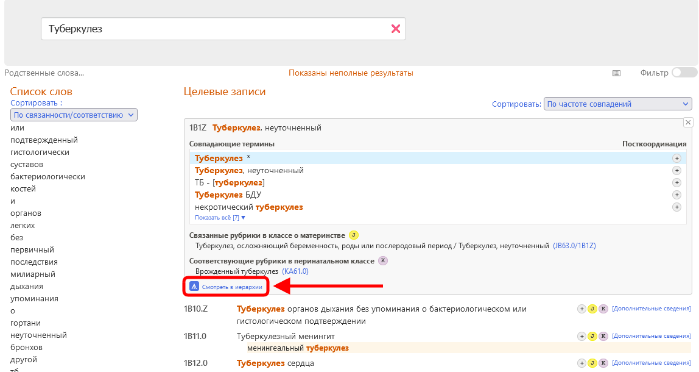
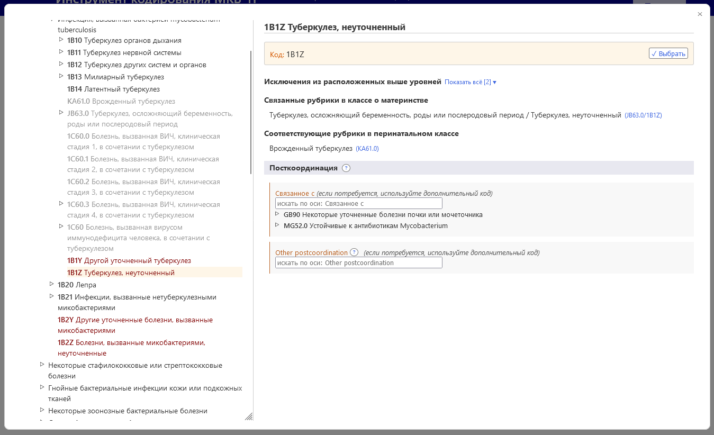
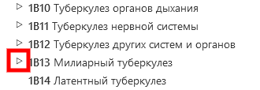

# Встроенный браузер

Когда отобразятся дополнительные сведения о записи, нажатие на значок «развернуть» (маленький квадрат, указанный на скриншоте ниже) открывает браузер МКБ-11 в Инструменте кодирования.

Встроенный браузер МКБ-11 отображается на странице в виде окна на переднем плане.

Данные о записи, отображаемые в правой части браузера (если они есть):

- Полностью уточненное название 
- Описание
- Дополнительная информация
- Включения
- Исключения
- Исключения из вышерасположенных уровней
- Кодируется в других рубриках
- Связанные рубрики в классе о материнстве
- Связанные рубрики в перинатальном классе
- Примечание к кодированию
- Примечание к кодированию из вышерасположенных уровней
- Посткоординация

При просмотре МКБ-11 вы увидите иерархию классификации в левой части экрана. Нажав на любую запись, вы увидите подробную информацию об этой записи в правой части экрана.

Первоначально система открывает только иерархию выбранного кода. Однако вы можете сделать видимыми дочерние записи каждой записи, нажав на маленькие треугольники слева от записей. 

