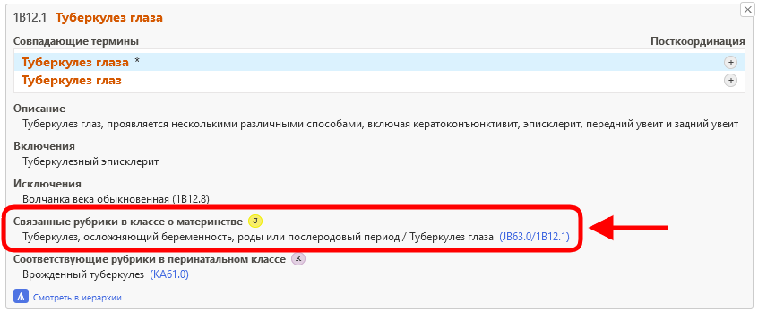
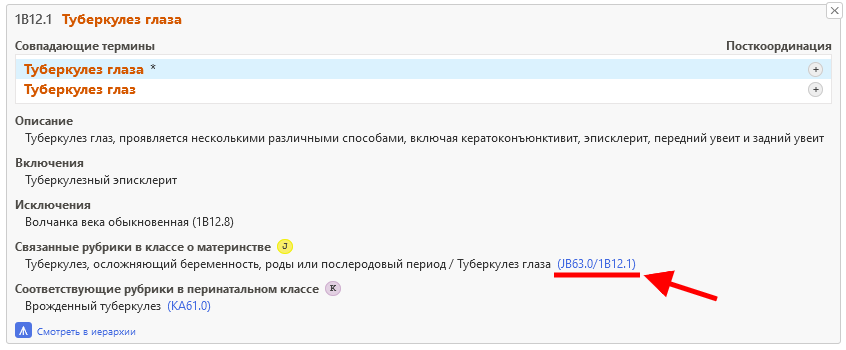
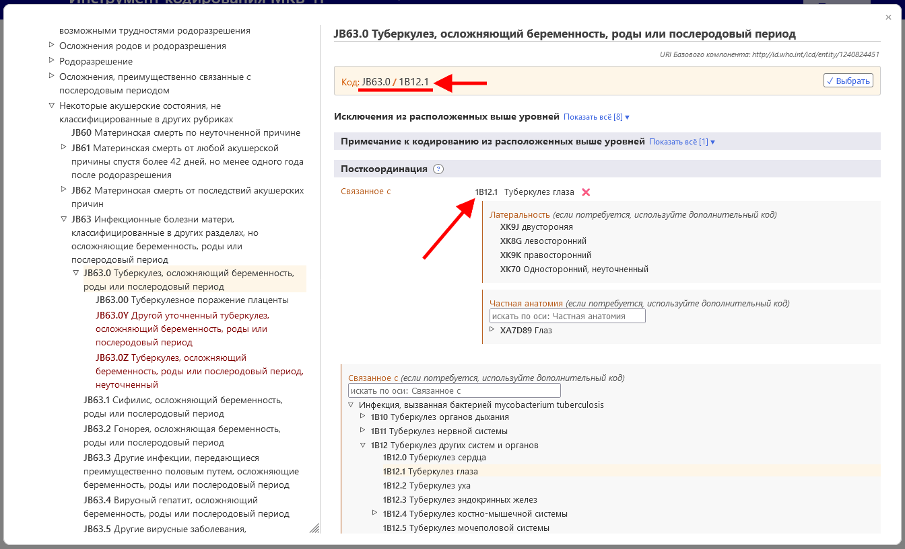

# Связанные рубрики в классе о материнстве     

При кодировании материнской смертности случаи смерти кодируются в основном в классе 18. Чтобы упростить этот процесс, а также сохранить детализацию из остальной части классификации, Инструмент кодирования МКБ-11 предлагает вам дополнительные коды из класса о материнстве. 

Если результат поиска имеет дополнительный код из класса о материнстве, вы увидите значок J.

Когда вы открываете дополнительные сведения о записи в списке результатов, для этой записи отображается раздел "Связанные рубрики в классе о материнстве”.     

Например, запись "Туберкулез глаза" (1B12.1) имеет в качестве связанной рубрики в классе о материнстве рубрику "Туберкулез, осложняющий беременность, роды или послеродовой период" (JB63.0).
Этот код объединяется с кодом Туберкулез глаза (1B12.1), и в результате получается код JB63.0/1B12.1. 

Когда вы находитесь на записи во встроенном браузере МКБ-11, раздел "Связанные рубрики в классе о материнстве" отображается следующим образом

Нажатие на код в разделе "Связанные рубрики в классе о материнстве", в данном примере JB63.0/1B12.1 (ниже подчеркнуто красным цветом на скриншоте дополнительных сведений о записи, а также на скриншоте встровенного браузера)

напрямую открывает связанную рубрику в классе о материнстве во встроенном браузере (в примере ниже: "JB63.0 Туберкулез, осложняющий беременность, роды или послеродовой период"), посткоординированную с выбранной записью (в примере ниже: "1B12.1 Туберкулез глаза") без вмешательства пользователя.

