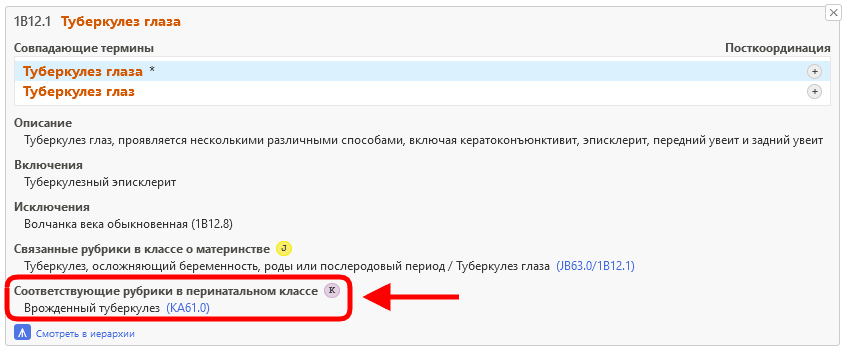

# Связанные рубрики в перинатальном классе

При кодировании перинатальной смертности случаи смерти в основном кодируются в классе 19. Чтобы упростить этот процесс, а также сохранить детализацию из остальной части классификации, Инструмент кодирования МКБ-11 предлагает вам дополнительные коды из перинатального класса. 

Если в результатах поиска есть дополнительный код в перинатальном классе, вы увидите значок K.

Когда вы открываете дополнительные сведения о записи в списке результатов, для этой записи отображается значок «Связанные рубрики в перинатальном классе»".     

Например, запись "Туберкулез глаза" (1B12.1) имеет в качестве связанной рубрики в перинатальном классе рубрику "Врожденный туберкулез" (KA61.0).

Когда вы находитесь на записи во встроенном браузере МКБ-11, раздел "Связанные рубрики в перинатальном классе»" отображается следующим образом

Нажатие на значок в разделе «Связанные рубрики в перинатальном классе», в данном примере KA61.0 (ниже подчеркнуто красным цветом на скриншоте дополнительных сведений о записи, а также на скриншоте встроенного браузера)

напрямую открывает связанную рубрику в перинатальном классе во встроенном браузере (в примере ниже: "KA61.0 Врожденный туберкулез") без вмешательства пользователя.

