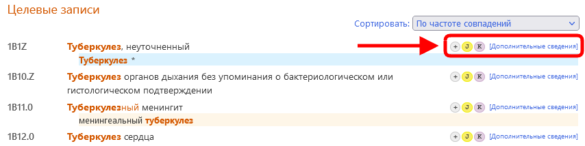

# Поиск
            
Инструмент кодирования работает путем поиска по мере того, как пользователь продолжает вводить текст в поле поиска: 

Инструмент кодирования генерирует (и динамически обновляет) два различных результата по мере продолжения поиска:

1. ## Список слов
        
    В левой части интерфейса Инструмент кодирования показывает список слов.

    Если вы начали набирать слово в сроке поиска, система попытается угадать слово, которое вы набираете.
    
    

    Если вы закончили набирать слово (это означает, что вы **нажали пробел** в конце слова или **выбрали слово** непосредственно из списка слов), система покажет вам связанные ключевые слова.     
    Связанность рассчитывается с помощью количества раз, когда слова встречаются вместе в МКБ, а также с помощью других подобных критериев.

    

    Этот список может быть отсортирован по связанности (по умолчанию) или по алфавиту

    

    Можно нажать на эти слова вместо того, чтобы продолжать набирать текст.

     

2. ## Целевые записи
    
    В средней части интерфейса Инструмент кодирования показывает совпавшие записи поиска.
 
    Эти результаты сортируются в соответствии с тем, насколько точно введенный текст совпадает с фразой в МКБ. Совпавшие слова в этом списке результатов выделены (например, слово "туберкулез" на скриншоте ниже).    
    Указатель мыши или клавиатуры (список записей можно прокручивать также клавишами вверх и вниз) отображается красной стрелкой слева от записи и светло-серым фоном.    

    

    В правой части результата поиска записей Инструмент кодирования также показывает небольшие значки, которые предоставляют конкретную информацию о записях, как показано на скриншоте ниже:  

    

    Каждый значок имеет свое значение:

    - Посткоординация доступна для этой записи: 
    - Посткоординация обязательна для этой записи: 
    - Для этой записи доступно примечание к кодированию:     
    - Для этой записи существует (существуют) связанная (связанные) рубрика (рубрики) в классе о материнстве:     
    - Для этой записи существует (существуют) связанная (связанные) рубрика (рубрики) в перинатальном классе:     
   
    Если результат поиска содержит "идеальное совпадение", совпавшая запись выделяется синим фоном (как на скриншоте ниже).

    

    Вы можете изменить порядок сортировки с помощью выпадающего окна в верхней части списка. У нас есть два варианта

      - Сортировка по количеству совпадений (по умолчанию)
      - Сортировка по расположению в классификации

    

    В списке отображаются только коды и наименования основных терминов, за исключением случаев, когда наименование основного термина не является результатом поиска. Например, на скриншоте ниже выделенный термин является совпавшим термином:

    

    ### Неполные результаты

    Если введенные в поле поиска слова недостаточно точны, и система находит больше результатов, чем может показать, она выдает следующие предупреждения:

    Если найдены результаты более чем в 100 записях, то будут показаны 100 лучших совпадений и предупреждение: *Показаны не все результаты*.

     

    

    В этих случаях вам рекомендуется ввести больше информации в поле поиска.

    ### Гибкий поиск

    Функция гибкого поиска может быть использована в случаях, когда обычный поиск в Инструменте кодирования не дает никаких результатов.

    

    Способ выполнения поиска в режиме гибкого поиска отличается в следующих аспектах:

    В режиме обычного поиска Инструмент кодирования выдает только результаты, содержащие *все* слова, которые вы использовали при поиске. Он допускает различные варианты или синонимы слов, но в основном он ищет результат, содержащий все компоненты вашего поиска. В то время как в режиме гибкого поиска результаты не обязательно должны содержать все введенные слова. Он все равно попытается найти наиболее подходящую фразу, но в результатах поиска могут быть слова, которые вообще не подходят.
    
    - Например, допустим, пользователь ищет * первичная стеаторея *, а в указателе МКБ-11 нет фразы, содержащей эти слова вместе. Обычный поиск в Инструменте кодирования не даст вам никаких результатов, в то время как гибкий поиск даст вам результаты, содержащие одно из этих слов. Наилучшим результатом в данном случае будет стеаторея, которая является термином в Алфавитном указателе в разделе "Другие уточненные симптомы, связанные с нижними отделами желудочно-кишечного тракта или брюшной полости".    

     

    

    Другая дополнительная возможность заключается в том, чтобы использовать также некоторые более широкие варианты слов. Например, если пользователь ищет _Аденосаркома легкого_, он получит _Злокачественные новообразования бронхов или легких, неуточненные_. Для этого вместо фразы "аденосаркома" используется фраза "злокачественное новообразование".

    ### Быстрое копирование

    Нажатие на код (или на наименование основного термина, которое соответствует коду) или нажатие клавиши Enter на клавиатуре копирует выделенный код в буфер обмена. Вы можете в любой момент проверить, какой код скопирован в буфер обмена, в правой верхней части страницы:

    

    ### Дополнительные сведения о записи

    Нажатие на значок «Дополнительные сведения» (или на одну из маленьких иконок), расположенную справа от каждого результата, открывает дополнительные сведения о записи (см. скриншоты ниже):

    

    

    В верхней части дополнительных сведений о записи, с помощью значка «Показать все», Инструмент кодирования показывает все совпадающие термины для текущей записи.

    

    Нажав на значок "скрыть", вы скроете все совпадающие термины, кроме первых пяти.

    

3. ## Распределение по классам / фильтр

    С правой стороны интерфейса с помощью кнопки-переключателя Инструмент кодирования показывает распределение записей результатов поиска по классам и позволяет включить фильтр для поиска по классам.

    

    Распределение по классам показывает количество совпадений, найденных в каждом классе классификации.

    

    По умолчанию система осуществляет поиск во всех классах, кроме классов *Коды расширения* и *Традиционная медицина*.
    Фильтр можно изменить, нажав на флажки рядом с названиями классов. Если флажок не установлен, результаты из этого класса не отображаются.

    Нажав на название класса, вы увидите результаты только по этому классу.

    

    Нажав на *Показать результаты из списка по умолчанию*, вы сбросите установленные вами фильтры распределения по классам и получите результаты из всех классов, кроме классов *Коды расширения* и *Традиционная медицина*.

    

