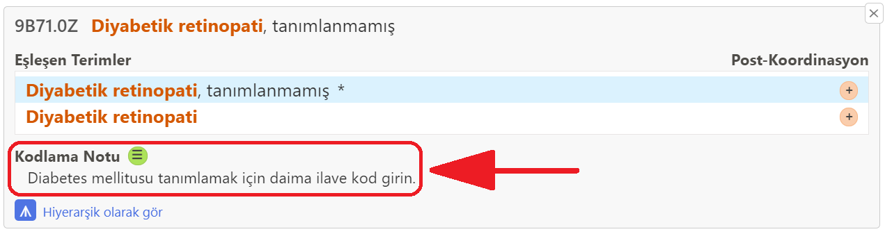
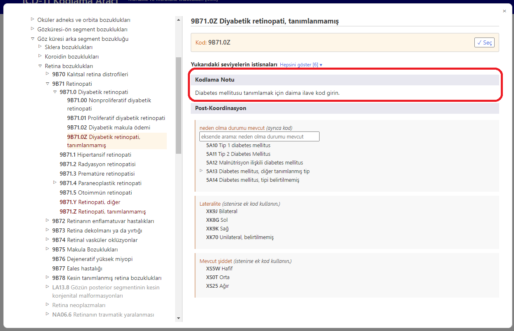

# Kodlama Notu

Sonuç listesinde bir öğenin detayını açtığınızda, o öğe için eğer var ise "Kodlama Notu" bölümü görüntülenir (aşağıdaki ekran görüntüsüne bakın)

Entegre ICD-11 tarayıcısında bir öğe üzerindeyken "Kodlama Notu" bölümü aşağıdaki gibi gösterilir

