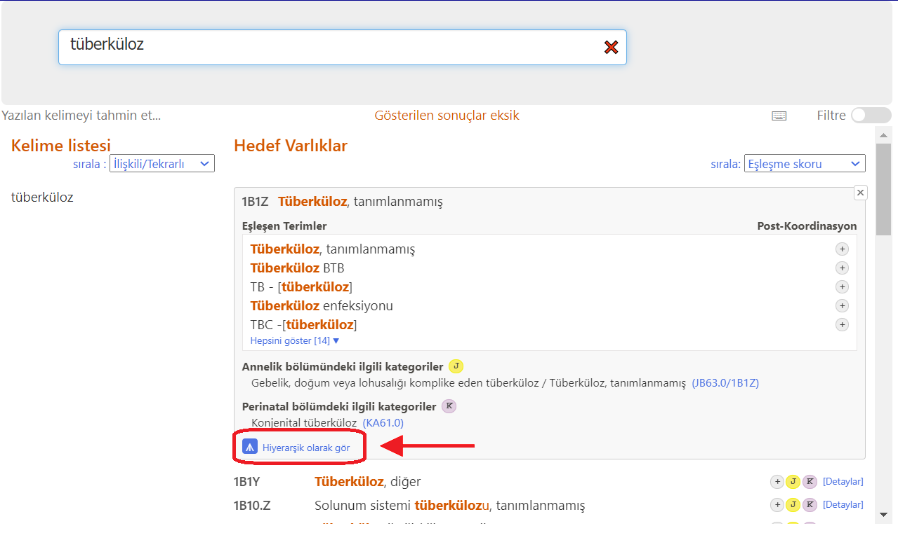
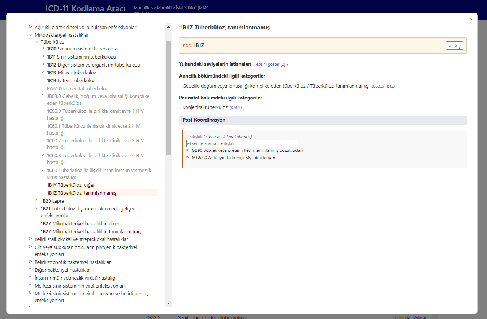
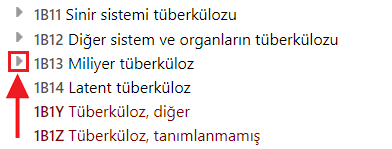

# Entegre tarayıcı

Öğe ayrıntıları görüntülendiğinde, büyüt simgesine (aşağıdaki ekran görüntüsünde belirtilen küçük kare) tıklamak, kodlama aracı içinde ICD-11 tarayıcısını açar.

Entegre ICD-11 tarayıcısı, sayfada bir ön plan penceresi olarak görüntülenir.

Tarayıcının sağ tarafında görüntülenen öğenin verileri (eğer varsa):

- Tam Belirtilen Ad
- Açıklama
- Additional Information
- Dahil edilenler
- Hariç tutulanlar
- Yukarıdaki seviyelerin hariç tutulanları
- Başka yerde Kodlanmış
- Annelik bölümündeki ilgili kategoriler
- Perinatal bölümdeki ilgili kategoriler
- Kodlama Notu
- Yukarıdaki seviyelerden Kodlama Notu
- Postcoordinasyon

ICD-11'e göz atarken, ekranın sol tarafında sınıflandırma hiyerarşisini göreceksiniz. Herhangi bir öğeye tıklamak, o öğenin ayrıntılarını ekranın sağ tarafında görüntüler.

Başlangıçta, sistem yalnızca seçilen kodun hiyerarşisini açar. Ancak öğelerin sol tarafındaki küçük üçgenlere tıklayarak her varlığın alt kırılımlarını görünür hale getirebilirsiniz. 

