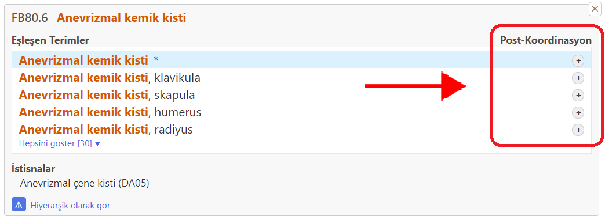
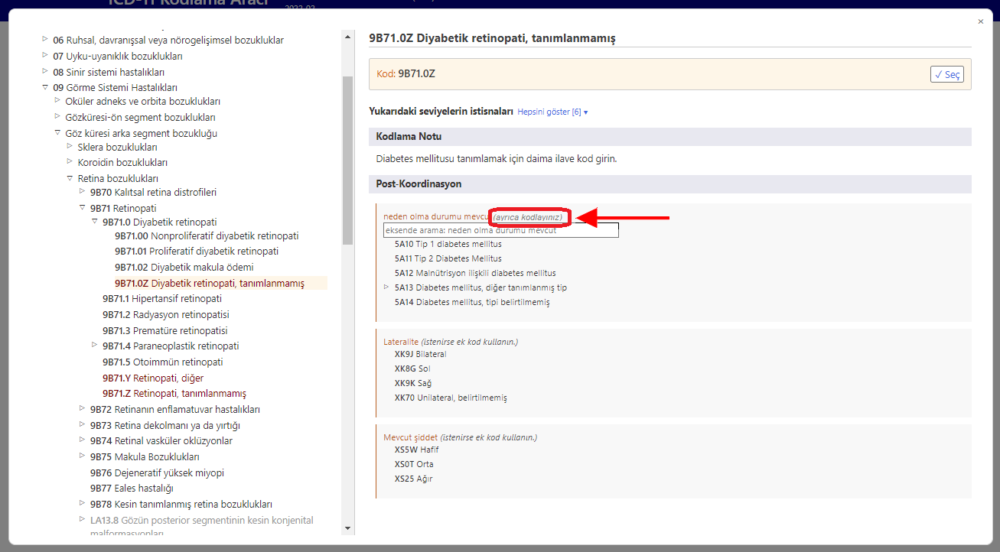
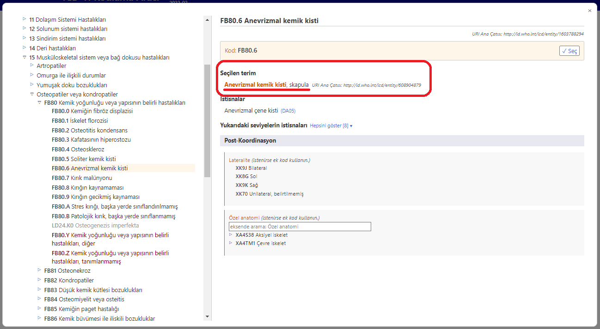
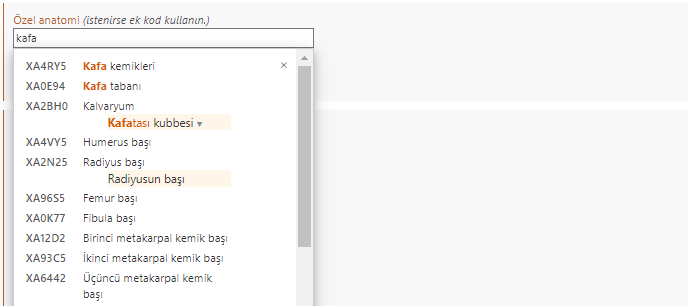

# Postkoordinasyon    

Postkoordinasyon sistemi, seçilen öğeye daha fazla ayrıntı eklenmesine izin verir. Farklı öğelere farklı bilgi türleri eklenebilir. Örneğin, Neoplazma kategorilerinin çoğuna ek "Histopatoloji" bilgisi eklenebilir, ancak sınıflandırmanın başka yerlerindeki kategorilere eklenemez.

Sonuçlar listesinde bir öğenin detayını açtığınızda, postkoordinasyon bağlantısı yalnızca bu varlık için postkoordinasyon uygulanabiliyorsa görüntülenir (aşağıdaki ekran görüntüsüne bakın) 

Entegre ICD-11 tarayıcısında bir öğe üzerindeyken, koordinasyon sonrası alanı yalnızca o öğe için geçerli olan olası postkoordinasyon eksenlerini gösterecektir.

Bazı kategoriler, ICD'nin çeşitli amaçları için eksik olan bilgiler içerir. Bu gibi durumlarda simge "Zorunlu postkoordinasyon" olur.    

Postkoordinasyon zorunluysa, tarayıcının postkoordinasyon alanındaki "*(ayrıca kodlayınız)*" notu, o eksen için bilgilerin eklenmesi gerektiğini belirtir.   

Belirli bir eşleştirme terimine karşılık gelen postkoordinasyonu açmak için varlık ayrıntıları içeriğinin sağ tarafındaki postkoordinasyon simgelerden birine tıklamanız gerekir. 
Simge postkoordinasyon vardır şeklinde olabilir:

Veya Postkoordinasyon zorunludur simgesi: 

Entegre ICD-11 tarayıcısında, karşılık gelen eşleşen terim "Seçilen terim" olarak gösterilir. Kodlama Aracı, geçerli öğenin Çatı yapı URI'sinden farklıysa, seçilen terimin Çatı Yapı URI'sini de gösterir (aşağıdaki ekran görüntüsüne bakınız).

## Görselleştirme / Değer kümelerinde arama 

Postkoordinasyon eksenlerinin bazıları Lateralite gibi daha küçük bir olası değerler kümesinden değerler alırken, bazı eksenler Histopatoloji gibi daha büyük bir değer kümesinden değerler alabilir.

  - Değer kümesi küçükse, tarayıcı olası tüm değerleri kodlarıyla birlikte gösterecektir.

    

  - Değer kümesi büyükse, postkoordinasyon ekseninin hiyerarşi ağacına göz atarsınız. Diğer bir seçenekte; arama kutusuna yazarak değer kümelerini arayabilirsiniz. Tarayıcı yalnızca o eksen için değerleri arayacaktır.     

    
  
  - Sometimes, even though the actual value set for an axis is large, not all values from the value set are applicable for an entity. In such cases, the browser will show/search only the relevant part. If the number of values that can be applied is less than 12, the browser will list all of them. If the result is larger than the browser will allow searching and browsing of the axis.

    Örneğin, Anevrizmal kemik kisti Spesifik Anatomik Ayrıntı ile postkoordine edilebilir ancak tüm değerler postkoordinasyon için geçerli değildir. Bu gibi durumlarda, tarayıcı yalnızca ilgili olanları sunacak/arayacaktır. Aşağıdaki örnekte kullanıcı "kafa" araması yaptığında sistem sadece "Spesifik anatomik detay" ekseninin "kemikler" dalında bulunan sonuçları göstermektedir. 
    
    

## Kod Dizisi Oluşturma 

Bir kod oluşturmak için arama sonuçlarında, hiyerarşide veya daha kısa listelerde görüntülenen değerlere tıklamanız gerekir. 

Aşağıdaki örnek, "lateralite ve spesifik anatomi ile detaylandırılmış meme malign neoplazmı"nın nasıl kodlanacağını göstermektedir.     
The postcoordination selections are shown at the top of the postcoordination section and the code string generated is shown above the postcoordination section.     
"Seç" düğmesine tıklamak, oluşturulan kod dizisini panoya kopyalar.

## Aynı eksenden birden fazla değer kullanarak postkoordinasyon 

Sistem, postkoordinasyon eksenlerinin çoğunda eksen başına bir değere izin verir.      
Örneğin, "şiddet" ile postkoordinasyon yaparken aynı anda "hafif" ve "orta" değerini seçemezsiniz. Ancak, belirli eksenler için sistem birden fazla değer seçilmesine izin verir. Birden fazla değere izin veren eksen türleri aşağıda listelenmiştir:

- İle ilişkili
- Neden olan durum
- Mevcut tezahürler
- Specific anatomy
- Enfeksiyöz ajanlar
- Kimyasal ajanlar
- İlaç tedavisi

Bu eksenler için birden fazla değer seçebilirsiniz. Örneğin, belirli bir anatomiyle postkoordinasyona izin verildiğinde, birden fazla anatomik yer seçebilirsiniz.

Bazı dış neden eksenleri için, yalnızca farklı bloklardan geldiklerinde birden fazla değere izin veriyoruz.
Örneğin, bir pedallı araç binicisinin yaralanmasına neden olan Kasıtsız kara taşımacılığı trafik olayını Taşıma olay tanımlayıcı eksenini kullanarak postkoordine ederken, "ULAŞIMLA İLGİLİ OLAYDA YARALANAN KİŞİNİN ARAÇTA BULUNUŞ ŞEKLİ" bloğundan bir değer ve "KARA OLAYI TAŞIMACILIĞI KAZASINDA KARŞI TARAF" bloğundan başka bir değer kullanabiliriz, ancak aynı bloktan iki değer kullanamayız.

Bir eksen için birden fazla değere izin verilmediğinde ve kullanıcı ikinci kez bir seçeneğe tıkladığında, sistem mevcut seçilmiş değeri son tıklanan değer ile değiştirecektir. Örneğin, şiddet ile postkoordinasyon yapıyorsanız ve zaten bir değer olarak hafif'i seçtiyseniz, orta'ya tıklamak hafif değeri orta değerle değiştirecektir. 

## İç içe postkoordinasyon 

Bazı durumlarda sistem, postkoordinasyon değerlerinin daha fazla detaylanmasını sağlayabilir. Spesifik detay biliniyorsa, daha kesin olan öğeyi seçin. Değilse, daha az spesifik öğeyi seçebilirsiniz.

