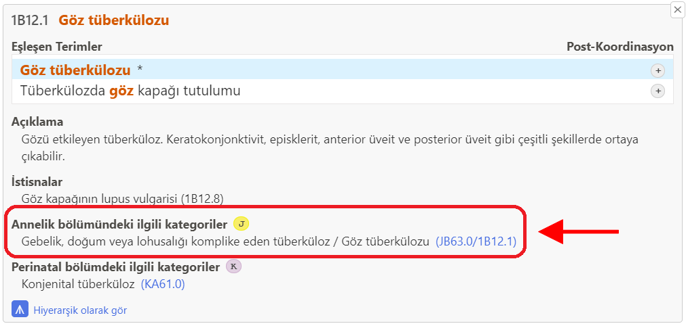
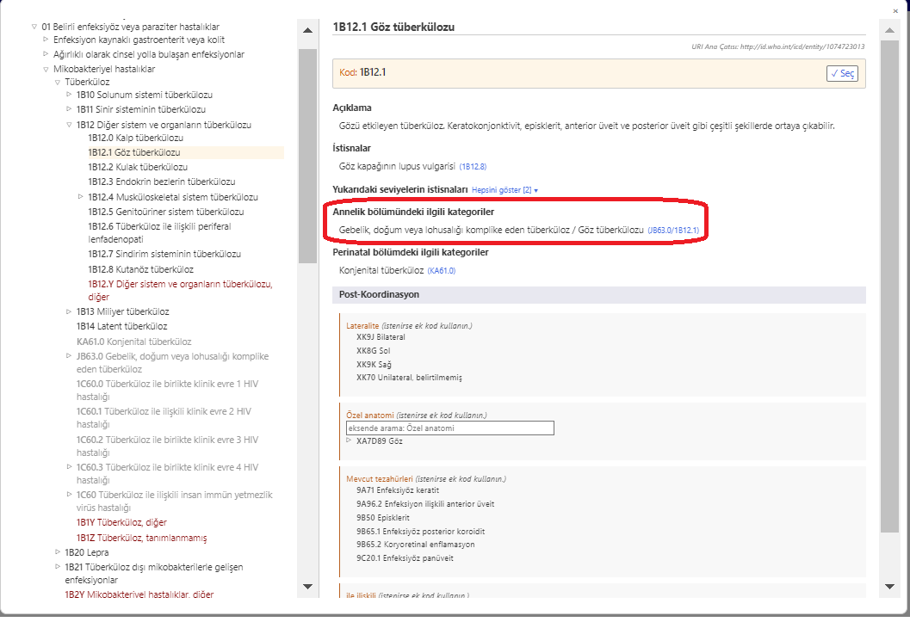
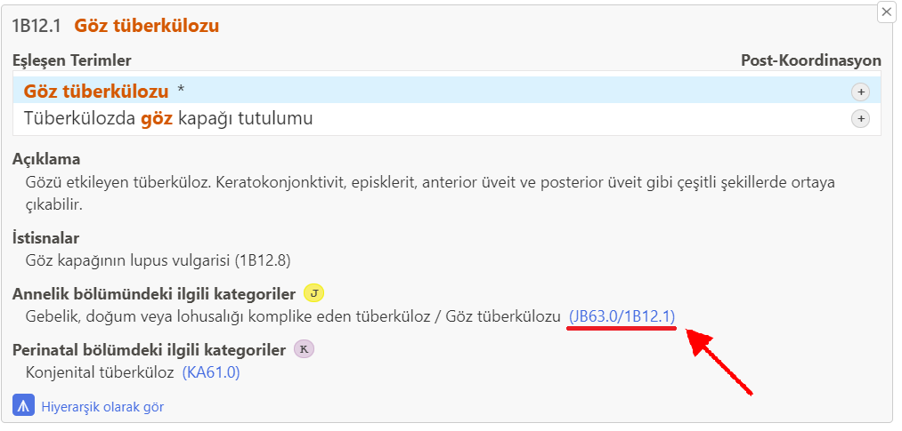
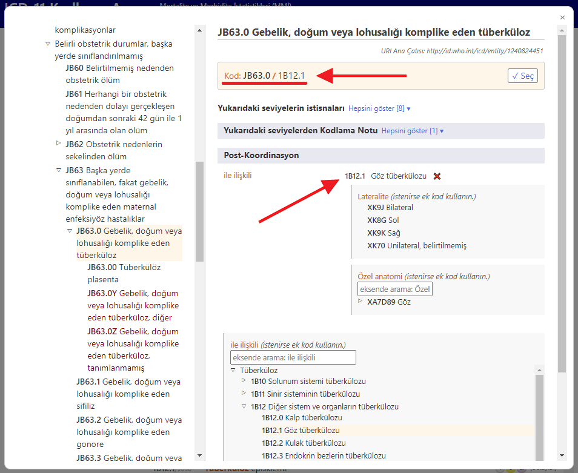

# Annelik bölümündeki ilgili kategoriler 

Anne ölümlerini kodlarken, çoğunlukla vaka Bölüm 18'den kodlanır. Bunu basitleştirmek ve ayrıca sınıflandırmanın geri kalanından gelen ayrıntıyı koruyabilmek için, ICD-11 Kodlama Aracı size annelik bölümünden alternatif kodları sunar. 

Arama sonucunda annelik bölümünden alternatif kod varsa, J simgesini görürsünüz.

Sonuç listesinde varlığın ayrıntılarını açtığınızda, o varlık için "Annelik bölümdeki ilgili kategoriler" bölümü görüntülenir.     

FÖrneğin, "Göz tüberkülozu" (1B12.1) öğesi, annelik bölümünde ilgili kategori olarak "Gebelik, doğum veya lohusalığı komplike eden tüberküloz" (JB63.0) öğesine sahiptir.
This code is combined with the code of Tuberculosis of eye (1B12.1) and the resulting code becomes JB63.0/1B12.1. 

Entegre ICD-11 tarayıcısında bir öğe üzerindeyken, "Annelik bölümdeki ilgili kategoriler" bölümü aşağıdaki gibi gösterilir

CBu örnekte JB63.0/1B12.1'deki "Annelik bölümdeki ilgili kategoriler" bölümündeki bağlantıya tıklanması (öğe ayrıntıları ekran görüntüsünde ve ayrıca entegre tarayıcı ekran görüntüsünde aşağıda altı kırmızıyla çizilmiştir)

Entegre tarayıcı, seçilen öğe ile postkoordine edilen (aşağıdaki örnekte: "1B12.1 Göz Tüberkülozu") annelik bölümünde ilgili varlığı doğrudan açar (aşağıdaki örnekte: "JB63.0 Gebelik, doğum veya lohusalığı komplike eden tüberküloz") ve bunun için herhangi bir kullanıcı müdahalesi gerekmez

