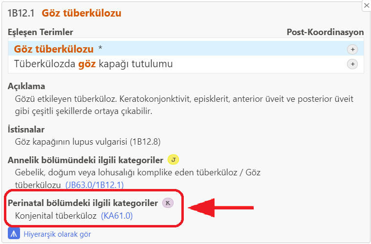
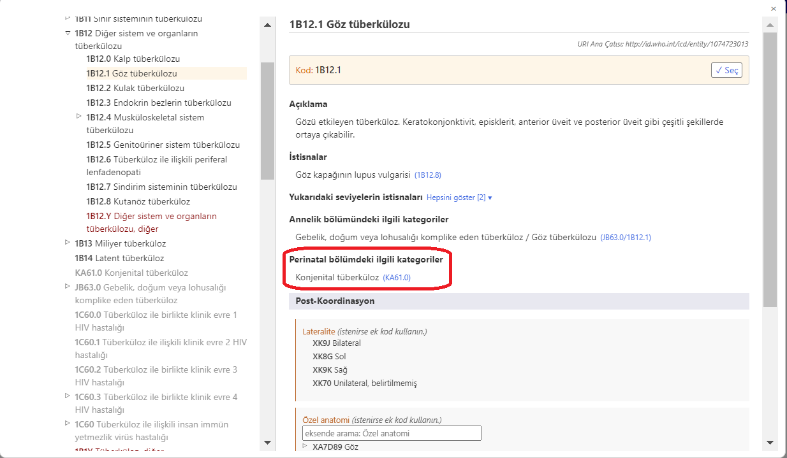
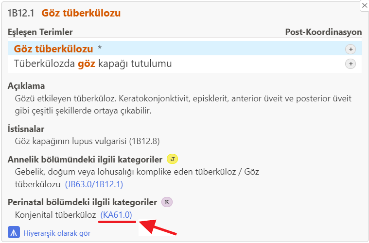
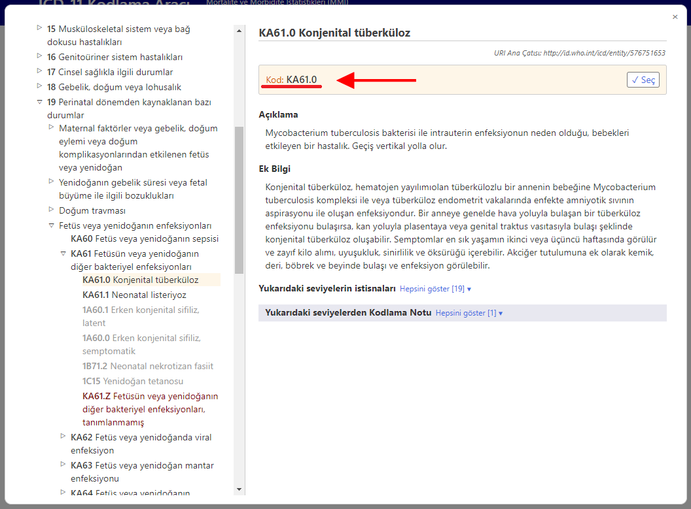


# Perinatal bölümdeki ilgili kategoriler    

Perinatal mortalite kodlanırken çoğunlukla vaka Bölüm 19'dan kodlanır. Bunu basitleştirmek ve ayrıca sınıflandırmanın geri kalanından gelen ayrıntıyı koruyabilmek için, ICD-11 Kodlama Aracı size perinatal bölüm alternatif kodları sunar.

Arama sonucunda bir perinatal kod alternatifi varsa, K simgesini görürsünüz.

Sonuç listesinde öğenin ayrıntılarını açtığınızda, o öğe için "Perinatal bölümdeki ilgili kategoriler" bölümü görüntülenir.     

Örneğin, "Göz tüberkülozu" (1B12.1) varlığı perinatal bölümdeki ilgili kategori olarak "Konjenital tüberküloz" (KA61.0) öğesine sahiptir.

Entegre ICD-11 tarayıcısında bir öğe üzerindeyken, "Perinatal bölümdeki ilgili kategoriler" bölümü aşağıdaki gibi gösterilir

"Perinatal bölümdeki ilgili kategoriler" bölümündeki bağlantıya tıklandığında, bu örnekte KA61.0 (altta varlık ayrıntıları ekran görüntüsünde ve ayrıca entegre tarayıcı ekran görüntüsünde altı kırmızıyla çizilmiştir)

Entegre tarayıcı, herhangi bir kullanıcı müdahalesi olmadan doğrudan perinatal bölümdeki ilgili öğeyi açar (aşağıdaki örnekte: "KA61.0 Konjenital tüberküloz")

