# Aramalar
            
Kodlama aracı, arama kutusuna yazmaya başladığınızda aramayı başlatır

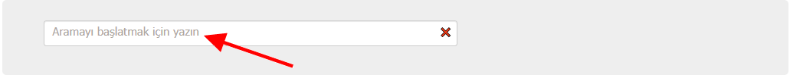

Arama devam ederken Kodlama Aracı iki farklı çıktı üretir (ve dinamik olarak günceller):

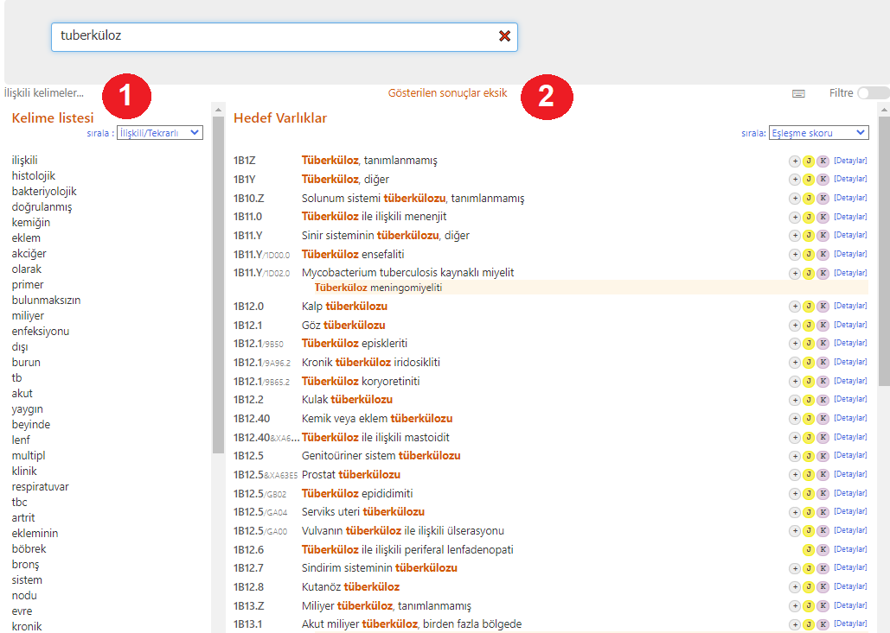
            
1. ## Kelime Listesi
    
    Sol tarafta, Kodlama Aracı bir kelime listesi gösterir.

    Bir kelimenin ortasındaysanız, sistem yazdığınız kelimeyi tahmin etmeye çalışacaktır.
    
    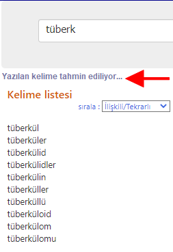
 
    Bir kelimeyi tamamladıysanız (bu, bir kelimenin sonuna **boşluk yazdığınız** veya doğrudan kelime listesinden **bir kelimeyi** seçtiğiniz anlamına gelir) sistem size ilgili anahtar kelimeleri gösterecektir.     
    İlişkililik, kelimelerin ICD'de bir arada görünme sayısı ve diğer benzer ölçütler kullanılarak hesaplanır.
    
    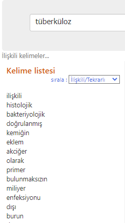

    Bu liste ilişkili olma durumuna göre (varsayılan) veya alfabetik olarak sıralanabilir.
    
    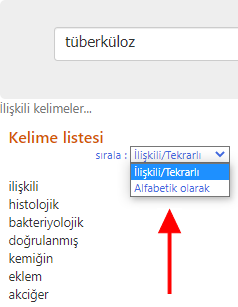

    Yazmaya devam etmek yerine bu kelimelere tıklamak mümkündür.

     

2. ## Hedef Öğeler
    
    Kodlama Aracı arayüzünün orta çıktısı, aramanın eşleşen öğelerini gösterir.
 
    Bu çıktı, girilen metnin ICD'deki ifadeyle ne kadar iyi eşleştiğine göre sıralanır. Eşleşen kelimeler bu listede vurgulanır (ör. aşağıdaki ekran görüntüsünde "tüberküloz" kelimesi).    
    Farenin odağı veya klavyenin odağı (öğeler listesini klavyenin yukarı ve aşağı tuşlarıyla da kaydırabilirsiniz) öğenin sol tarafındaki kırmızı okla ve açık gri arka planla gösteriliyor.    

    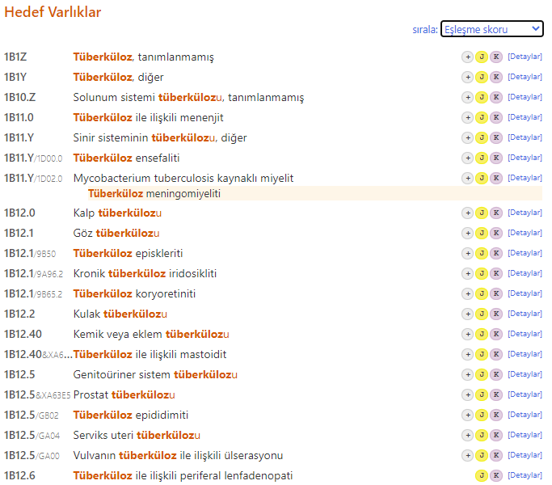

    Kodlama Aracı, öğeler sonuç listesinin sağ tarafında aşağıdaki ekran görüntüsünde olduğu gibi öğeler hakkında belirli bilgiler sağlayan küçük simgeler de gösterir:  

    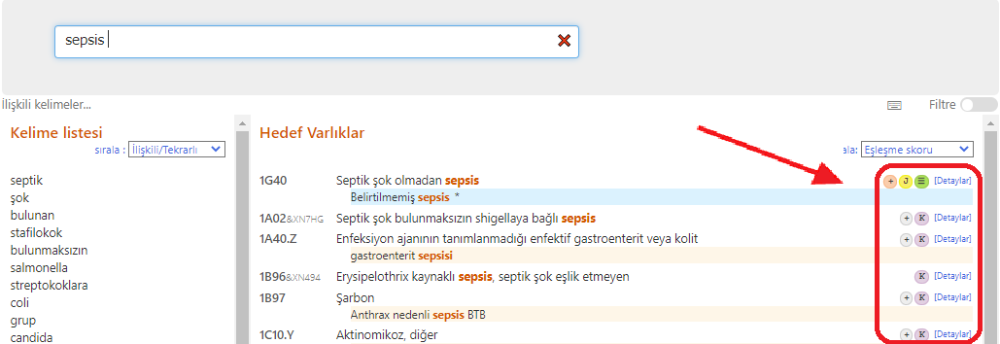

    Her simgenin farklı bir anlamı vardır:

    - Bu öğe için postkoordinasyon vardır: 
    - PBu öğe için postkoordinasyon zorunludur: 
    - Bu öğe için kodlama notu vardır:     
    - Bu öğe için Annelik bölümünde ilgili kategori/kategoriler vardır:     
    - Bu öğe için perinatal bölümde ilgili kategori/kategoriler vardır:     

    Arama sonucu bir "mükemmel eşleşme" içeriyorsa, eşleşen varlık mavi bir arka planla vurgulanır (aşağıdaki ekran görüntüsünde olduğu gibi)
    
    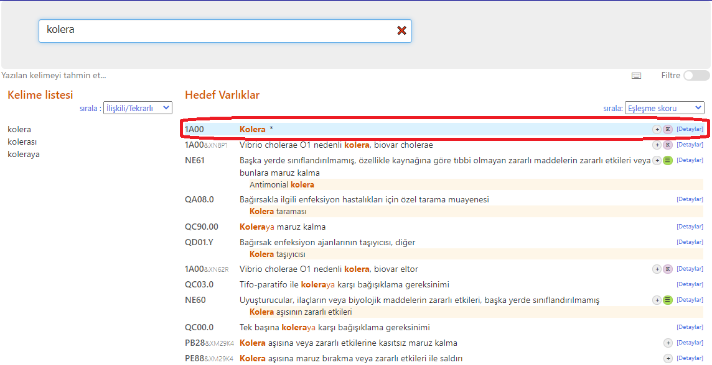

    Listenin üst kısmındaki açılır kutuyu kullanarak sıralama düzenini değiştirebilirsiniz. iki seçeneğimiz vardır

      - Eşleşme skoru temelinde sıralama (varsayılan)
      - Sınıflama sırası temelinde sıralama

    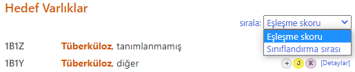

    Liste yalnızca kodları ve başlıkları gösterir bir istisna olarak sonuçlarda başlık yok ise örneğin, aşağıdaki ekran görüntüsünde, vurgulanan terim eşleşen bir terimdir:
    
    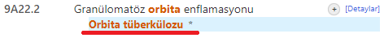

    ### Tam olmayan sonuçlar
   
    Aramada girilen kelime(ler) yeterince kesin değilse ve sistem gösterebileceğinden daha fazla sonuç bulursa aşağıdaki uyarıları verir:

    50'den fazla öğe içeren sonuç bulursa, en iyi 50 eşleşmeyi gösterecek ve şu uyarıyı verecektir: *Gösterilen sonuçlar eksiktir*

    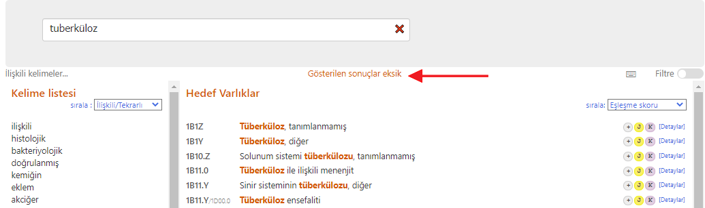

    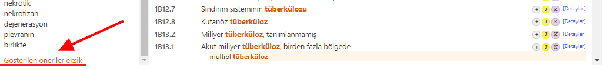

    Bu durumlarda, arama alanında daha fazla bilgi girmeniz önerilir.
    

    ### Esnek Arama 

    Esnek arama özelliği, Kodlama Aracı'nın normal aramasının herhangi bir sonuç döndürmediği durumlarda kullanılabilir.

    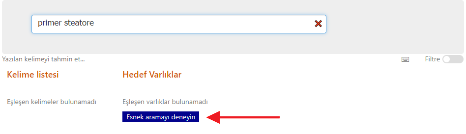

    Esnek arama modunda aramanın gerçekleştirilme şekli aşağıdaki belirtilen hususlarda farklıdır:

    Normal arama modunda, Kodlama Aracı size yalnızca aramanızda kullandığınız kelimelerin *tümünü* içeren sonuçları verecektir. Kelimelerin farklı varyantlarını veya eşanlamlılarını da kabul eder, ancak esas olarak aramanızın tüm bileşenlerini içeren bir sonuç arar. Oysa esnek arama modunda, sonuçların yazılan tüm kelimeleri içermesi gerekmez. Yine de en iyi eşleşen ifadeyi bulmaya çalışır, ancak aramanızda hiç eşleşmeyen kelimeler olabilir.
        
    - Örneğin, kullanıcının *primer steatore* araması yaptığını ve ICD-11 dizininde bu sözcükleri bir arada içeren bir tümcecik olmadığını varsayalım. Kodlama Aracının normal araması size herhangi bir sonuç vermezken, esnek arama size kelimelerden birini içeren sonuçları verecektir. Bu durumda en iyi sonuç, alt gastrointestinal sistem veya karın ile ilgili diğer belirtilen semptomlar altında bir indeks terim olan steatore olacaktır.    

     

    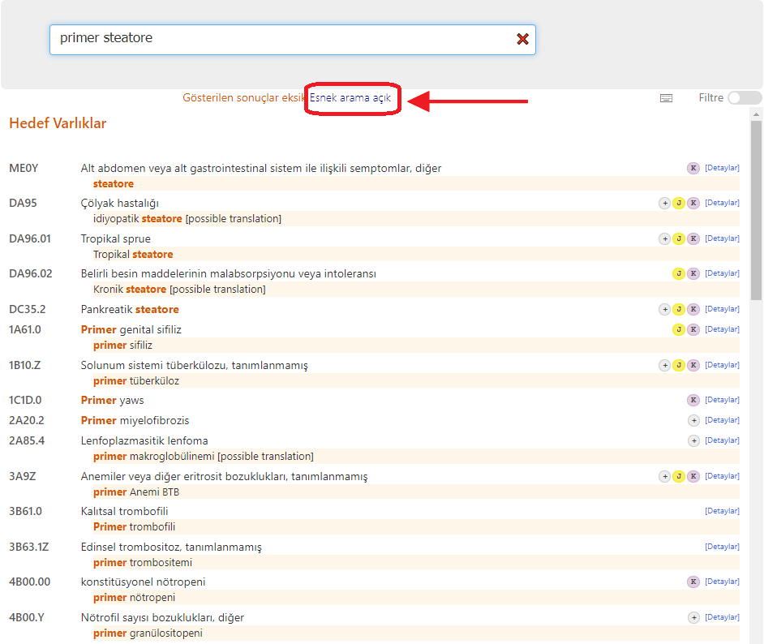

    AEklenen başka bir esneklik de kelimelerin bazı daha geniş varyantlarını denemektir. Örneğin, kullanıcı _Akciğer adenosarkomu_ ararsa, _Bronş veya akciğerin Malign neoplazmaları, belirtilmemiş_ sonucunu alacaktır. Bu da "adenosarkom" ibaresi yerine "malign neoplazm" denenerek yapılır.

    ### Hızlı Kopyalama

    Koda (veya kodun başlığına) tıklamak veya klavyede enter tuşuna basmak, seçilen kodu panoya kopyalar. Panoya hangi kodun kopyalandığını istediğiniz zaman sayfanın sağ üst kısmından kontrol edebilirsiniz:

    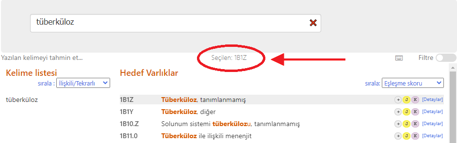

    
    ### Öğe Detayları

    Her sonucun sağındaki "Detaylar" bağlantısına (veya küçük simgelerden birine) tıklandığında öğe ayrıntıları içeriği açılır (aşağıdaki ekran görüntülerine bakın):

    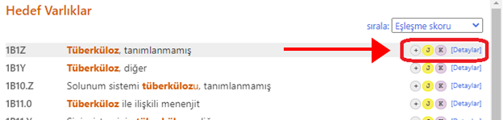

    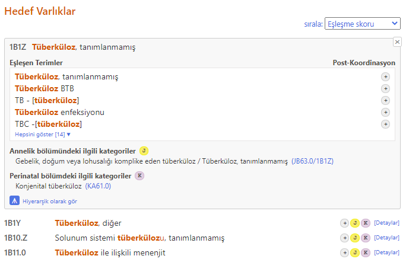

    Öğe ayrıntıları içeriğinin üstünde, "hepsini göster" bağlantısı aracılığıyla Kodlama Aracı, geçerli öğe için eşleşen tüm terimleri gösterir.

    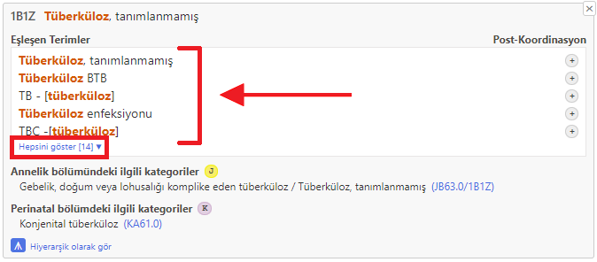

    "Gizle" bağlantısına tıklamak, ilk beş terim dışındaki tüm eşleşen terimleri gizleyecektir.

    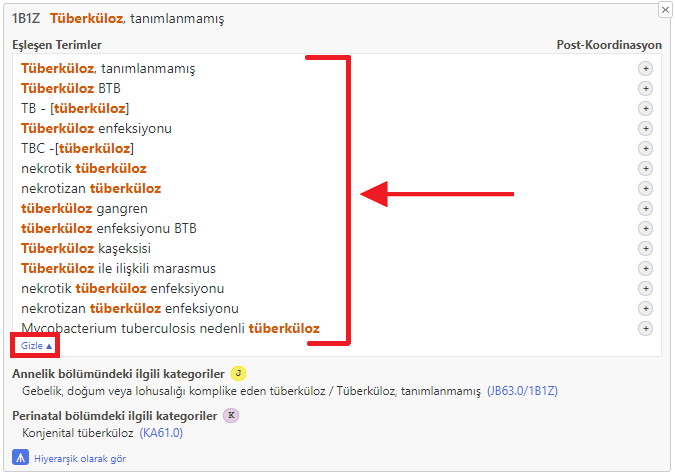
                
3. ## Bölüm dağılımı / filtre
    
    Sağ tarafta, bir anahtar düğmesi aracılığıyla, Kodlama Aracı bölüm dağılımını gösterir ve arama için filtreler ayarlanabilir.

    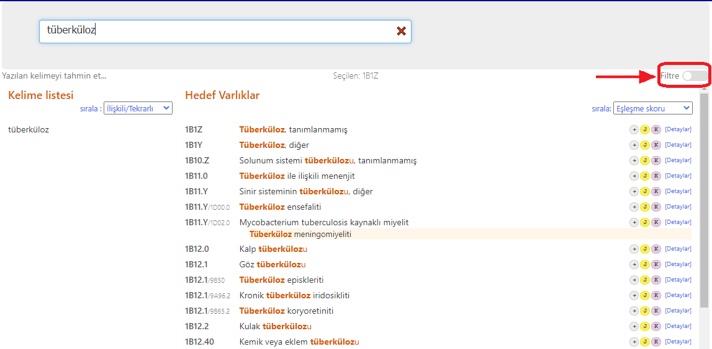

    Bölüm dağılımı, sınıflandırmanın her bölümünde bulunan eşleşme sayısını gösterir.

    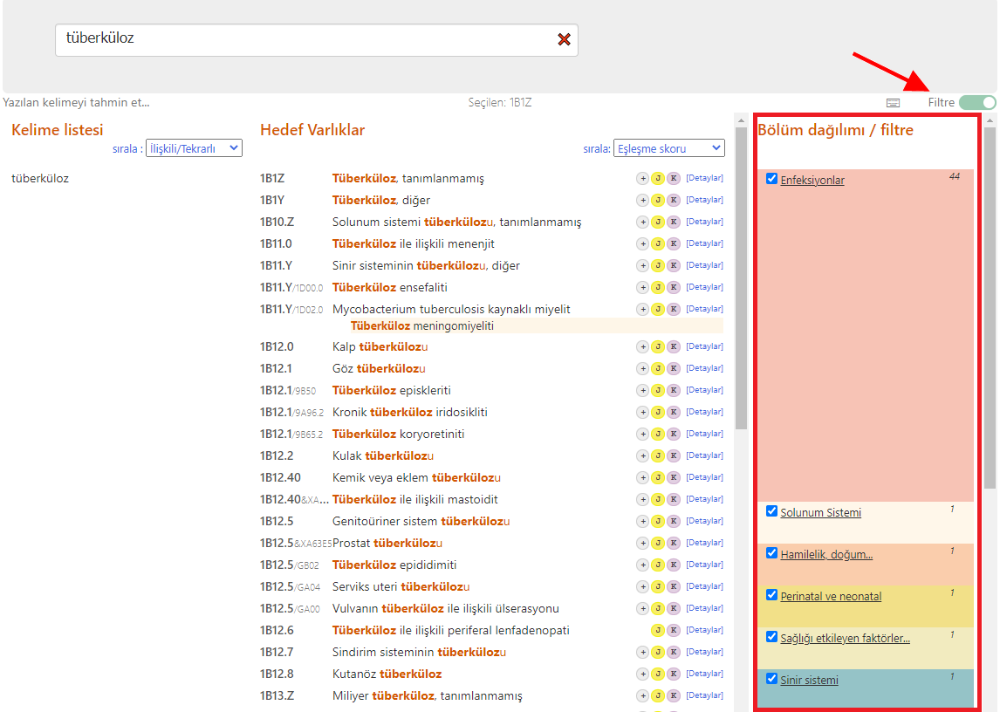
              
    Varsayılan olarak, sistem *Uzatma Kodları* ve *Geleneksel Tıp* dışındaki tüm bölümlerde arama yapar.
    Bölüm adlarının yanındaki onay kutularına tıklayarak filtre değiştirilebilir. İşaretlenmezse, o bölümün sonuçları gösterilmez.
 
    Bir bölüm başlığına tıklamak size yalnızca o bölümün sonuçlarını gösterecektir.
              
    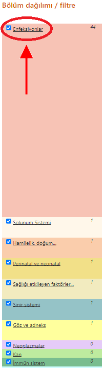

    *Varsayılan kümedeki sonuçları göster* seçeneğine tıklamak, tanımladığınız bölüm filtrelerini sıfırlar ve size *Uzantı Kodları* ve *Geleneksel Tıp* dışındaki tüm bölümlerin sonuçlarını verir.
              
    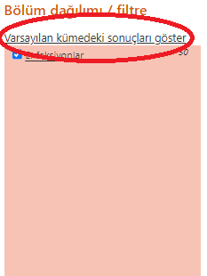

