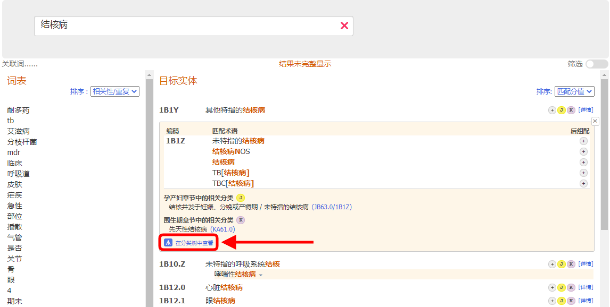
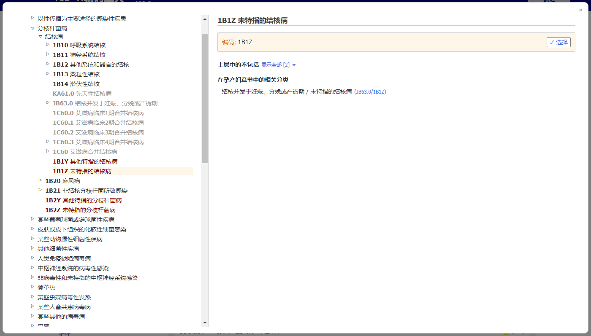
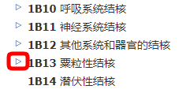

# 嵌入式浏览器

当显示细节信息后，点击放大符号（下图中所示的小方块）在编码工具下打开ICD-11浏览器。

嵌入式ICD-11浏览器会显示在页面的前台窗口。

在浏览器右侧显示的实体数据有（如果存在）:

- 实体全称
- 描述
- 额外信息
- 包括
- 不包括
- 从以上层级中的排除项
- 编码至他处
- 编码提示
- 后组配

当浏览ICD-11时，你会在屏幕左侧看到分类层级结构。点击任意一个实体将会在屏幕右侧显示该实体的细节信息。

开始时，系统仅能打开选中编码的层级结构。但是你可以通过点击实体旁边的小三角查看每个子节实体。

