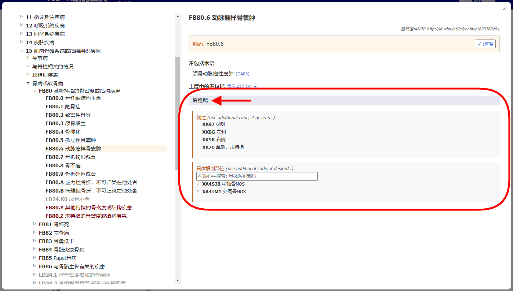
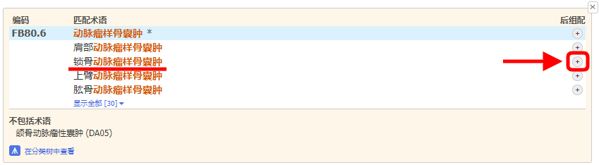

# 后组配  

后组配系统允许对选择的实体补充更多细节信息。不同分类可以补充不同类型信息。例如，为大部分的肿瘤分类补充额外的肿瘤形态学信息但该补充的信息不可用于其他分类。

当你在结果列表中打开一个实体细节信息时，后组配区域仅能显示适用于该实体的后组配链接。(请见下图) 

当您在ICD-11浏览器中选择一个实体时，后组配区域仅能显示可能的适用于该实体的后组配轴心。

若一些分类因包含的信息不完整从而无法满足ICD的多用途应用时，“标签”链接将被设置为强制性后组配。  

如果后组配是强制的，在浏览器中后组配区域注释的“另编码”则表示必须补充该轴心的相关信息。  

若要打开某一特定匹配术语相应的后组配，您需要点击实体详情右侧的其中一个后组配图标。    
图标可能是存在可用后组配:

或者存在强制性后组配: 

在嵌入式ICD-11浏览器中，相应的匹配术语将显示为“选定术语”。若选定术语的基础组件URI不同于当前实体，编码工具也将显示其基础组件URI。(请见下图)。

## 数据集显示和检索

一些后组配轴心能够从较小的数据集中获得可能的数值，例如单双侧。而另外一些轴心可以从很大的数据集获得数值，例如肿瘤形态学。

  - 如果是小数据集，浏览器将显示所有可能的数值及其编码。

    

  - 如果是大数据集，你可以浏览后组配轴心的层级树状结构。另外，你可以在搜索框中键入检索词实现数值搜索。浏览器仅会在本轴心内搜索数值。

    
  
  - 有时，即使某一轴心的数据集很大，但并不是内部所有数值均适用于某个疾病。在这种情况下，浏览器仅会显示或查找出相关的部分。如果适合的数值个数小于12个，浏览器将列出全部。如果结果数值更多，浏览器允许查找和浏览该轴心。

    例如：动脉瘤性骨囊肿可以使用特殊解剖细节信息进行后组配，但并不是所有数值都适合选择。在此种情况下，浏览器将显示或查找与之相关部分。在下面例子中，当用户查找“头”时，系统仅会显示特殊解剖细节轴心中骨骼分支中的命中结果。
    
    

## 构建编码串

构建一个编码时，你需要点击查找索结果、层级结构或短列表中显示的数值。

下面的例子所显示是如何通过编码为乳腺恶性肿瘤提供单侧和部位的等细节信息。
后组配选项显示在后组配区域的最上面，生成的编码串显示在后组配区域的上面。   
点击“选择”按钮，复制的编码串会出现在剪切板中.

## 使用同一轴心多个数值的后组配

对于大部分后组配轴心，系统仅允许每个轴心选择一个数值。例如，当选择后组配数值“重度”时，此时不可以再同时选择“轻度”和”中度”。但是在某些轴心，系统允许选择多个数值。允许使用多个数值的轴心如下：
•	与…..有关
•	引起的情况
•	具有的临床表现
•	特定解剖结构
•	感染原
•	化学制剂
•	药物制剂

对于这些轴心，您可以选择更多数值。例如：当被允许使用某特定解剖部位作为后组配时，您可以选择多个部位。

对于其他外因轴心，仅当来源于不同类别时我们允许使用多个数值。

例如：当使用交通事件描述轴心对“陆地运输交通事故意外伤及骑车人”进行后组配时，我们可以从类别“运输事件受害者的车辆使用者角色”中选择一个数值，同时可以在类别“陆地运输碰撞中对方受害者”中选择另一个数值，但我们不允许在相同类别中国选择两个数值。

不允许使用同一轴心的多个数值。用户点击第二个数值，系统会自动替换之前的数值。例如，当你选择严重程度作为后组配时，如果你已经选择了“轻度”这一数值，此时点击“中度”数值则会替换掉“轻度”的数值。

## 后组配/预组配等同

在某些案例中，用户构建的编码组合可能与分类中已经存在的实体等同。此时，系统会自动使用预组配编码。 本例中, 用户已经选择了浸润性乳腺癌以及形态学后组配 浸润性导管癌, NOS. 但系统仅会给出一个编码而不是两个编码，因为分类中存在能够涵盖上述信息的 “2C61.0乳腺浸润性导管癌”，因此系统会给出该编码。 

## 嵌套后组配

在某些案例中，系统允许对后组配数值提供更加详细的描述。如果已知特定的细节信息，然后选择更加精确的实体。如果没有，则选择较低特异性的实体。

## 其他后组配

许多实体已经提示或规定了与它们相关的后组配轴心。您可以在后组配区域中看到这些轴心，并使用它们来细化实体。

然而，有时您可能需要将一个实体与其他未建议或规定的实体进行后组配。在这种情况下，您可以在“其他后组配”区域来使用更广泛的分类实体集构建后组配表达式。

