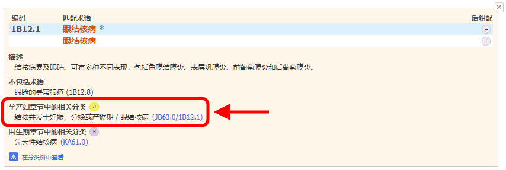
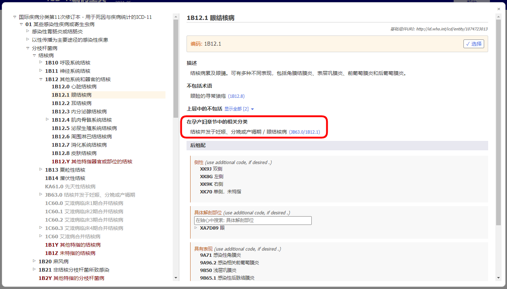
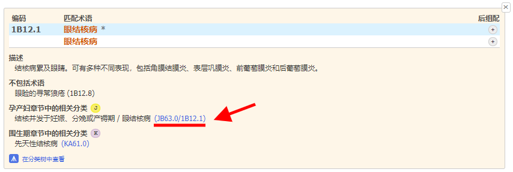
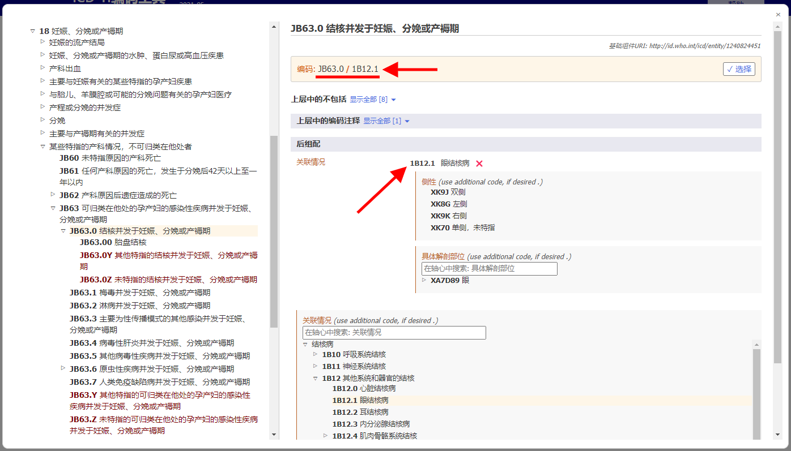

# 孕产妇章节的相关分类  

当编码孕产妇死亡时，大多数病例的根本死因应编码于18章。为了简化过程并且能够同时保留来自其他章节分类的细节信息，ICD-11编码工具提供了孕产妇章节选择性编码。 

如果查找结果中存在孕产妇选择性编码，您将会看到"J"符号。

当你在结果列表中打开实体信息， 孕产妇相关分类章节部分也会显示。   

例如，实体“眼结核”(1B12.1) 在孕产妇章节存在“结核并发于妊娠、分娩或产褥期” (JB63.0)的相关分类。这个编码将存在联合编码“眼结核” (1B12.1)组成JB63.0/1B12.1。

当你使用嵌入式ICD-11浏览器查看某个实体时，“孕产妇章节相关分类”将如下图显示：

在“孕产妇相关分类”内点击链接，本例中JB63.0/1B12.1（见下图中红色划线部分）

用户无需任何干预，嵌入式浏览器会直接打开孕产妇章节中的相关实体（如下："JB63.0结核并发于妊娠、分娩或产褥期”）同时伴有已经选择好的后组配 (如下: “1B12.1 眼结核")。

