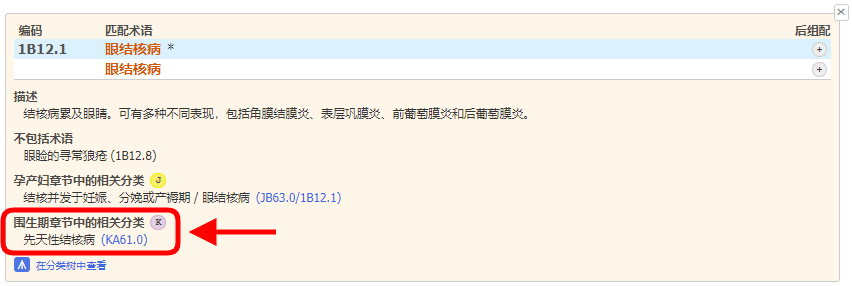
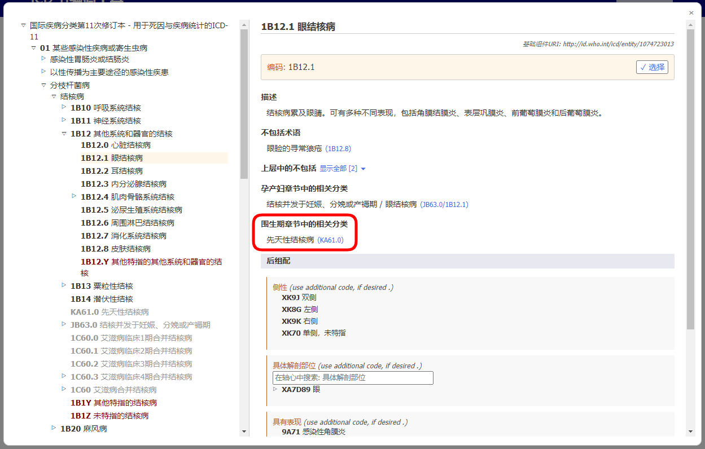
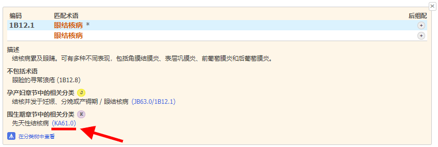

# 围生期章节相关分类    

当编码围生期死亡时，大多数病例被编码至第19章。为了简化编码过程，同时保留来自其他章节分类的细节信息，ICD-11编码工具提供了围生期章节可供选择的编码。

当搜索结果中存在围生期章节可供选择的编码时，以“K”图标标示。

当您在结果列表中打开实体详情时，该实体下方会显示“围生期章节相关分类”。     

例如，实体“眼结核”（1B12.1）在围生期章节存在相关分类“先天性结核病”（KA61.0）

当您使用嵌入式ICD-11浏览器查看某个实体时，“围生期章节相关分类”的内容将如下图显示:

点击“围生期章节相关分类”中的链接，在本例中是KA61.0 (见实体详情以及嵌入式浏览器截图中的红色下划线内容)

用户无需任何干预，嵌入式浏览器将直接打开围生期章节中的相关实体 (如下面的例子: "KA61.0先天性结核病") 

