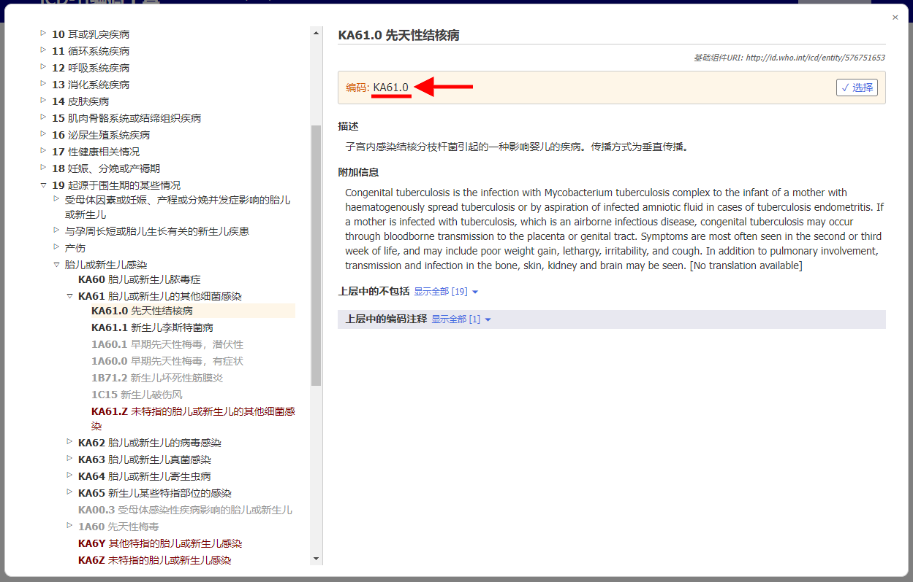

# Related categories in perinatal chapter

When coding perinatal mortality, mostly the case is coded to Chapter 19. To simplify this and also to be able to keep the detail coming from the rest of the classification, ICD-11 Coding Tool provides you perinatal chapter alternative codes. 

If the search result has a perinatal code alternative, you'll see the K icon.

When you open the details of the entity in the results list, the "Related categories in perinatal chapter" section is displayed for that entity.     

For example, the entity "Tuberculosis of eye" (1B12.1) has as related category in perinatal chapter the entity "Congenital tuberculosis" (KA61.0)

When you are on an entity in the integrated ICD-11 browser, the "Related categories in perinatal chapter" section is shown as below

Clicking on the link within the "Related categories in perinatal chapter" section, in this example KA61.0 (below underlined in red in the entity details screenshot and also in the integrated browser screenshot)

The integrated browser directly opens the related entity in the perinatal chapter (in the example below: "KA61.0 Congenital tuberculosis") without any user intervention

