# 查找
          
当用户在查找框中持续键入索引词时，编码工具开始工作

持续查找时，编码工具生成（动态更新）两种不同输出界面:

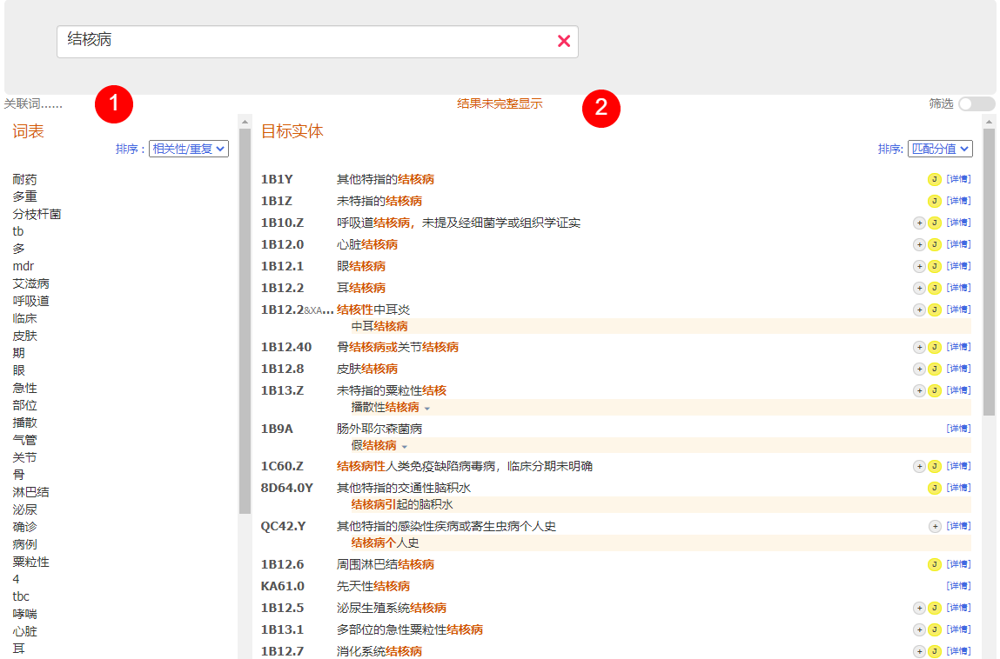
            
1. ## 词汇表
    
    编码工具的左侧显示的是词汇表。

    当你仅录入到单词中间部分而未完成全部输入时，系统会尝试猜测你想录入的单词。

    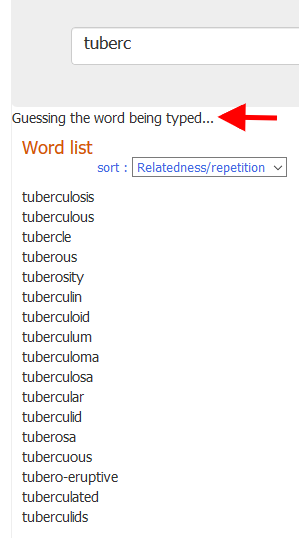

    当你完成一个词条的录入（意味着你已经在词尾处键入空格，或者你已经从词汇表中直接选择了一个词条），系统会自动显示相关关键词。
    相关度的计算依据ICD中词条出现的次数结合其他相似的测算方式。

    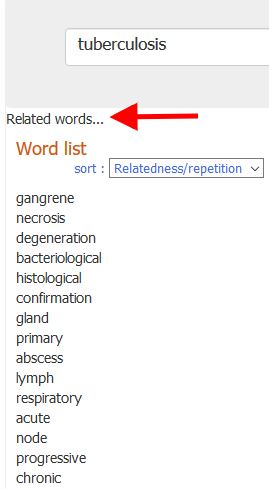

    列表将默认按照相关性排列，也可按字母顺序排列。

    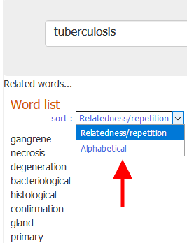

    可以点击列表中的词条从而不必继续人工录入。 

     

2. ## 目标实体
    
    编码工具中间输出界面中将显示所有与查找相匹配的实体。
    输出界面是按照与ICD词条与录入词条的匹配度由高到低排序。匹配的词条将会在列表中突出显示（如下图“结核病”）

    鼠标或键盘聚焦（你可以通过滚动条或者键盘的上下键查看实体）的词条将以浅灰色底色显示。

    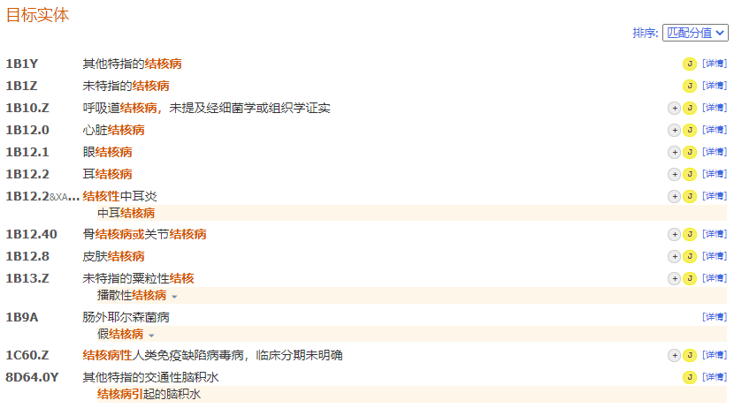

    编码工具在实体结果列表的右侧显示的小图标提示实体存在特别信息，如下面截图所示： 

    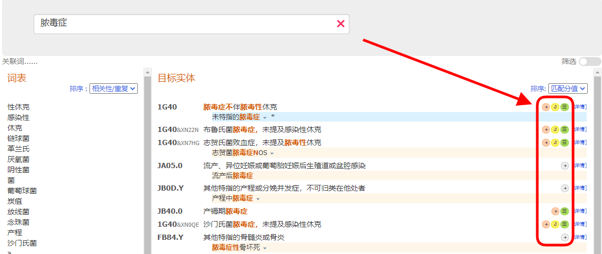

    每个图标有不同含义:

    - 该实体存在选择性后组配: 
    - 该实体存在强制性后组配：
    - 该实体存在编码注意事项：:     
    - 在孕产妇章节存在相关实体或分类:     
    - 该实体存在围生期章节相关分类:     

    如果检索结果中存在“完美匹配”结果，则匹配的实体背景将呈现蓝色（正如下面截图所示）

    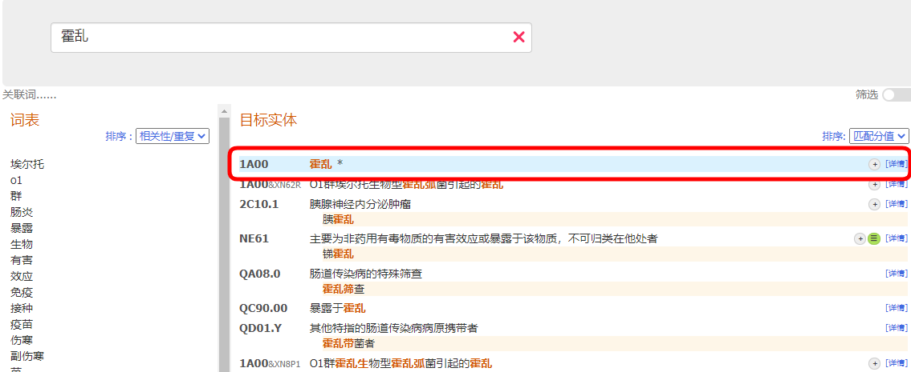

    你可以使用列表上方的下拉框改变输出的排列顺序。这里提供两个选项

    -按照匹配分值排列（默认） 
    -按照分类中的顺序排列

    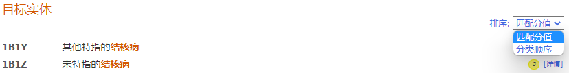

    列表中仅显示编码和标题，除非标题不是查找结果，例如下图所示高亮词条是一个匹配词条：？？

    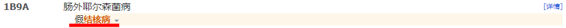

    ### 不完整结果
    
    如果检索词不够精确，系统查找到的结果过多而无法显示完全时，就会给出以下警示：

    如果查找结果多于50个实体，则会显示匹配度最佳的前50个实体，并且会给出“结果显示不完整的”警示。

    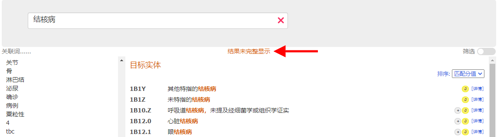

    

    在这些案例中，我们建议在查找框录入更多信息。
        

    ### 灵活查找

    灵活查找可以用于在编码工具普通检索功能无法返回任何结果时使用。

    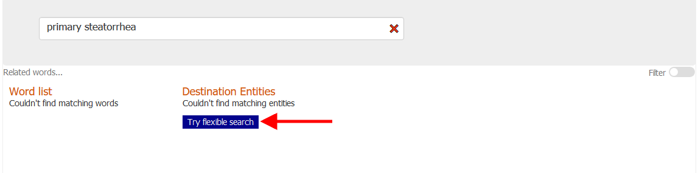

    灵活查找模式在以下几方面存在不同：
    在普通查找模式下，编码工具仅提供同时包含所有索引词的结果。接受检索词的变异词或同义词索引，但最关键的是查找结果必须同时包含所有索引词。但在灵活查找模式下，查找结果不一定包含所有索引词。该模式尽力在帮助寻找匹配的词条，但是结果中出现的词条也可能与索引词完全不匹配。

    - 例如，假设用户查找“primary steatorrhea”，而ICD-11索引库中无同时包含primary steatorrhea的索引词。编码工具的普通查找不会给出任何结果，但灵活查找会给出包含其中一个索引词的结果。本例中上面显示结果为steatorrhea，该词条是其他特指的与下消化道或腹部相关症状的索引词。

     

    

    另外，灵活性还体现在系统会努力使用比索引词本身范围更大的变异词。例如当用户索引Lung adenosarcoma，会得到Malignant neoplasms of bronchus or lung, unspecified的结果。这是因为系统尝试用词条"malignant neoplasm" 代替 "adenosarcoma" 所达到的效果。

    ### 快速复制

    点击编码（或编码标题）或点按键盘回车键，选择的编码会复制到剪切板中。你可以随时在页面正上方查看复制的编码。
        
    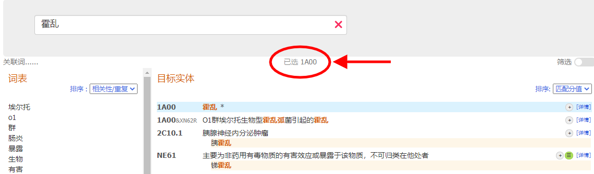

        
    ### 实体细节

    在每条结果右侧点击“细节“链接（或点击其中一个小标识符）打开实体的细节内容（请见下图）

    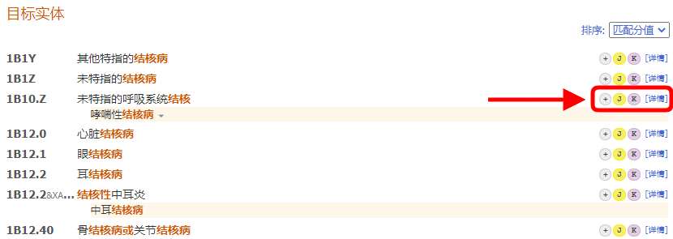

    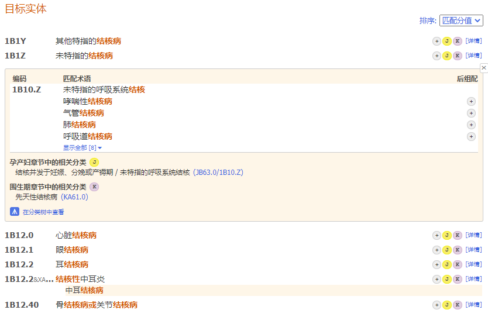

    在实体详细内容的最上方，点击“显示全部”，编码工具将显示当前实体下所有的匹配术语。

    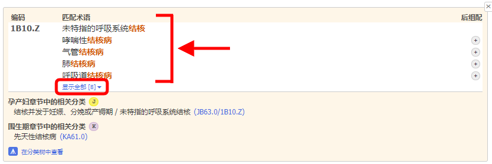

    点击“隐藏”，将隐藏除前5个术语以外的所有匹配术语。

    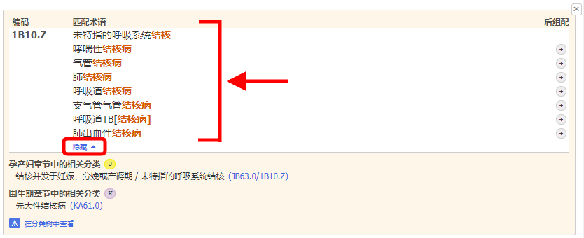
                
3. ## 章节分布/筛选
    
    在右侧，通过开关按钮，编码工具可以显示章节分布并可以设定筛选功能。

    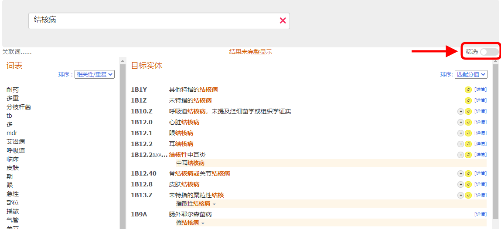

    章节分布中可以显示每个分类章节中匹配词条的数目。

    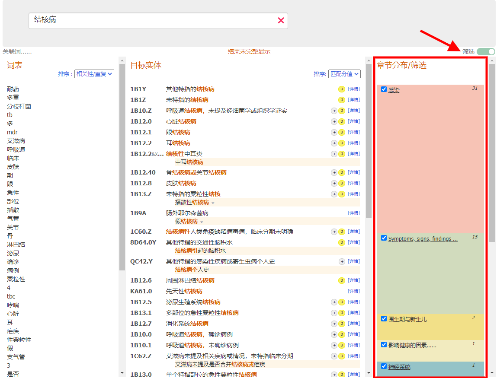
                
    默认状态下，系统可以查找除“扩展码”和“传统医学”章节以外的全部章节。
    你可以通过勾选每个章节名称旁的复选框来改变筛选内容。未被选择的章节将不会出现在结果中。

    勾选章节标题将只显示来自本章节的结果。
                
    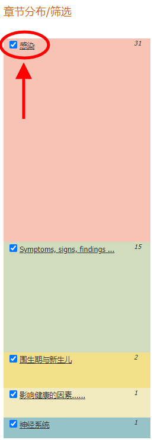

    点击“显示默认状态下的结果”时，系统将会重置你的筛选设置，然后给出除外“扩展码”和“传统医学”章节外其他所有章节的结果。
                
    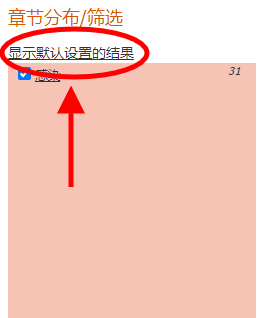

